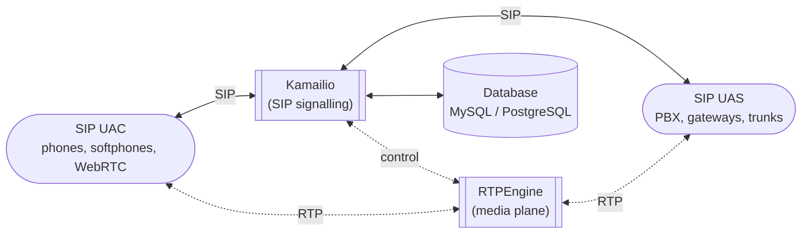

# Kamailio Handbook

Architecture notes and operational documentation for the [Kamailio](https://www.kamailio.org/) SIP server.

Available in two languages / Доступно двома мовами:

- 🇬🇧 [English](docs/en/README.md)
- 🇺🇦 [Українська](docs/uk/README.md)

## What this is

An **architecture-focused** handbook — distilled from the official docs, with extra attention to *why* Kamailio is built the way it is, not just how to run it. Target version: Kamailio **5.8.x**.

## Where Kamailio sits



Kamailio handles **signalling only** — call setup, routing, registration, auth. Media flows around it through a separate engine (typically RTPEngine).

## Structure

```
docs/
├── en/   English documentation
└── uk/   Ukrainian documentation
```

Both language trees mirror each other — same chapters, same filenames. Diagrams use [Mermaid](https://mermaid.js.org/) so they render directly on GitHub and stay diff-friendly.

## License

[MIT](LICENSE)
