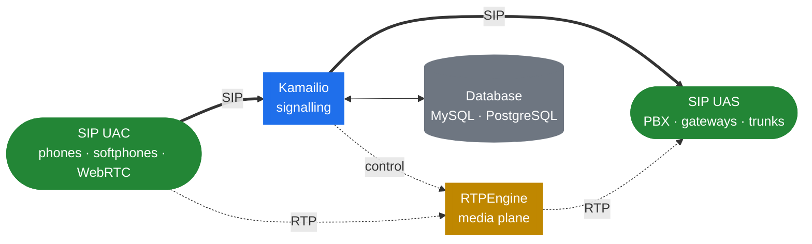

<h1 align="center">Kamailio Handbook</h1>

  <em>How Kamailio is built on the inside — a bilingual deep-dive into the runtime, the message lifecycle, KEMI, and the architectural tricks that make Kamailio behave the way it does.</em>

  
  
  
  
  
  

  
  &nbsp;
  

---

> [!IMPORTANT]
> This is **not** a re-telling of the official Kamailio documentation. The official docs and the wiki already cover installation, module references, and cookbook configs. This handbook focuses on what they don't: the **internals**.
>
> If you want to know what process types Kamailio forks at startup, how `pkg` and `shm` memory differ, how a SIP message threads through the routing engine, how KEMI bridges C and Lua/Python, or what `topos` and `dmq` actually do under the hood — you're in the right place.

## Where Kamailio sits

Kamailio handles **signalling only**. Media flows around it through a separate engine (typically [RTPEngine](https://github.com/sipwise/rtpengine)). Understanding this split is the foundation for everything else in the handbook.

## What's inside

<table>
  <thead>
    <tr><th align="left">#</th><th align="left">Part</th><th align="left">What's in it</th></tr>
  </thead>
  <tbody>
    <tr><td>1</td><td><b>Preface</b></td><td>Mental model, the signalling-vs-media split, what to expect</td></tr>
    <tr><td>2</td><td><b>The Runtime</b></td><td>Process model · <code>pkg</code> vs <code>shm</code> memory · locks · lifecycle</td></tr>
    <tr><td>3</td><td><b>SIP Message Lifecycle</b></td><td>Reception · parsing strategy · the routing engine · forwarding</td></tr>
    <tr><td>4</td><td><b>The Script Engine</b></td><td>cfg DSL · AST · module dispatch · pseudo-variables</td></tr>
    <tr><td>5</td><td><b>KEMI</b></td><td>Bridge to Lua / Python / JS / Ruby · lifecycle · tradeoffs</td></tr>
    <tr><td>6</td><td><b>State, Transactions, Dialogs</b></td><td>tm internals · timer wheels · usrloc cache pattern</td></tr>
    <tr><td>7</td><td><b>Control Plane</b></td><td>JSON-RPC · BINRPC · <code>kamcmd</code> · event routes</td></tr>
    <tr><td>8</td><td><b>Architectural Tricks</b></td><td><code>topos</code> · async transactions · <code>htable</code> · <code>dispatcher</code> · <code>dmq</code></td></tr>
    <tr><td>9</td><td><b>Reference</b></td><td>Process roles · term map</td></tr>
  </tbody>
</table>

Full ToC: [English](docs/en/README.md) · [Українська](docs/uk/README.md)

## Conventions

> [!TIP]
> Each chapter lives in **both** `docs/en/` and `docs/uk/` under the same filename. Fix a typo in one tree, please mirror it in the other.

- **Diagrams** use [Mermaid](https://mermaid.js.org/) — renders natively on GitHub and on the docs site.
- **Callouts** (`> [!NOTE]`, `> [!TIP]`, `> [!IMPORTANT]`, `> [!WARNING]`) flag the parts you can't skim past.
- **Code blocks** are language-tagged for syntax highlighting.
- The companion site at [denyspozniak.github.io/kamailio-handbook](https://denyspozniak.github.io/kamailio-handbook/) is auto-built from `main` via GitHub Actions (MkDocs Material).

## Sources

| Priority | Source | Used for |
|---|---|---|
| 1 | [kamailio.org/wikidocs](https://www.kamailio.org/wikidocs/) | Background, operational know-how, surface-level API |
| 2 | [github.com/kamailio/kamailio](https://github.com/kamailio/kamailio) | Source of truth for internals — actual implementation |

## License

[MIT](LICENSE) — use it, fork it, translate it.
