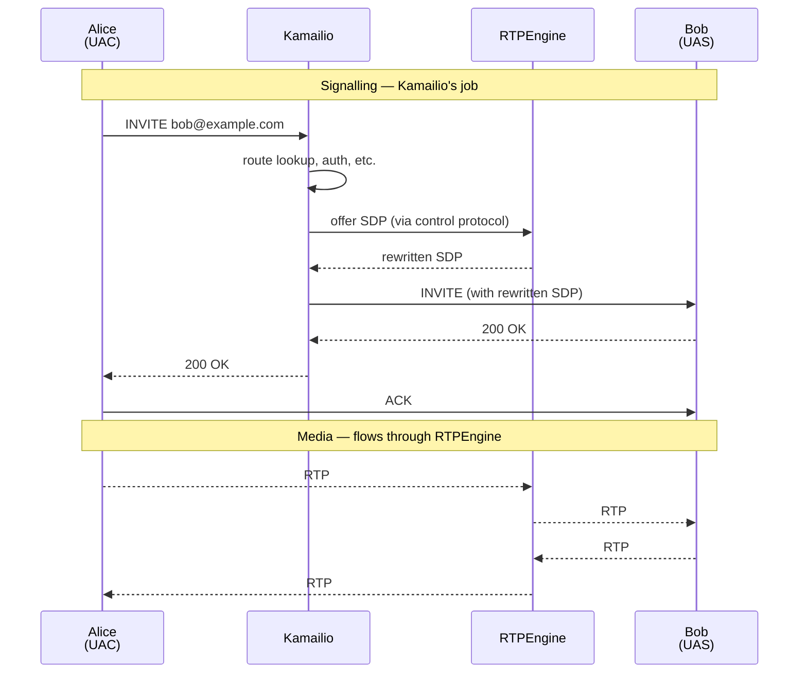

# 1.1 Introduction

> [!NOTE]
> If you only learn one thing from this chapter: **Kamailio is a SIP signalling server, not a media server.** Almost every architectural decision in the codebase follows from this one constraint.

## What Kamailio is

Kamailio is an open-source SIP server written in C, designed to handle the **signalling plane** of real-time communications at scale. It routes SIP messages — `INVITE`, `REGISTER`, `BYE`, and the rest — between user agents (phones, softphones, gateways, trunks) according to rules you express in its configuration language.

It is a load-bearing piece of telecom infrastructure for many operators. Production deployments comfortably handle **thousands of call setups per second** on commodity hardware, primarily because Kamailio's runtime is lean: a small core plus a swarm of loadable modules, all sharing memory across pre-forked worker processes.

## The signalling-vs-media split

This is the foundational mental model. Once you have it, the rest of the architecture stops looking arbitrary.



Kamailio touches **every SIP message** in the conversation but **zero RTP packets**. Media is delegated to a separate process — typically [RTPEngine](https://github.com/sipwise/rtpengine), which Kamailio controls via an out-of-band control protocol. This separation is what lets Kamailio scale: signalling is bursty and rule-heavy, media is steady and bandwidth-heavy, and the two have completely different performance profiles.

## A 30-second history

Kamailio's lineage explains a lot of the codebase's idiosyncrasies:

| Year | Event |
|------|-------|
| 2001 | **SER** (SIP Express Router) released by Fhg Fokus / iptel.org |
| 2005 | **OpenSER** forked from SER for community development |
| 2008 | OpenSER renamed to **Kamailio** (after a trademark dispute) |
| 2008 | A parallel project — **SIP-Router** — merges the SER and Kamailio codebases |
| 2012 | The merger completes: Kamailio and SER converge on a shared codebase |

You will still see references to `ser` and `kamailio` interchangeably in directory names, module APIs, and old documentation. They are the same project today.

## What it is good at

- **High-volume routing.** Stateless or stateful proxying of large SIP traffic with predictable latency.
- **Registration & location services.** Acting as a SIP registrar backed by a database, with hundreds of thousands of online contacts.
- **Load balancing & failover.** Distributing traffic across PBXes, media servers, or trunks via the `dispatcher` module.
- **WebRTC gateways.** SIP-over-WebSocket termination, often paired with RTPEngine for ICE/DTLS-SRTP.
- **Authentication & accounting.** Digest auth against a database, CDR generation, integration with billing systems.

## What it is not

- **Not a B2BUA by default.** Kamailio proxies messages; it does not by default originate or terminate dialogs (though modules like `uac` or `topos` change this).
- **Not a media server.** No transcoding, no RTP handling, no MoH out of the box.
- **Not a PBX.** No application logic for IVR, queues, voicemail — that's Asterisk's or FreeSWITCH's territory.
- **Not a turnkey product.** It is a toolkit. You write the routing logic. The reward for that effort is full control over every message.

## The mental model

Everything Kamailio does fits this pattern:

```
SIP message arrives  →  parsed and sanity-checked
                    →  enters the routing script (request_route)
                    →  routing script calls module functions
                    →  module functions decide: forward / reply / drop
                    →  message leaves (or doesn't)
```

The **routing script** is where the operator's intent lives. Everything else — modules, the transaction engine, the database layer, the transport layer — is machinery that the script orchestrates. The chapters that follow take that machinery apart, one piece at a time.

> [!TIP]
> The chapters that follow assume you've installed Kamailio at least once and watched it process a message. If you haven't, [the official quick-start](https://www.kamailio.org/wikidocs/) is faster than anything this handbook could write. Come back here when you want to know why what just happened, happened.

---

<p align="center">
  <a href="README.md">← Table of contents</a> · <em>Next: 2.1 Process model (coming)</em>
</p>
