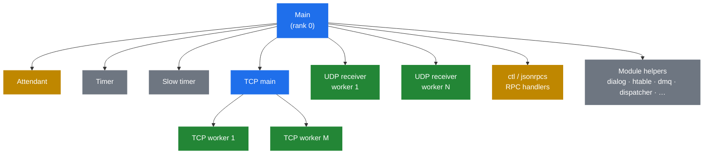

# 2.1 Process model

> [!IMPORTANT]
> Kamailio is a **multi-process** server, not a multi-threaded one. Every "Kamailio is doing X" statement really means "some specific process inside the Kamailio process group is doing X." Forgetting this is the single most common source of confusion when debugging.

## What you see when it's running

Run `ps -ef | grep kamailio` on a healthy box and you'll see something like a dozen processes, not one. They share the same binary and parent, and they cooperate via a region of **shared memory** mapped into all of them. A canonical layout looks like this:



Every box is a real OS process. Every one has its own PID. Every one has its own **rank** — an integer assigned at fork time that modules use for seeding RNGs, picking timer slots, and identifying themselves in logs.

## What each role does

**Main process.** Started by `kamailio` on the command line. It parses `kamailio.cfg`, allocates the shared-memory pool, forks all the children below, and then sits in a loop reaping dead workers via `SIGCHLD`. It does **not** process SIP traffic. If you `gdb` into it expecting to see message-handling code, you'll find a supervisor instead.

**Attendant.** A second supervisor-ish process that handles a subset of lifecycle signals — historically it dates back to SER and persists for legacy compatibility. You can mostly ignore it.

**UDP receiver workers.** The bulk of the SIP traffic-handling fleet. There are `children` of these per UDP listener (default: `8`). Each one sits in a tight loop:

```c
for (;;) {
    n = recvfrom(udp_sock, buf, ...);
    receive_msg(buf, n, &from);   // parse, run request_route, forward
}
```

That second call is where **everything** you wrote in `request_route` happens. One message → one worker → one full pass through the script → the message leaves (or is dropped). No handoff. No work-stealing. The worker is occupied for the entire duration.

**TCP main.** Listens on the TCP socket, accepts new connections, and hands the file descriptors to TCP workers. Splitting `accept()` from message processing is what lets Kamailio handle long-lived TCP/TLS connections without one worker getting stuck.

**TCP workers.** There are `tcp_children` of these (default: `4`). Each handles a set of connections, parsing incoming streams into SIP messages and running them through the same `receive_msg()` entry point as UDP workers. From the script's point of view, "where did this message arrive from?" is just a pseudo-variable lookup.

**Timer process** and **slow timer**. Wake up at regular intervals (default: every 1 second and every ~100 ms respectively) to drive timer-based modules. The transaction module's retransmission and timeout logic, `dialog`'s keepalive, `dispatcher`'s probing, `htable`'s expiry — they all live here. Two timers exist because slow tasks would starve fast ones if they shared a loop.

**ctl / jsonrpcs.** Listen on a UNIX socket (`/run/kamailio/kamailio_ctl`) and/or HTTP for RPC commands from `kamcmd` and other tools. They don't touch SIP — they read internal state, ask other workers to do things, and write back JSON or binrpc.

**Module helpers.** Many modules fork their own dedicated workers. `dialog` runs keepalive senders. `htable` runs an expiry sweep. `dmq` runs message receivers for peer instances. `dispatcher` runs probing for dead-gateway detection. Each of these is just another `fork()` from the main process, with a module-specific entry point.

## Why multi-process, not multi-threaded

This is a deliberate design choice, not laziness. The tradeoffs that matter:

| Multi-process (what Kamailio does) | Multi-threaded |
|---|---|
| Fault isolation — a segfault in one worker is logged and the worker is re-forked. The rest keep serving. | A segfault kills the entire server. |
| Simple memory model inside a process — no thread-safety boilerplate around per-message state. | Every variable that touches more than one thread needs locks or atomics. |
| Shared state lives in **one** explicit place (the shm pool) where the rules are obvious. | Shared state is anywhere any thread can reach. |
| Higher per-context-switch cost. | Cheaper context switches. |
| Per-process memory overhead. | Lower memory footprint. |

For a SIP signalling server — high-message-rate, low-per-message-CPU, latency-sensitive, must-not-crash — the first three rows are worth the cost of the last two. Telecoms have been burning multi-threaded SIP stacks since the early 2000s; Kamailio's model is what falls out when you decide "must run for years without restarts" is the hardest constraint.

## What this means for your script

Some practical consequences that catch people off guard:

> [!WARNING]
> **`$var(x)` is per-process, per-message.** It does not survive across workers. If worker 3 sets `$var(call_id)` and then worker 7 handles the next message in the same dialog, worker 7 sees nothing. To share state, you need shared memory: `$shv(...)`, `htable`, or a database.

- **You cannot rely on which worker handled the previous message.** The OS load-balances `recvfrom()` across blocked workers; there's no affinity.
- **A blocking call in your script blocks the whole worker.** That worker can't handle other messages until you return. This is why the async modules exist — `http_async_client`, `t_suspend` / `t_continue` (covered later in chapter 8.2).
- **Log lines are interleaved across workers.** Use `$pp` (process pid) or the rank to disambiguate.

## How many workers do you actually need

The honest answer: enough that a UDP `recvfrom` is never queued waiting for a free worker, but not so many that they thrash on shm locks. In practice:

- Start with `children=8` and `tcp_children=4` for moderate loads.
- Watch `kamcmd core.shmmem` and `kamcmd core.pkgmem all` under peak traffic.
- If you see `ps` showing UDP workers stuck in `recvfrom` while the queue grows, you need more.
- If workers are spending most of their time in lock contention, you need fewer.

The next chapter takes apart the memory architecture that makes all this cooperation possible.

---

<p markdown="1" align="center">
  [← Table of contents](../) · [← 1.1 Introduction](01-introduction.md) · [Next: 2.2 Memory architecture →](03-memory-architecture.md)
</p>
