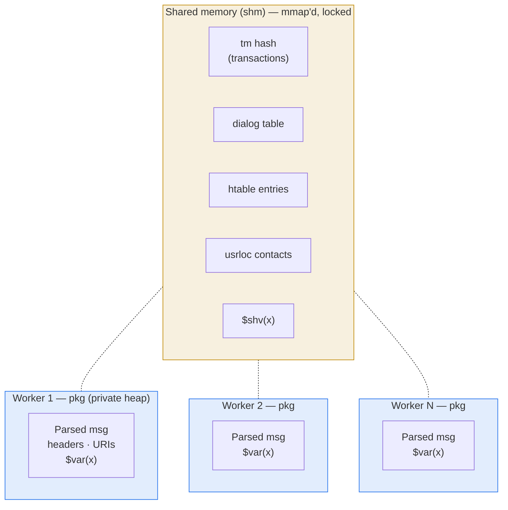

# 2.2 Memory architecture

> [!IMPORTANT]
> Kamailio has **two heaps**, not one. Mixing them up — freeing pkg-allocated memory with a shm function, holding pkg pointers across messages, sharing a struct between workers without putting it in shm — is the source of roughly half of all production crashes.

The two-heap model is forced by the [process model](02-process-model.md): if Kamailio is going to be N independent OS processes that need to cooperate on call state, **some** memory has to be reachable from all of them, and **some** memory should stay private so it doesn't need a lock every time you touch it.

## The two heaps



**`pkg` (package memory).** Each worker process has its own pkg heap, sized via the `-M <megabytes>` startup flag (default `8`). It's a private region — no other process can touch it, no locks are needed, allocations and frees are fast. This is where the **parsed SIP message**, all per-message scratch space, and your `$var(x)` script variables live. The whole heap is reused across messages: nothing in pkg survives the worker exiting, and even within a single worker, allocations from the previous message are freed before the next one starts.

**`shm` (shared memory).** A single `mmap()`'d region created by the main process at startup, before any forks. Sized via `-m <megabytes>` (default `64`). After fork, every child has the same region mapped at the same address, so a pointer into shm in one worker is valid in every other worker. **Every** allocation, free, and read/write in shm goes through a lock. This is where **anything that survives the worker boundary** has to live: transactions, dialogs, `htable` entries, the registrar's user location cache, `$shv` variables, dispatcher's gateway sets.

| | pkg | shm |
|---|---|---|
| Visible to | one worker | all workers |
| Lock needed | no | yes |
| Sized via | `-M MB` (per worker) | `-m MB` (total) |
| Lifetime | one message | until freed or process group exits |
| Allocate with | `pkg_malloc` / `pkg_free` | `shm_malloc` / `shm_free` |
| Holds | parsed message, script `$var`, transient parsing buffers | tm hash, dialog, htable, usrloc, `$shv` |

## Why a custom allocator (or several)

Kamailio doesn't use libc's `malloc` for either heap. The C source ships **multiple** allocator implementations — `q_malloc`, `f_malloc`, `tlsf_malloc`, and a couple of variants — chosen at compile time. Distros usually pick `q_malloc` or `f_malloc`.

There are three reasons it's worth the maintenance burden of a custom allocator:

1. **RPC introspection.** `kamcmd core.pkgmem` and `kamcmd core.shmmem` walk the heap and report fragmentation, free-list sizes, largest free block, who allocated what. With libc's `malloc` you'd be reading `/proc/<pid>/smaps` and guessing.
2. **Determinism for shm.** The shared-memory allocator has to be lockable in a way that's safe across processes (not just threads). libc's malloc isn't designed for that — its locks are intra-process.
3. **Fault containment.** A corruption in Kamailio's heap doesn't necessarily torch all of libc's data structures. A bad allocator is its own little blast radius.

You will sometimes see references to compiling with `-DDBG_QM_MALLOC` or similar — these enable per-allocation tracking so the allocator can tell you exactly which line of which file leaked, at the cost of significant overhead. Useful in dev, not in prod.

## Lifetime rules in practice

These are the rules that, if you get them wrong, will get you a segfault three days later under load:

> [!WARNING]
> **Anything you allocate in shm, you must free in shm.** Calling `pkg_free()` on a shm pointer corrupts both heaps. The C API has `shm_malloc`/`shm_free` and `pkg_malloc`/`pkg_free`; they are not interchangeable.

- **Per-message structures live in pkg.** When `request_route` exits, the parsed SIP message and everything hanging off it gets cleaned up. Don't stash pkg pointers in shm — by the time another worker reads them, they're pointing at garbage.
- **`$var(x)` is pkg-allocated, per-message.** It's freed when the route exits. (And per-process, see [the previous chapter](02-process-model.md#what-this-means-for-your-script).)
- **`$shv(x)` is shm-allocated.** It survives across messages and across workers, but every read and write takes a lock. Use it for things that need to be shared, not as a general-purpose variable.
- **`htable` entries are shm.** Setting an htable cell from one worker is visible to all the others. This is *the* mechanism people reach for when they want shared state without a database round-trip.
- **Transaction state (`tm`) is shm.** When `t_relay()` creates a transaction, the struct goes into a hash table in shm so that the reply (which may land on a different worker) can find it again.

## Sizing and observability

The two numbers you actually have to pick:

- **`-M <megabytes>`** — per-worker pkg heap. Default is small (8 MB). If you have lots of script complexity (long routes, many `$var(...)`, large bodies), bump this. Symptom of too-low pkg: `parse: out of memory` or `pv_get_var: cannot get pv value` errors.
- **`-m <megabytes>`** — total shm pool, shared across the whole instance. Default is conservative. Symptom of too-low shm: `shm_core_malloc: not enough free shm memory` and transactions failing to be created. This one fails *catastrophically* — under traffic, you can't make new calls.

Two RPC calls to keep in your back pocket:

```bash
kamcmd core.shmmem
# prints total / free / used / fragments / largest_free for the shm pool

kamcmd core.pkgmem all
# walks every worker's pkg heap and prints the same per-process
```

In production, alert on `free < 20%` for either pool, and definitely alert on `largest_free` falling below the size of a typical allocation — that's fragmentation eating you alive even though there's "plenty of memory left."

## Why this design wins

The combination — small private heap per worker plus one bounded shm region that everyone shares — has properties that matter for a SIP server:

- **You can predict memory use.** The total RSS is bounded by `(N_workers × pkg_size) + shm_size`. It does not grow with traffic.
- **Memory leaks are localised.** A bug in a worker's per-message code leaks pkg, which gets reaped when that one worker is restarted. A leak in shm is global but inspectable, and `kamcmd` will show you which allocator caller is responsible.
- **Cross-worker state is impossible to fake.** You cannot accidentally share state by leaving a pointer lying around — if it's not in shm, another worker literally cannot see it. The discipline is enforced by the architecture, not by convention.

The next chapter covers the concurrency primitives — locks, atomics — that make shm safe to share.

---

<p align="center">
  <a href="./">← Table of contents</a> · <a href="02-process-model.md">← 2.1 Process model</a> · <a href="04-concurrency.md">Next: 2.3 Concurrency primitives →</a>
</p>
