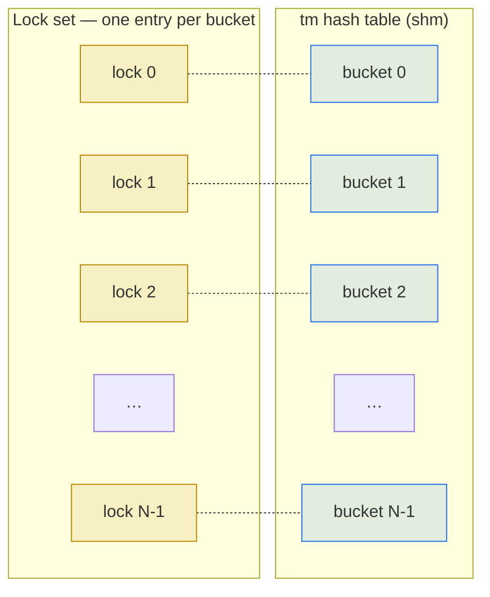

# 2.3 Concurrency primitives

> [!NOTE]
> Kamailio has no threads, so it doesn't need thread-safe code. What it does need is **inter-process** synchronisation: workers reaching into the same shm region from different OS processes, racing on the same data structure. The primitives below are the toolkit that makes that safe.

## What synchronisation buys, and what it costs

Anything in shm that more than one worker can touch needs a lock. Without one, two workers can read a structure, both decide to modify it, and write back — with one update silently lost. With a lock around the modification, the second worker waits for the first to finish, sees the post-update state, and reacts correctly.

The cost is real. Locks serialise. If you put one lock around the whole transaction hash and a hundred workers all want to insert a transaction, ninety-nine of them are blocked on a single mutex. Throughput collapses. So the rules-of-thumb that shape Kamailio's internals are:

1. **Hold locks for as little time as possible.** Take, modify, release.
2. **Don't take locks you don't need.** Atomic operations beat full locks for simple counters.
3. **Shard the lock.** One mutex per hash bucket beats one mutex per hash table.

## The lock API

The C API is small enough to fit on a napkin:

```c
gen_lock_t *lock_alloc(void);          // allocate a lock in shm
gen_lock_t *lock_init(gen_lock_t *l);  // initialise it
void        lock_get(gen_lock_t *l);   // acquire (blocking)
int         lock_try(gen_lock_t *l);   // acquire (non-blocking)
void        lock_release(gen_lock_t *l);
void        lock_destroy(gen_lock_t *l);
void        lock_dealloc(gen_lock_t *l);
```

Plus an array variant:

```c
gen_lock_set_t *lock_set_alloc(int n);
void            lock_set_get(gen_lock_set_t *s, int i);
void            lock_set_release(gen_lock_set_t *s, int i);
```

> [!WARNING]
> **These locks are not recursive.** Calling `lock_get()` twice from the same process on the same lock deadlocks immediately. Module code uses a strict take-modify-release pattern, often with `goto cleanup` to ensure release on every exit path.

## What backs the lock

The implementation is chosen at compile time. The candidates:

- **Fast lock (`USE_FAST_LOCK`).** Hand-written assembly using x86 `cmpxchg` (or the equivalent on other architectures) for a futex-like spinlock. This is the default on Linux and the fastest option. The lock state is a single byte in shm; contention is resolved by spinning briefly and then sleeping via `futex(2)`.
- **POSIX semaphores (`USE_POSIX_SEM`).** Portable, kernel-mediated, more expensive per acquire.
- **SysV semaphores (`USE_SYSV_SEM`).** Older interface, has hard kernel limits on count, mostly kept for compatibility.

`fast lock` is what virtually every production build uses. The other backends exist for platforms where the inline assembly isn't available or where the operator has a specific reason to want a kernel-mediated primitive.

## Per-bucket locking — the pattern that matters most

The transaction module's hash table is the canonical example. Conceptually it's "one hash table for all in-flight transactions." Naively, that needs one lock around the whole thing. Kamailio shards it instead:



To insert a transaction, a worker hashes the call-id, picks the bucket, takes **only that bucket's lock**, mutates the bucket's linked list, and releases. Two workers inserting transactions whose call-ids hash to different buckets never block each other. With a typical bucket count of `1024` (configurable via `hash_size`), the effective concurrency is `min(1024, N_workers)` — enough that lock contention disappears from profiling traces under normal load.

The dialog, usrloc, and htable modules use the same pattern with their own hash tables and lock sets. When you read the source and see `lock_set_get(_set, hash & mask)` near every modification — that's the per-bucket pattern at work.

## Atomic operations

For things that don't need protection from racing writers — just consistent reads of a single integer — Kamailio uses atomic primitives instead of locks. The API:

```c
void atomic_set(atomic_t *v, int i);
int  atomic_get(atomic_t *v);
void atomic_inc(atomic_t *v);
void atomic_dec(atomic_t *v);
int  atomic_inc_and_test(atomic_t *v);  // returns nonzero if result is 0
int  atomic_dec_and_test(atomic_t *v);
int  atomic_cmpxchg(atomic_t *v, int old, int new);
```

These are the right tool for reference counts, "is this thing still live" flags, and any cheap state that doesn't carry a structural invariant. `t->ref_count` in `tm` and the `dlg->ref` count in `dialog` are atomic — multiple workers can increment and decrement them without ever taking a lock, and the structure is freed when the count hits zero (typically via `atomic_dec_and_test`).

## Where this breaks down

Locking is correct by default, but two failure modes recur:

> [!WARNING]
> **Deadlock from ordered acquisition.** If module A always takes lock X then lock Y, and module B takes Y then X, and both meet at the wrong moment, they wait on each other forever. Kamailio's defence is convention, not enforcement: locks have a documented acquisition order. When you mix modules that don't follow it, you can deadlock under load and not in tests.

- **Lock contention masquerading as slowness.** If a single bucket is hot — say, every `INVITE` updates the same htable cell — you'll see high CPU usage and high latency but **low** throughput. The fix is usually to shard further (more buckets, finer-grained keys), not to throw cores at it.
- **Forgotten release on error paths.** Module code that takes a lock and then returns early due to an error leaves the lock held forever. `goto release_and_return` patterns and disciplined cleanup are the only protection — there's no RAII in C.

## What the operator can see

Production diagnostics for lock contention are mostly indirect. The signals to watch:

- **CPU time in kernel mode climbing** while throughput plateaus — workers blocked in `futex(2)` show up here.
- **`perf top` on a Kamailio process** showing time in `lock_get` / `lock_set_get` — direct evidence of contention.
- **Latency under load increasing** while individual route execution time (when measured in isolation) stays flat — symptom of waiting at lock acquisition.

There is no `kamcmd lock.stats` to make this visible directly. Lock contention is the kind of problem you find with system tools — `perf`, `bpftrace`, `strace -c` — rather than with Kamailio's RPC.

The next chapter covers the runtime's lifecycle — startup, reload, shutdown — which is where most of these primitives are first initialised and last torn down.

---

<p markdown="1" align="center">
  [← Table of contents](../) · [← 2.2 Memory architecture](03-memory-architecture.md) · [Next: 2.4 Lifecycle →](05-lifecycle.md)
</p>
