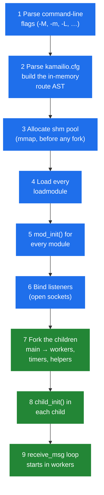

# 2.4 Lifecycle

> [!NOTE]
> Kamailio has three lifecycle events that matter to the operator: **startup**, **runtime configuration reload**, and **shutdown**. Each is more nuanced than it looks, and getting any of them wrong is the difference between a service that survives years between restarts and one that drops calls every Tuesday.

## Startup, in order

When you run `kamailio -f /etc/kamailio/kamailio.cfg`, what happens isn't "the daemon starts." It's a carefully ordered sequence that has to finish *before* the first SIP message arrives:



Two things in this sequence are load-bearing:

**`mod_init()` runs once, in the main process, before fork.** Every loaded module gets a chance to allocate shm structures, register RPC commands, set up timers, and parse its own config parameters. After this point, the **memory layout of the entire instance is fixed** — every shm allocation that the module will ever do has been counted. The shm pool sized via `-m` has to accommodate all of it plus the runtime workload. If `mod_init()` fails — usually because shm is too small or a config parameter is malformed — the whole startup aborts and you never reach fork.

**`child_init()` runs once per child, after fork.** This is where modules open per-process resources: database connections, file descriptors, anything that can't be shared across processes. The argument is the child's *rank* — modules use it to do work in exactly one child (`if (rank == PROC_MAIN) { ... }`) or to evenly partition work across children.

The order matters because of two invariants:

1. **shm is allocated before any fork.** This is what makes the same pointer valid in every process — they all inherit the same mapped region from main. Allocating shm *after* fork would give each child its own copy. Modules know this; they do all their shm work in `mod_init()`.
2. **Sockets are bound before fork.** All children inherit the same listening socket file descriptors and call `recvfrom()` on them. The kernel load-balances incoming packets across whichever child is currently blocked in the system call. No userspace dispatcher needed.

> [!TIP]
> If you see `kamailio` start, log a few lines, then exit silently — it's almost always shm exhaustion during `mod_init()`. Bump `-m` and try again. The error message ends up in stderr or syslog, not in the main log; the main log isn't open yet at that point.

## Runtime reload — what you can and can't change

The bad news: **you cannot reload `kamailio.cfg` while Kamailio is running.** The routing script is parsed once at startup, compiled into an AST, and the AST is what every worker executes. Changing the cfg file on disk and signalling Kamailio does nothing useful. To pick up cfg changes, you restart.

The good news: a lot of what looks like "config" actually isn't. There are three runtime-mutable axes:

**Module parameters (some of them).** Many module parameters are declared `MODULE_PARAM_USE_FUNC` or read at every function invocation, which means you can change them via RPC:

```bash
kamcmd cfg.set_now_int dispatcher gw_priority 5
kamcmd cfg.get_now_int dispatcher gw_priority
```

The `cfg.` family — `cfg.set_now_int`, `cfg.set_now_str`, `cfg.commit`, `cfg.rollback` — exposes the runtime-mutable subset. Whether a given parameter is in that subset is up to the module's author. `kamcmd cfg.help <module>` lists the candidates for a given module.

**Module-managed tables.** `dispatcher`'s gateway list, `permissions`' rules, `dialplan`'s number rewrites, `htable`'s entries, `usrloc`'s contacts — these all live in shm and have RPC commands to reload from DB or modify directly:

```bash
kamcmd dispatcher.reload          # re-read the dispatcher table from DB
kamcmd htable.dump my_table       # inspect htable contents
kamcmd permissions.addressReload  # reload permissions
```

These are the operational "hot-reload" surface — most production changes happen here, not in `kamailio.cfg`.

**Logging level.** `kamcmd log.level <N>` changes the runtime log level globally. The value can be negative (less verbose) or large (debug noise). Useful for catching transient issues without restarting.

What you **cannot** change without a restart:
- The number of UDP/TCP workers.
- The shm or pkg sizes.
- The set of loaded modules.
- The routing script (`request_route`, `branch_route`, etc.).
- Listeners — adding a new IP or port.

For all of those, you need a full restart, which means dropping in-flight UDP transactions and TCP connections.

## Graceful shutdown

Send `SIGTERM` to the main process. What happens next:

1. Main propagates `SIGTERM` to every child.
2. Every worker breaks out of its `recvfrom` loop after the current message is done — **but not before**. A worker that is mid-route, holding a lock, waiting on a database query, will finish that route before exiting.
3. The `destroy()` function of every module runs in the main process. This is where modules flush in-memory state to the database (most importantly `usrloc`, which syncs the in-memory contact cache to the `location` table so registrations survive the restart) and free shm.
4. Main process exits.

The whole sequence typically takes 1–3 seconds on an idle box, longer if there's an in-progress route that's blocked on a slow call (HTTP, database). The shutdown timeout is bounded by `tcp_wait_data` and the `db_*` timeouts of whatever module is taking its time.

> [!WARNING]
> **`SIGKILL` (`kill -9`) is destructive.** It bypasses the destroy hooks. `usrloc`'s in-memory contacts that haven't yet been flushed to DB will be lost — every registered user effectively has to re-REGISTER after the restart. In production, only use it as a last resort, and reserve `SIGTERM` for normal restarts.

`SIGINT` (Ctrl-C in foreground) behaves like `SIGTERM` and triggers the same graceful path. `SIGUSR1` historically dumped memory state but the modern way is `kamcmd core.shmmem` instead.

## Crash recovery (informal)

What happens when **one** worker crashes — segfault, abort, OOM-killed:

- The kernel sends `SIGCHLD` to main with the child's exit status.
- Main's signal handler logs the death (`child process N exited normally|by signal`).
- For workers that are part of the core message-handling fleet (UDP, TCP, timer), main **re-forks a replacement**. The new worker re-runs `child_init()` and joins the pool.
- For module-helper workers (e.g., a `dialog` keepalive sender), the behaviour depends on the module — many do not re-spawn, and the missing helper just stays missing until restart.

This is what makes Kamailio "feel" resilient: a single bad message that segfaults one worker doesn't take down the service. The other N-1 workers keep processing, the dead one is replaced, log lines get written, and you find out at on-call review on Monday.

> [!IMPORTANT]
> A repeated worker crash (every few seconds) is the **worst kind of failure** because the service "is up" — the main process is alive, the listener is bound, telemetry says traffic is flowing — but every Nth message is dropped because the worker that picked it up died before forwarding. Monitor `SIGCHLD` rate, not just process aliveness.

The next part of the handbook moves out of the runtime and into the SIP message lifecycle — what happens between a packet hitting the socket and a routing-script function being called.

---

<p align="center">
  <a href="./">← Table of contents</a> · <a href="04-concurrency.md">← 2.3 Concurrency primitives</a> · <em>Next: 3.1 Reception (coming)</em>
</p>
