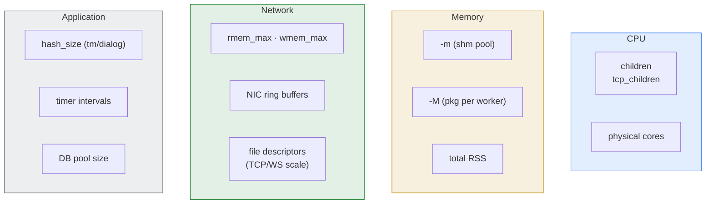

# 2.5 Sizing & tuning for traffic patterns

> [!IMPORTANT]
> No two Kamailio deployments need the same numbers. A 100k-user registrar and a 100k-call/sec stateless proxy can run on the same hardware but with completely different `children`, `-m`, `-M`, and kernel-side tuning. This chapter is about reading your traffic and choosing accordingly — not about a magic recipe.

The four chapters before this one explain *how* Kamailio works internally. This one is about turning that understanding into operational defaults: how many workers, how much memory, what kernel knobs, and how those decisions shift per traffic pattern.

## The dimensions you actually tune



Each of these knobs maps to something in the architecture chapters: `children` to the process model, `-m`/`-M` to the memory architecture, `hash_size` to the per-bucket concurrency pattern. The right number for each depends on which knob is your bottleneck — and the only way to know is to look.

## Starting baselines (then measure)

Treat the numbers below as defaults you start from and walk away from once telemetry shows you what's really going on.

| Knob | Default | Bump when… |
|---|---|---|
| `children=8` (UDP workers per listener) | 8 | UDP `recvfrom` queue is backed up under load |
| `tcp_children=4` | 4 | TCP/WS connection count grows; reads stall |
| `-M 8` (MB pkg per worker) | 8 | script logs `out of memory` on parsing |
| `-m 64` (MB total shm) | 64 | `kamcmd core.shmmem` shows `free < 30%` at peak |
| `hash_size=1024` for `tm`, `dialog`, `htable`, `usrloc` | 1024 | concurrent calls / users far exceed this and lock contention shows in `perf` |
| `tcp_max_connections=2048` | 2048 | WebSocket / TCP-heavy workloads |
| `tcp_connection_lifetime=120` (sec) | 120 | want longer idle keepalive |

## Pattern 1 — Stateless proxy

**Shape of traffic.** High request rate. Small messages. Mostly `INVITE`/`REGISTER` getting forwarded after a routing decision. Optionally retransmission-handling via `tm` but no per-call state held.

**What dominates the cost.**
- CPU — every packet parses, runs the route, forwards.
- Network packet rate (PPS), not bandwidth.
- Almost zero shm growth per call.

**Sizing.**
- `children = 2 × cores`, up to ~32. Stateless workers spend most of their time in the route, not blocked, so more workers translates almost directly to more PPS.
- `-M 8` (default fine — no transactions held).
- `-m 64–128` is plenty unless you also run modules like `dispatcher` with large tables.
- Tune kernel UDP buffers: `net.core.rmem_max = 16777216`, `net.core.wmem_max = 16777216`. With high PPS, the default 256 KB UDP receive buffer is the most common cause of "drops we can't explain."

**What kills you.**
- `recvfrom` drops at the kernel level if the worker pool can't keep up — increase `children` and/or kernel buffers.
- Slow DNS lookups inside the route: even one bad upstream lookup can park a worker for seconds. Use `cache` modules or pre-resolved IPs.

## Pattern 2 — Registrar server

**Shape of traffic.** Mostly `REGISTER` with steady refresh cadence (typically every 30–600 s). Modest in-flight transaction count but a huge static state: every active contact lives in `usrloc`.

**What dominates the cost.**
- shm size — `usrloc` cache scales linearly with online contacts. Plan ~500 B per contact as a rough heuristic.
- Database writes if you've configured `usrloc` with synchronous DB mode (avoid in scale; use `db_mode=1` with periodic flushes).
- Spike load during *re-registration storms* — when an upstream peer fails, every device may re-REGISTER within seconds.

**Sizing.**
- `children = cores`, maybe a bit less. Workers spend less time per message than a stateless proxy.
- `-m` sized for `peak_contacts × 600 B × 2` (the 2× is headroom for fragmentation and tm transactions in flight). For 100 k contacts → ~120 MB → use `-m 256` or higher.
- `usrloc` `hash_size` should be at least `peak_contacts / 10` so buckets stay short — for 100 k contacts, `hash_size=16384` is reasonable.
- Set `usrloc` `db_mode=1` (write-back) and flush periodically rather than per-REGISTER.

**What kills you.**
- shm exhaustion when a DB sync fails and the in-memory cache grows unchecked — alert on `kamcmd ul.dump` count vs DB row count divergence.
- Re-registration storms after upstream failover — consider rate-limiting via `pike` or randomised registration intervals on UAC config.

## Pattern 3 — Stateful proxy / call routing

**Shape of traffic.** `INVITE`/`BYE` flows with full transactions tracked by `tm`, often `dialog` to follow calls end-to-end. Per-call state lives in shm from `INVITE` until either the call ends or the dialog timer expires.

**What dominates the cost.**
- shm per concurrent call — `tm` + `dialog` together cost roughly 5–10 KB per call. Plan accordingly.
- Transaction hash contention if `hash_size` is too low for the call rate.
- Database lookups on call setup (auth, accounting).

**Sizing.**
- `children = 2 × cores` is a reasonable start. Calls touch more code than stateless forwarding, so per-message CPU is higher.
- `-m` for `peak_concurrent_calls × 10 KB × 2`. 10 k concurrent calls → ~200 MB → use `-m 512` or `1024`.
- `tm hash_size = 4096` or higher for high call rates. The default 1024 hits per-bucket contention around 50 k transactions/sec.
- Database pool size (per-module DB connections × number of workers) should be sized so you don't queue: at least `children` connections in the pool.

**What kills you.**
- Long-running routes due to slow DB queries — use timeouts and async modules.
- shm fragmentation when concurrent call count fluctuates wildly — monitor `largest_free` block, not just `free`.

## Pattern 4 — WebSocket / WebRTC gateway

**Shape of traffic.** Tens of thousands of long-lived TCP/TLS connections, modest per-connection message rate, paired with RTPEngine for media.

**What dominates the cost.**
- File descriptors — every connection is one FD plus kernel-side TCP state.
- TCP main and tcp_children scheduling — TCP worker count limits how fast you can drain busy connections.
- TLS handshake CPU during connection storms.

**Sizing.**
- `tcp_children = 2 × cores` if WS is the dominant traffic. WS reads need a worker per connection burst.
- `tcp_max_connections` set to the peak connection count + headroom.
- `ulimit -n` must be set above `tcp_max_connections + children + DB pool + slack`. 65535 is the common floor.
- `tls_max_connections` mirror `tcp_max_connections` if all are TLS.
- Increase `tcp_connection_lifetime` if your UAs send WS keepalives less frequently than the default 2 minutes.
- For high TLS handshake rates, pin TLS workers to specific cores and enable session resumption.

**What kills you.**
- `EMFILE: too many open files` — first thing to check is `ulimit -n` and `tcp_max_connections`.
- TCP main becoming the bottleneck if connection accept rate is huge; this is rare but happens with WebRTC sign-up storms.

## How to measure, not guess

Three commands you should be running before you change any sizing knob:

```bash
kamcmd core.shmmem          # total / free / largest_free / fragments
kamcmd core.pkgmem all      # per-worker pkg state
kamcmd tm.stats             # transactions in flight, per-bucket depth
```

Plus from the OS side:

```bash
ss -lntu                    # listen socket queue depths
ss -tan state established | wc -l   # active TCP connections
perf top -p $(pgrep -f kamailio | head -1)   # where the workers are spending CPU
```

> [!TIP]
> **The single most useful operational metric is `largest_free` in `core.shmmem`.** Total `free` can stay healthy while `largest_free` collapses due to fragmentation. When `largest_free` drops below the size of a typical shm allocation, the next big alloc fails even though "there's plenty of memory left." Alert on this, not on `free`.

## Tuning workflow

1. **Set defaults.** Start from the table at the top of this chapter. Don't over-engineer the first deployment.
2. **Drive realistic load.** Use [SIPp](https://github.com/SIPp/sipp) or capture-replay from production. Synthetic load patterns mislead.
3. **Look at four things.** CPU (`top`/`perf`), shm (`kamcmd core.shmmem`), pkg (`kamcmd core.pkgmem all`), and message rate at the listener (`ss -lntu` or per-listener counters).
4. **Change one knob at a time.** If you double `children` and add 1 GB of shm and bump `hash_size` simultaneously, you can't tell which fixed the problem.
5. **Re-baseline after every meaningful traffic-shape change.** A registrar with 10 k users and a registrar with 100 k users want different numbers, even with everything else identical.

The kernel-side tuning that pays off across all patterns is small: increase UDP buffer sizes for high PPS, increase `ulimit -n` for TCP-heavy workloads, and consider `net.core.netdev_max_backlog` on hosts that see traffic bursts. Everything else is workload-specific.

---

<p align="center">
  <a href="./">← Table of contents</a> · <a href="05-lifecycle.md">← 2.4 Lifecycle</a> · <a href="07-reception.md">Next: 3.1 Reception →</a>
</p>
