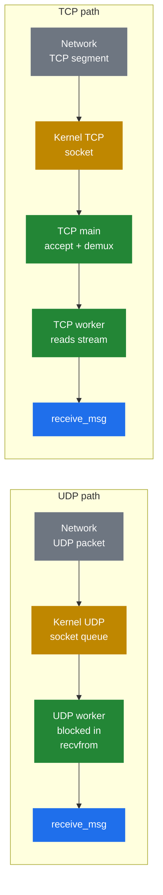

# 3.1 Reception

> [!NOTE]
> Reception is the cheapest, most boring part of the SIP lifecycle — and intentionally so. The interesting work starts in the next chapter; reception's only job is to get bytes off the wire into pkg memory and hand them to `receive_msg()`.

## The two paths in

A SIP message can arrive in two shapes, and Kamailio treats them differently up to the point where they meet.

Both paths converge on **`receive_msg(buf, len, source)`** in the core. After that point, the transport is irrelevant — the routing engine, the modules, the script all see the same struct.

## UDP — the simple case

UDP is the bulk of SIP traffic and is intentionally the simplest path. Each UDP worker sits in a `recvfrom()` call, blocked. The kernel maintains a queue of incoming packets per socket. When a packet arrives, the kernel picks **whichever worker is currently blocked** and wakes it. The worker copies the packet into its private pkg buffer, records the source address, and calls `receive_msg()`.

A few details that matter:

- **All workers `recvfrom()` on the same socket.** They're competing for the wakeup. This is what gives Kamailio its zero-overhead load balancing — the kernel does the work of distributing packets across N workers, with no userspace coordinator and no contention except whatever the kernel's UDP layer itself does.
- **One UDP packet is one SIP message.** SIP-over-UDP defines a one-message-per-datagram framing, so there is no parser-side work to find message boundaries. The packet's size is the message's size.
- **The packet is opaque until parsing.** At this point Kamailio has a `(buffer, length, source_addr)` triple in pkg, and that's all. No header has been read, no fields extracted, no struct populated. It's just bytes.
- **The worker is now committed.** From `recvfrom()` returning until `receive_msg()` returns, this worker is busy with this one message. It cannot pick up another packet from the queue. If your script takes 50 ms to run, this worker can handle at most 20 messages per second by itself.

## TCP — the complicated case

TCP is harder because the framing is wrong for SIP. TCP is a byte stream, not a record protocol — there is no concept of "one TCP segment = one message." The kernel may deliver one SIP message in three reads, or three SIP messages in one read, depending on how it segmented and reassembled the stream.

Kamailio splits TCP across two process roles:

**TCP main** owns the listening socket. It calls `accept()` to bring new connections in, then hands each new connection's file descriptor to a TCP worker. It also handles incoming activity on existing connections by waking the right worker when the kernel signals that data is readable.

**TCP workers** own the file descriptors that TCP main hands them. Each maintains a per-connection read buffer. When data is available, it `read()`s into the buffer and runs the SIP-over-TCP framing parser: read the headers until a blank line, find the `Content-Length`, accumulate that many body bytes, then declare "this is a complete message" and call `receive_msg()`.

Several things follow from this design:

- **A slow connection occupies a worker.** If a peer trickles a message in slowly, the TCP worker handling that connection has to keep its buffer alive and re-read on every kernel wakeup. It can't simultaneously handle other connections' message boundaries — though it can process several connections' completed messages serially.
- **Half-closed and idle connections cost memory but not CPU.** A connection with no inbound data is just a file descriptor sitting in TCP main's epoll set. The cost is a small struct per connection plus the kernel's TCP control block. This is why Kamailio can hold tens of thousands of registered WebSocket clients on a few workers.
- **TLS is a TCP variant.** From the worker's POV, TLS is just TCP after the OpenSSL layer has decrypted. Reception is identical, only the read path goes through `SSL_read()` instead of `read()`. The TLS module handles the handshake on connection setup.
- **WebSocket is a TCP variant too.** A WebSocket connection is upgraded from HTTP, then becomes a frame-oriented transport that the `websocket` module decodes back into SIP messages. Same convergence at `receive_msg()`.

## What `receive_msg()` actually does

Once `receive_msg(buf, len, source)` is called — regardless of transport — the worker is firmly inside Kamailio's domain:

1. **Allocate a fresh `struct sip_msg` in pkg**, point its `buf` field at the received bytes.
2. **Run the first-pass parser** — just enough to know the message is well-formed and what method/response it is. This is *not* a full parse; that's the next chapter's topic.
3. **Initialise the lump list to empty.** Future mutations will hang off the `sip_msg`.
4. **Enter the appropriate route** — `request_route` for requests, `onreply_route` for responses.
5. **When the route returns, free the entire `sip_msg`** and everything dangling off it. The pkg heap is essentially reset for the next message.

The cleanup at step 5 is what makes pkg's per-message lifetime work. The worker doesn't have to track every allocation it did during the route; the whole pkg arena is recycled in one operation.

> [!IMPORTANT]
> If your script causes a worker to spend a long time inside `receive_msg()` — slow database queries, blocking HTTP calls, expensive parsing — that worker is **unavailable** for the entire duration. The kernel may still be queuing packets for it, but they're sitting in the socket buffer until the worker returns. This is why the async modules exist: to release the worker while waiting on external I/O.

The next chapter takes the `struct sip_msg` apart — what the parser actually populates, what it leaves for later, and how lazy parsing makes the common path fast.

---

  [← Table of contents](../) · [← 2.5 Sizing &amp; tuning](06-sizing-and-tuning.md) · [Next: 3.2 The parsed message →](08-parsed-message.md)

