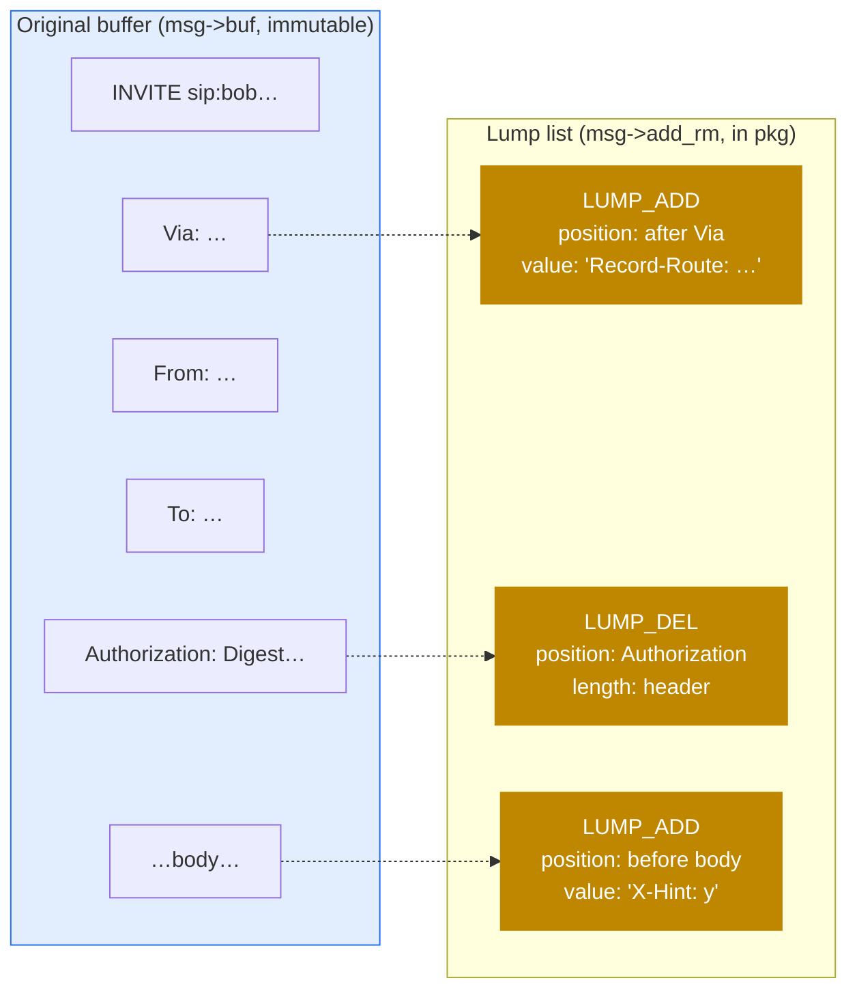

# 3.3 Lumps — queued mutations

> [!IMPORTANT]
> When your script says "remove the `Authorization` header" or "insert a `Record-Route`" — **the message buffer is not modified.** What happens instead is that a small descriptor (a "lump") is added to a list, and the entire list is applied in one pass when the message is finally forwarded. This is the central trick that lets Kamailio modify messages cheaply: many edits, one buffer rewrite.

## The problem

The previous chapter ended on a constraint: after parsing, **dozens of cached pointers** scattered across the `sip_msg` and module state all point into `msg->buf`. If a route says "delete the From-tag" and Kamailio actually does `memmove()` on the buffer to remove those bytes, every one of those pointers becomes either stale or wrong.

The naive alternatives:

- **Copy the buffer on every edit.** A route that makes 10 modifications copies the buffer 10 times. Quadratic in the number of edits. Death at scale.
- **Track every cached pointer and adjust.** Requires every module to register its pointers. Brittle, error-prone, and doesn't survive new modules being added.

Kamailio picks neither. It picks: **defer the edits.**

## What a lump is

A lump is a small descriptor of "an edit that's going to happen, eventually." The data structure is roughly:

```c
struct lump {
    unsigned int op;       // LUMP_ADD, LUMP_DEL, LUMP_NOP
    unsigned int type;     // header / body / URI / SDP / etc.
    int          u_off;    // offset into msg->buf where this lump applies
    int          len;      // for deletions: how many bytes to remove
    str          value;    // for additions: the bytes to insert
    struct lump *before;   // chain of lumps inserted before this one
    struct lump *after;    // chain of lumps inserted after this one
    struct lump *next;     // next lump in the message's list
};
```

Two operations exist:

- **Add content** — specified by a position in the original buffer and a value. The value can be a static byte string or a special marker resolved at send time (e.g. the IP of the outgoing socket, which isn't known until forwarding). This is how `Record-Route`, `Via`, and most header-addition operations work.
- **Remove content** — specified by a position and a length. The bytes between `u_off` and `u_off + len` will be skipped when the outgoing message is reconstructed.

There are two **classes** of lumps, separated because they have different lifecycles:

| Class | Purpose | Source files |
|---|---|---|
| **Message lumps** (`msg->add_rm`) | Mutations to the message being forwarded. Both add and remove. | `data_lump.c`, `data_lump.h` |
| **Reply lumps** (`msg->reply_lump`) | Content to inject into the reply that this request will trigger. Add only — replies are constructed from scratch, there's nothing to remove. | `data_lump_rpl.c`, `data_lump_rpl.h` |

When you call `t_reply()` with extra headers, those go into `reply_lump`. When you call `append_hf()` on a request, that goes into `add_rm`. They are *not* the same list.

## How the list works



Lumps are added through a small set of API functions:

```c
insert_new_lump_after(after, value, len, type);   // queue ADD
insert_new_lump_before(before, value, len, type); // queue ADD
del_lump(msg, offset, len, type);                 // queue DEL
anchor_lump(msg, offset, len, type);              // queue NOP as an anchor
```

`anchor_lump()` is subtle: it creates a no-op lump at a specific position so that *other* lumps can attach themselves before or after it. This is how a module that wants to insert a chain of headers does it: anchor at the position, then `insert_new_lump_after()` repeatedly to chain.

The result is a tree-of-lists structure. A linked list of lumps in buffer order, and each lump can have its own `before` and `after` chains for things that should be inserted immediately around it.

## Application — what happens on send

When `forward_request()` (or its equivalent) finally needs to put bytes on the wire, it runs the **lump applier**. The applier walks the original buffer linearly, consulting the lump list. At each position:

- If no lump applies, copy the byte to the output.
- If an ADD lump anchored here, emit its value first.
- If a DEL lump anchored here, skip ahead by `len` bytes.

Special markers in ADD values are resolved at this point — the `received` parameter for Via, the IP of the chosen outgoing socket for Record-Route, the branch-id for the new transaction. These are why the marker mechanism exists: at script-runtime, Kamailio may not yet know which interface will be used (RFC 3261 / DNS / DSCP rules), but at send-time it does.

The cost of applying lumps is `O(buf_size + sum of insertion sizes)`. Compare to the naive `O(buf_size × N_edits)` of in-place mutation. For a message that has 5 inserts of a few dozen bytes each, that's a few hundred bytes of work, not a few kilobytes.

> [!TIP]
> Bidirectional traversal of the lump list is what makes inserting a header "after Record-Route" and a header "after the inserted Record-Route" both work cheaply: the second `insert_new_lump_after()` attaches to the first lump's `after` chain, not to the buffer position.

## The gotcha every developer hits eventually

The most famous consequence of the lump system is this:

> [!WARNING]
> If your script does `remove_hf("Authorization")` and then immediately tests `if (is_present_hf("Authorization"))`, **the test returns true.** Because the buffer hasn't actually changed — only a lump was queued. The header is still sitting in `msg->buf` and the parsed pointer is still there. The "removal" only manifests in the forwarded message.

This is not a bug; it's the architecture. The script is operating on a description of what the *outgoing* message should look like, not on a mutable copy of the incoming one. The asipto devel guide calls this out as "one of the most discussed issues" precisely because it surprises people.

The escape hatch is `msg_apply_changes()` from the `textopsx` module:

```kamailio
remove_hf("Authorization");
msg_apply_changes();        # apply pending lumps now, rebuild msg->buf
if (is_present_hf("Authorization")) { ... }    # now this works as expected
```

`msg_apply_changes()` walks the lump list, builds a new buffer with all mutations applied, reparses headers from the new buffer, and points `msg->buf` at it. It's expensive — it does *exactly* the work that the lump system was designed to avoid — so use it sparingly, only when downstream script logic genuinely needs to see post-mutation state.

## Branching — when one message gets sent multiple places

Stateful forwarding (via `tm`) often forks a request to multiple branches (parallel call to several phones, for example). Each branch may want its own mutations — different Record-Route, different headers — without affecting siblings.

`tm` handles this by **cloning the lump list per branch**. The original `msg->add_rm` list is the "shared" set; per-branch lumps live in the transaction's branch struct. When a branch's outgoing message is constructed, the applier walks the original buffer with the shared lumps **and** the branch's lumps merged. This way a Record-Route inserted in `request_route` is on every branch, but a header inserted in `branch_route[1]` is only on branch 1.

## Why this is *the* speed trick

A SIP proxy that touches every message with a handful of header mutations would be very slow on a naive implementation — each forward would copy the buffer, reparse cached pointers, dirty the cache lines. With lumps:

- The buffer is parsed once. Pointers cached at parse time stay valid the entire route.
- The route can queue arbitrarily many mutations in O(1) per call.
- The outgoing message is constructed in one linear pass at send time.
- Branches share the buffer and most of the lump list — only the deltas are per-branch.

The result is that Kamailio's message-processing path is dominated by parsing (which is bounded by message size) and route execution (which is bounded by script complexity), not by mutation overhead. This is a major reason the same hardware can move thousands of calls per second through a Kamailio-shaped proxy.

The next chapter takes the lumps you've queued and walks them through the routing engine — `request_route`, `branch_route`, `failure_route`, `onreply_route`, `event_route` — and shows when each fires.

---

<p markdown="1" align="center">
  [← Table of contents](../) · [← 3.2 The parsed message](08-parsed-message.md) · [Next: 3.4 The routing engine →](10-routing-engine.md)
</p>
