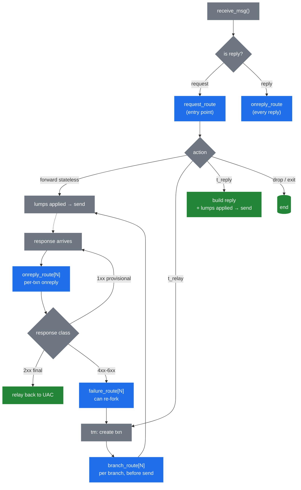

# 3.4 The routing engine

> [!IMPORTANT]
> The routing engine is what makes Kamailio *Kamailio*. Everything before it — process model, memory, lumps — is plumbing. The engine is where your `kamailio.cfg` becomes executable behaviour, where the message meets the operator's intent, and where most of the day-to-day mental model of "what is this server doing" lives.

## Routes are pre-compiled, not interpreted per-message

When Kamailio starts, the cfg parser reads `kamailio.cfg` and produces an in-memory **abstract syntax tree** of every route block, every `if/else`, every function call. That tree is sealed at the end of `mod_init()` and never changes again at runtime.

Per-message execution is a tree walk, not a script interpretation. The cost of `if (is_method("INVITE"))` is a comparison and a branch — there is no parser involved, no string lookup at runtime. This is why Kamailio's per-message overhead from "the script" is tiny: it's executing pre-compiled instructions, not interpreting source code.

> [!NOTE]
> This is also why `kamailio.cfg` changes need a full restart (see [chapter 2.4](05-lifecycle.md)). The AST has been forked into every worker, baked into modules' function-pointer registrations, and inlined into the executable. There is no path to re-parse and swap it in place.

## The route blocks and when they fire

Kamailio has several distinct kinds of route. Each is invoked by the runtime at a specific moment in the message lifecycle:



**`request_route`** — the entry point for every incoming **request**. This is where most of what people think of as "the Kamailio config" lives: routing decisions, authentication, rewrite rules, the call to `t_relay()` or `forward()`. There is exactly one `request_route` block.

**`onreply_route`** — runs for every incoming **reply**, before the reply is forwarded back to the UAC. The bare `onreply_route { … }` runs unconditionally; named variants `onreply_route[N]` only run for replies belonging to transactions that opted in via `t_on_reply("N")`. The named ones are how you intercept the reply for a specific call you've forwarded — to do SDP rewriting, accounting on 200 OK, etc.

**`branch_route[N]`** — runs **once per branch**, just before that branch's outgoing message is constructed and sent. This is where per-branch modifications go: a different Record-Route per branch, branch-specific headers, decisions based on which gateway the branch will hit. Activated via `t_on_branch("N")` before `t_relay()`.

**`failure_route[N]`** — runs when a branch produces a final negative response (4xx-6xx) or times out. Inside, you can **re-fork** the transaction to a different destination (a common pattern: failover to a secondary gateway), build a custom reply with `t_reply()`, or just let the failure propagate. Activated via `t_on_failure("N")`.

**`event_route[<event-name>]`** — runs in response to runtime events that are *not* tied to a message arriving on the wire. Common ones: `event_route[tm:branch-failure]` for branch-specific failure hooks, `event_route[xhttp:request]` for HTTP-over-SIP-socket requests, `event_route[dispatcher:dst-down]` when a gateway is marked dead. Each module exposes its own events.

**`send_route`** — invoked right before any message goes onto the wire. Use sparingly; it runs on top of an already-built outbound message and can be expensive to do meaningful work in.

## The cfg DSL — what it actually is

The configuration language is not a general-purpose scripting language. It's a domain-specific dialect that exists to do one thing well: express SIP routing decisions over a parsed message.

What it has:
- **Control flow** — `if/else`, `switch/case`, `while`, `break`, `return`, `exit`, `drop`.
- **Comparison operators** including regex matching (`=~`, `!~`).
- **String operations** through pseudo-variables and transformations.
- **Function calls** — to module-exported functions (`t_relay()`, `record_route()`, `is_method("INVITE")`).
- **Sub-route invocation** — `route("auth")` calls another route block, sharing the `sip_msg`.

What it deliberately doesn't have:
- **Arbitrary computation.** No arithmetic beyond what pseudo-variable transformations provide. No data structures of your own.
- **Loops over collections.** You can't iterate the headers; you can only check named ones.
- **Recursion.** Sub-routes can call other sub-routes but the depth is bounded.
- **Closures, modules, or anything you'd find in a real language.**

This is a feature, not a limitation. The constraints make it tractable to reason about (one route, one path, bounded depth) and make every operation cheap (no dynamic allocation per loop iteration, no name lookups at runtime). When you need real computation — credit checks, complex routing tables, HTTP calls — you escape to a module, or to KEMI (chapter 5), which embeds a full interpreter for exactly those cases.

## Sub-routes and how routes interact

`route("name")` invokes a named sub-route, which is just another route block defined with `route[name] { … }`. The sub-route runs with the same `sip_msg`, the same `$var(...)` state, the same pseudo-variables. There's no function-call isolation; it's textual inclusion that happens to be deferred to runtime.

```kamailio
request_route {
    route("sanity");
    route("auth");
    route("routing");
}

route[auth] {
    if (!is_present_hf("Authorization")) {
        auth_challenge("$fd", "0");
        exit;
    }
}
```

`return` from a sub-route returns to the caller. `exit` from anywhere ends script processing for this message entirely. `drop` is `exit` plus a hint to `tm` that the transaction should be silently absorbed rather than answered.

## How routes interact with lumps

A key observation: every route block runs on **the same `sip_msg`**, and the lump list is part of that struct. Modifications made in `request_route` are visible (as queued lumps) to `branch_route`. Lumps queued in `branch_route` apply only to that branch's outgoing message. Lumps queued in `onreply_route` apply to the reply being forwarded back.

This is also why `branch_route` is the right place for per-destination customisation: each branch's outgoing message-build sees the union of `request_route`'s lumps plus that branch's lumps. The two are not merged into a shared list — the applier composes them at send-time.

## The implicit drop

A subtle but important rule: if `request_route` finishes execution without explicitly forwarding the message (`t_relay`, `forward`, `t_reply`, etc.), Kamailio **drops the message silently**. There's no implicit forwarding — the script must decide.

This is unintuitive when first learning the cfg DSL. People expect "I didn't say to drop it, so it should be forwarded." It works the other way: nothing is forwarded unless you say so.

The next chapter takes the routing decisions made in this engine and walks them through the actual transmission — how lumps get applied, how stateful vs stateless forwarding differ at send-time, and how replies find their way back.

---

<p markdown="1" align="center">
  [← Table of contents](../) · [← 3.3 Lumps](09-lumps.md) · [Next: 3.5 Forwarding and replies →](11-forwarding.md)
</p>
