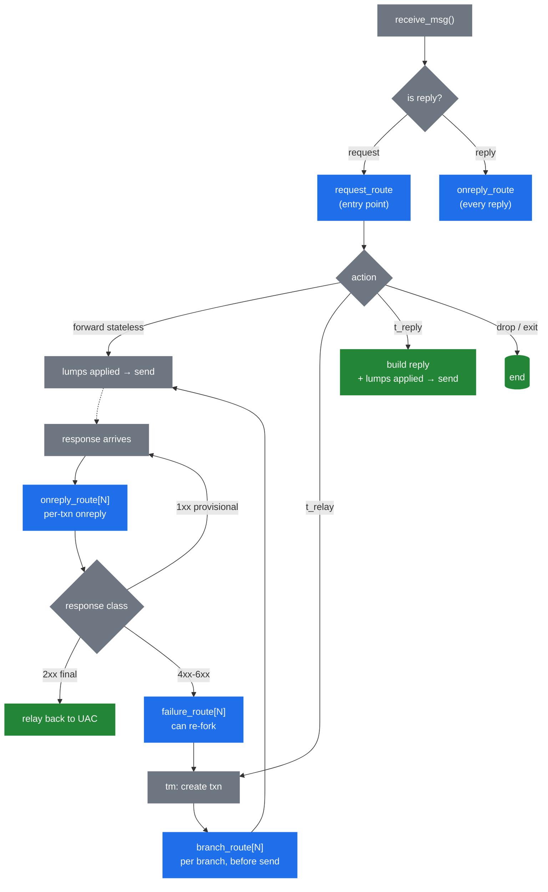

# 3.4 The routing engine

> [!IMPORTANT]
> The routing engine is what makes Kamailio *Kamailio*. Everything before it — process model, memory, lumps — is plumbing. The engine is where your `kamailio.cfg` becomes executable behaviour, where the message meets the operator's intent, and where most of the day-to-day mental model of "what is this server doing" lives.

## Routes are pre-compiled, not interpreted per-message

When Kamailio starts, the cfg parser reads `kamailio.cfg` and produces an in-memory **abstract syntax tree** of every route block, every `if/else`, every function call. That tree is sealed at the end of `mod_init()` and never changes again at runtime.

Per-message execution is a tree walk, not a script interpretation. The cost of `if (is_method("INVITE"))` is a comparison and a branch — there is no parser involved, no string lookup at runtime. This is why Kamailio's per-message overhead from "the script" is tiny: it's executing pre-compiled instructions, not interpreting source code.

> [!NOTE]
> This is also why `kamailio.cfg` changes need a full restart (see [chapter 2.4](05-lifecycle.md)). The AST has been forked into every worker, baked into modules' function-pointer registrations, and inlined into the executable. There is no path to re-parse and swap it in place.

## The route blocks and when they fire

Kamailio has several distinct kinds of route. Each is invoked by the runtime at a specific moment in the message lifecycle:



**`request_route`** — the entry point for every incoming **request**. This is where most of what people think of as "the Kamailio config" lives: routing decisions, authentication, rewrite rules, the call to `t_relay()` or `forward()`. There is exactly one `request_route` block.

**`reply_route`** — fires in the **core's reply-processing path** for *every* incoming reply, before tm gets a chance to match it to a transaction. Useful for inspecting or short-circuiting replies regardless of transaction state — drop malformed replies, count metrics at the wire layer, apply policies that don't need transaction context. Returning `0` (drop) from `reply_route` stops further processing of that reply entirely. Distinct from `onreply_route`: this one runs whether or not the reply belongs to an active transaction.

**`onreply_route`** — runs as part of tm's transaction processing, after tm has matched the incoming reply to a transaction in shm. The bare `onreply_route { … }` runs unconditionally for matched replies; named variants `onreply_route[N]` only run for replies belonging to transactions that opted in via `t_on_reply("N")`. The named ones are how you intercept the reply for a specific call you've forwarded — to do SDP rewriting, accounting on 200 OK, etc.

> [!TIP]
> Mental model for the two reply routes: `reply_route` is **wire-level** (every byte that looks like a reply), `onreply_route` is **transaction-level** (replies that belong to a `tm` cell). In a stateful proxy that uses `tm` for everything, most reply logic lives in `onreply_route`. `reply_route` is the right place for filtering, rate-limiting, or stateless replies that bypass `tm` entirely.

**`branch_route[N]`** — runs **once per branch**, just before that branch's outgoing message is constructed and sent. This is where per-branch modifications go: a different Record-Route per branch, branch-specific headers, decisions based on which gateway the branch will hit. Activated via `t_on_branch("N")` before `t_relay()`.

**`failure_route[N]`** — runs when a branch produces a final negative response (4xx-6xx) or times out. Inside, you can **re-fork** the transaction to a different destination (a common pattern: failover to a secondary gateway), build a custom reply with `t_reply()`, or just let the failure propagate. Activated via `t_on_failure("N")`.

**`event_route[<event-name>]`** — runs in response to runtime events that are *not* tied to a message arriving on the wire. Common ones: `event_route[tm:branch-failure]` for branch-specific failure hooks, `event_route[xhttp:request]` for HTTP-over-SIP-socket requests, `event_route[dispatcher:dst-down]` when a gateway is marked dead. Each module exposes its own events.

**`onsend_route`** — invoked right before any message goes onto the wire. Use sparingly; it runs on top of an already-built outbound message and can be expensive to do meaningful work in.

## The cfg DSL — what it actually is

The configuration language is not a general-purpose scripting language. It's a domain-specific dialect that exists to do one thing well: express SIP routing decisions over a parsed message.

What it has:
- **Control flow** — `if/else`, `switch/case`, `while`, `break`, `return`, `exit`, `drop`.
- **Comparison operators** including regex matching (`=~`, `!~`).
- **String operations** through pseudo-variables and transformations.
- **Function calls** — to module-exported functions (`t_relay()`, `record_route()`, `is_method("INVITE")`).
- **Sub-route invocation** — `route("auth")` calls another route block, sharing the `sip_msg`.

What it deliberately doesn't have:
- **Arbitrary computation.** No arithmetic beyond what pseudo-variable transformations provide. No data structures of your own.
- **Loops over collections.** You can't iterate the headers; you can only check named ones.
- **Recursion.** Sub-routes can call other sub-routes but the depth is bounded.
- **Closures, modules, or anything you'd find in a real language.**

This is a feature, not a limitation. The constraints make it tractable to reason about (one route, one path, bounded depth) and make every operation cheap (no dynamic allocation per loop iteration, no name lookups at runtime). When you need real computation — credit checks, complex routing tables, HTTP calls — you escape to a module, or to KEMI (chapter 5), which embeds a full interpreter for exactly those cases.

## Sub-routes and how routes interact

`route("name")` invokes a named sub-route, which is just another route block defined with `route[name] { … }`. The sub-route runs with the same `sip_msg`, the same `$var(...)` state, the same pseudo-variables. There's no function-call isolation; it's textual inclusion that happens to be deferred to runtime.

```kamailio
request_route {
    route("sanity");
    route("auth");
    route("routing");
}

route[auth] {
    if (!is_present_hf("Authorization")) {
        auth_challenge("$fd", "0");
        exit;
    }
}
```

### `return`, `exit`, `drop` — control-flow exit primitives

Three keywords that end script execution at different scopes, with different downstream side effects. They look interchangeable in trivial routes; in non-trivial ones they aren't.

**`return [value]`** — returns from the current `route[name]` block to its caller. At the top level of `request_route`, equivalent to falling off the end. With a value, sets the result of the `route("name")` call expression:

```kamailio
route[is_local] {
    if ($si =~ "^10\.") return 1;
    return -1;
}

request_route {
    if (route(is_local)) {
        # only entered when is_local returned positive
    }
}
```

The tri-state convention applies (positive → true, negative → false, zero → drop the message — see [the cfg DSL chapter](29-script-engine.md)).

**`exit`** — terminates script processing for this message **entirely**, immediately, regardless of nesting depth. The worker tears down the per-message pkg state and returns to its `recvfrom` loop. **No reply is generated automatically** — if your route was supposed to send one (`sl_send_reply`, `t_reply`, `t_relay`) and didn't before `exit`, the UAC sees nothing and will retransmit, then time out.

**`drop`** — historically distinct from `exit`: a "silently absorb, generate nothing" signal that prevents `tm` from emitting an implicit reply. In modern Kamailio they often behave identically for top-level use; `drop` reads more clearly when the intent is "this message is filtered out, not relayed, not replied to."

> [!WARNING]
> `exit` *after* `t_relay()` is **safe**. `tm` has already put the transaction in shm; the worker is free to return to its loop. The transaction proceeds independently. Operators new to Kamailio sometimes worry that exiting will cancel the relay — it won't. `exit` only frees the per-message pkg arena (chapter 2.2).

The fourth keyword in this family is **`break`**, which belongs to `switch/case` and `while` — not a route-exit primitive.

## What `exit` and `drop` mean in each route

The previous section described `return`, `exit`, and `drop` as if they were interchangeable. They are — but only at top level of `request_route`. Every other kind of route has a "default continuation" the engine performs after the script returns (forward the reply, send the branch, propagate the failure, put the message on the wire), and the verbs prune that continuation differently.

Mechanically, all four jump keywords (`exit`, `drop`, `return`, `break`) compile to a single opcode and differ only in which bit they OR into the action context's `run_flags`. The crucial split: **only `drop` sets `DROP_R_F`**. `exit` sets `EXIT_R_F` only — control flow, no suppression. `return 0` is auto-promoted to also set `EXIT_R_F`, but it does **not** set `DROP_R_F`. Each callee in the runtime checks its own subset of these bits.

| Route block | `exit` | `drop` | `return 0` at top level |
|---|---|---|---|
| `request_route` | script ends, no auto-forward | same | same |
| `reply_route` (core) | reply continues to `tm` matching | reply discarded, never reaches `tm` | discarded (engine also checks the int return) |
| `onreply_route[N]` | reply still relayed upstream | reply suppressed (provisional only, by default) | reply still relayed |
| `branch_route[N]` | branch is sent | branch cancelled, not sent | branch is sent |
| `failure_route[N]` | engine ignores — failure propagates | engine ignores — failure propagates | engine ignores — failure propagates |
| `event_route[…]` | usually no effect | event-specific; most ignore, some short-circuit | usually no effect |
| `onsend_route` | message goes on the wire | suppresses the send | message still sent (engine promotes 0 → 1) |

A few rows need explanation.

**`onreply_route[N]` — `drop` is provisional-only by default.** The `tm` check is gated: it suppresses upstream relay only when the reply's status is `< 200`. Dropping a final reply would leave the transaction in a broken state — tm has already committed to relaying something. A compile-time flag (`TM_ONREPLY_FINAL_DROP_OK`) removes the gate, but stock builds don't enable it. Practical consequence: you can suppress 1xx provisionals (e.g., filter unwanted 183s) but you cannot drop the 200/4xx/5xx that finalises the call.

**`branch_route[N]` — `return 0` is not `drop`.** The per-branch hook in `t_fwd.c` checks `DROP_R_F` only. `return 0` sets `EXIT_R_F` but not `DROP_R_F`, so a sub-route returning 0 — even though it feels like "stop" — does not cancel the branch. To actually cancel, use the literal `drop` keyword.

**`failure_route[N]` is special — there is no suppression verb.** Look at how `tm` invokes it (`t_reply.c`):

```c
if(run_top_route(failure_rt.rlist[on_failure], faked_req, 0) < 0)
    LM_ERR("...");
```

The third argument is `NULL` — tm never retrieves the action context. Neither `exit`, nor `drop`, nor `return 0` is visible to the failure-handling logic. Failure propagation is governed entirely by side effects the script runs *before* returning: `t_reply()` builds a different response, `t_drop_replies()` discards the stored negative replies, `append_branch()` + `t_relay()` re-forks to a new destination. If the script just `exit`s, tm propagates the best stored negative reply upstream as usual. The same `NULL`-ctx pattern applies to `event_route[tm:branch-failure]` (the branch-failure callback).

> [!WARNING]
> `exit` in `failure_route` does **not** absorb the failure. Operators sometimes add `exit` "to stop the failure" and find the UAC still gets the 4xx/5xx. The answer is that tm never asked the script's opinion — it's about to relay the negative reply unless you explicitly call `t_reply()` or `t_drop_replies()`.

**`onsend_route` is the inverse trap.** The check in `core/onsend.c` is `DROP_R_F`-only — and the engine explicitly *promotes* a `run_actions()` return of 0 back to 1 before deciding. So both `exit` and `return 0` let the message go onto the wire; only literal `drop` actually suppresses the send.

**`event_route[name]` is heterogeneous.** Most event-route call sites in core and modules pass `NULL` ctx — the script is fire-and-forget. A handful inspect `DROP_R_F`: `event_route[core:msg:received]` and `event_route[core:pre-routing]` use it to short-circuit further message handling at the wire level. Module-specific events vary; when in doubt, check the module's source for the `run_top_route` call site.

### The same rules apply to KEMI

`KSR.x.exit()` and `KSR.x.drop()` go through the same machinery as the cfg keywords — `KSR.x.exit()` sets `EXIT_R_F` only, `KSR.x.drop()` sets `DROP_R_F`. The per-route table above applies to KEMI scripts identically. The truthiness inversion described in [chapter 5.2](13-kemi-bridge.md) does not affect these — they are control-flow primitives, not predicates.

Beyond that, host-language details vary by binding: in some hosts the unwind back to the KEMI dispatcher is via an exception that aborts the current frame, in others it sets state and the script keeps running until the function returns. The `return KSR.x.exit()` form seen in many examples is the portable idiom — it terminates the function at the language level regardless of how the host handles the cfg-side unwind.

## How routes interact with lumps

A key observation: every route block runs on **the same `sip_msg`**, and the lump list is part of that struct. Modifications made in `request_route` are visible (as queued lumps) to `branch_route`. Lumps queued in `branch_route` apply only to that branch's outgoing message. Lumps queued in `onreply_route` apply to the reply being forwarded back.

This is also why `branch_route` is the right place for per-destination customisation: each branch's outgoing message-build sees the union of `request_route`'s lumps plus that branch's lumps. The two are not merged into a shared list — the applier composes them at send-time.

## The implicit drop

A subtle but important rule: if `request_route` finishes execution without explicitly forwarding the message (`t_relay`, `forward`, `t_reply`, etc.), Kamailio **drops the message silently**. There's no implicit forwarding — the script must decide.

This is unintuitive when first learning the cfg DSL. People expect "I didn't say to drop it, so it should be forwarded." It works the other way: nothing is forwarded unless you say so.

The next chapter takes the routing decisions made in this engine and walks them through the actual transmission — how lumps get applied, how stateful vs stateless forwarding differ at send-time, and how replies find their way back.

---

<p markdown="1" align="center">
  [← Table of contents](../) · [← 3.3 Lumps](09-lumps.md) · [Next: 3.5 Forwarding and replies →](11-forwarding.md)
</p>
