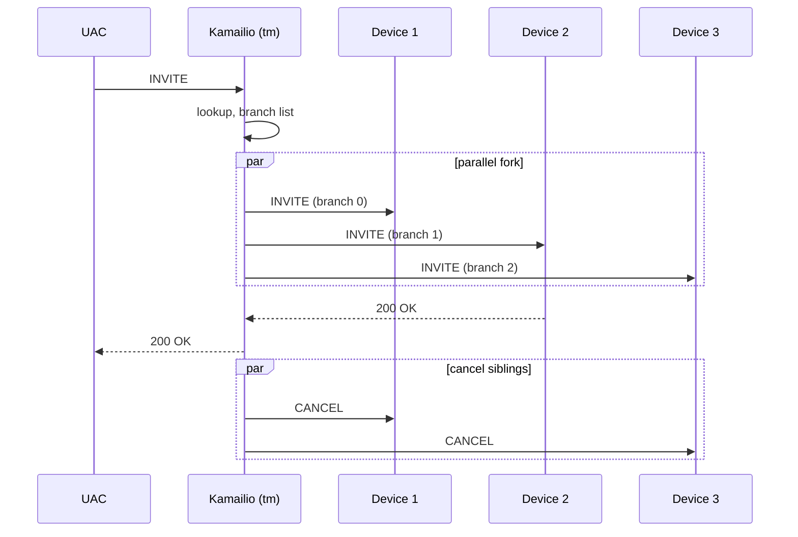

# 3.5 Forwarding and replies

> [!IMPORTANT]
> "Forwarding" is the moment everything queued so far — the parsed message, the lump list, the per-branch state — collapses into actual bytes on a socket. It's also where stateless and stateful forwarding diverge sharply: one is a function call, the other is the creation of a long-lived state machine.

## Two ways to forward, two cost profiles

Kamailio supports two fundamentally different forwarding modes, and the choice is yours per-message.

**Stateless (`forward()` / `sl`).** The worker:
1. Picks the destination (next hop) based on the request URI and any `Route` headers.
2. Asks the lump applier to build the outgoing buffer.
3. Writes it to the socket.
4. Forgets about the message entirely. No state retained.

There's no transaction, no retransmission timer, no awareness of whether the message arrives. If the response comes back, it's just another inbound message handled by `onreply_route`'s bare form. Cost: a few microseconds plus the kernel send. shm footprint: zero.

**Stateful (`t_relay()` / `tm`).** The worker:
1. Looks up — or creates — a transaction in the `tm` hash table (in shm).
2. For each branch (often just one, but can fork), clones the lump set, runs `branch_route` if armed, builds the outgoing buffer, sends it.
3. Starts retransmission timers.
4. Returns to the script. The transaction lives in shm until it terminates.

When a reply arrives, the worker that picks it up looks the transaction up in shm, may run `onreply_route[N]` (if armed), and decides whether to relay the response back, wait for more branches, run `failure_route`, or finalise.

Cost: a few KB of shm per call, plus the timer wheel slot, plus the lock contention on the per-bucket lock during insert/lookup. Worth it for any case where retransmission, forking, or post-decision logic matters — i.e. nearly everything except pure stateless proxying.

## The lump applier — where lumps become bytes

Both modes eventually call `build_req_buf_from_sip_req()` (or its reply counterpart). This is the function that walks the original `msg->buf` byte by byte, consulting the lump list, and produces a fresh buffer of the outgoing message. It's the moment every header insertion, header removal, URI rewrite, and SDP edit queued during routing finally happens.

The walker logic is precisely what was sketched in [chapter 3.3](09-lumps.md):

```
out_buf = new byte buffer of size (len(msg->buf) + sum of lump value lengths
                                                   - sum of lump del lengths)
walk msg->buf linearly, position i = 0..len:
    if a DEL lump anchors at i:
        i += lump.len     # skip
    if an ADD lump anchors at i:
        append lump.value to out_buf
        (resolve markers: outgoing socket IP for Record-Route etc.)
    append msg->buf[i] to out_buf
    i += 1
```

The resolved markers are important. A lump that says "insert `Record-Route: <sip:HOST:PORT;lr>`" where `HOST:PORT` is a marker — those bytes don't get filled in until the outgoing socket is chosen. The choice depends on the destination, on the kernel's route table, on `force_send_socket()` in the script. Resolving at this last moment means the script doesn't have to know which interface it's using.

## Forking — multiple destinations from one request

`tm` supports parallel and sequential forking. The classic case: an `INVITE` to a user who is registered on three devices. You want to ring all three simultaneously, accept the first 200 OK, cancel the others.



What actually happens inside `tm`:

- The transaction struct holds a **branch array** (typically up to `MAX_BRANCHES`, often 16).
- For each branch: its own destination, its own lump augmentations, its own retransmission timer, its own per-branch state.
- The cfg picks the destinations — either implicitly (via `Contact` headers from `usrloc`), or explicitly (`append_branch()` to add additional destinations before `t_relay()`).
- All branches send roughly simultaneously. From there, they run independently until one produces a final response.

`branch_route[N]` runs once per branch, before that branch's outgoing message is built. This is where you'd customise per-branch — different `From` display name per device, branch-specific accounting, branch-specific timeouts.

When the first **2xx** arrives, `tm` relays it to the UAC and starts cancelling the other live branches. When all final responses are in, `tm` picks the "best" failure response (typically the lowest 4xx that isn't a redirect) and relays that, unless `failure_route` intervenes first.

## Failure routes and re-forking

A `failure_route[N]` runs when:
- All branches have produced final responses, none were 2xx, and the transaction is about to relay a failure to the UAC.
- Or a single non-forking transaction got a 4xx-6xx.

Inside the failure route, the script can:
- **Build a custom reply** with `t_reply("503", "Service unavailable")` — overrides whatever the natural propagation would have been.
- **Re-fork to a different destination** by clearing the branch list (`append_branch()` with new destinations) and calling `t_relay()` again on the same transaction.
- **Do nothing**, in which case `tm` proceeds with the default behaviour and relays the failure.

The re-fork case is how operational failover is implemented: primary trunk returns 503 → failure_route catches it → append the secondary trunk's address → re-relay. From the UAC's perspective, it's one call setup that took slightly longer than usual.

## Reply path — finding the right transaction

When a SIP reply arrives at `receive_msg()`, the worker has to find the transaction it belongs to. The lookup is keyed on:

- The branch parameter of the topmost `Via` header (which `tm` set when sending the original request).
- The `Call-ID`, `CSeq`, `From` tag — a fallback hash when the branch parameter is missing or unusable.

This lookup hits the same per-bucket hash table that originally stored the transaction. The worker that picks up the reply may not be the worker that originally sent the request — that's why the transaction is in shm. After the lookup:

1. If it's a provisional response (1xx), update state, run `onreply_route` if applicable, and forward the response back to the UAC.
2. If it's a final response (2xx-6xx), update state, decide whether to wait for more branches or finalise.
3. If finalising, pick the best response, run `failure_route` if armed and the response is a failure, then relay back.

## Stateless replies — when you want to answer cheaply

For things that don't need transaction state — `200 OK` to `OPTIONS`, `401 Unauthorized` to an unauthenticated `REGISTER` — Kamailio offers stateless replies via the `sl` module:

```kamailio
sl_send_reply("200", "OK");
```

This builds a reply from the request, applies reply lumps, sends, and returns. No transaction is created. It is *the* cheap path and should be used whenever you don't need the protection of transaction-level retransmission handling.

## What you should now have in your head

The full path of a request from the wire to the wire:

1. **Reception** — kernel demuxes to a worker, worker calls `receive_msg()`.
2. **First-pass parse** — `parse_msg()` finds the first line and header offsets; nothing more.
3. **Route execution** — `request_route` runs against the `sip_msg`. Pseudo-variables and module functions trigger lazy parsing of specific fields. Modifications queue as lumps. The script decides where this message is going.
4. **Forwarding** — stateless `forward()` or stateful `t_relay()`. If stateful, `tm` creates a transaction in shm and forks to branches.
5. **Per-branch processing** — `branch_route[N]` adjusts per branch. Lumps are applied. Buffer is built. Send.
6. **Reply** — eventually a response arrives. `onreply_route` runs. State is updated. The response is forwarded back, or a `failure_route` re-decides.
7. **Cleanup** — when the transaction terminates (final response relayed, or all branches done), `tm` frees the shm state. pkg state for the message that arrived was freed at step 3's end.

That's it. Every other architectural piece in this handbook — the script engine, KEMI, the control plane, the tricks — is a refinement on this loop.

---

<p align="center">
  <a href="./">← Table of contents</a> · <a href="10-routing-engine.md">← 3.4 The routing engine</a> · <a href="12-kemi-overview.md">Jump to 5.1 KEMI →</a>
</p>
