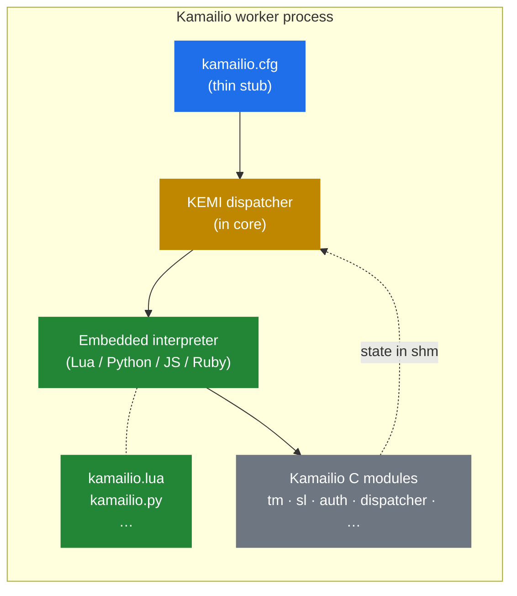

# 5.1 What problem KEMI solves

> [!IMPORTANT]
> KEMI — the **K**amailio **EM**bedded **I**nterface — exists because the cfg DSL is, on purpose, not a real programming language. The moment you need real strings, JSON, HTTP calls, an auth-token cache, or any of a hundred things a real telco backend needs, KEMI is the escape hatch. Routing logic gets written in Lua, Python, JavaScript, or Ruby; cfg becomes a thin shell that dispatches to it.

## The constraints the cfg DSL imposes

The previous part of the handbook walked through why the cfg DSL is shaped the way it is: pre-compiled AST, no recursion, no loops over collections, no dynamic data structures, deliberately constrained to keep per-message execution cheap. That trade-off is correct for the routing engine's fast path. It's also painful the moment you want to do real work.

Concrete things the cfg DSL cannot do, or can do only painfully:

- **Call an HTTP API.** There are modules for this (`http_client`, `http_async_client`), but the response is a flat string you have to parse with regex.
- **Parse JSON.** Same situation — the `jansson` and `json` modules exist, but composing nested object access with cfg's expression syntax is an exercise in masochism.
- **Hold a per-call decision tree.** No data structures of your own, no closures, no loops over arbitrary lists.
- **Reuse logic across modules of your own.** Sub-routes are textual inclusion — you can't write a library function that returns a value.
- **Integrate with anything that speaks a real protocol.** Redis, Kafka, gRPC, anything where the natural API is "here is a client object with methods."

For a pure SIP proxy that takes an `INVITE`, looks up a destination in `dispatcher`, and forwards — cfg is excellent and KEMI would only add overhead. For anything beyond that — authentication against a custom backend, dynamic pricing, fraud detection, per-call business rules — you reach for KEMI.

## The KEMI proposition

KEMI lets you write all the **non-trivial parts** of your routing in a real, well-known programming language while keeping the rest of Kamailio intact — same process model, same memory architecture, same lump system, same `tm` transactions. You don't rewrite Kamailio in Lua; you embed Lua *inside* Kamailio and dispatch to it from the cfg.

In a KEMI-driven setup, `kamailio.cfg` shrinks to a couple of dozen lines: load the language module, load the script file, dispatch the entry-point routes to the interpreter. Everything else — `request_route`, `branch_route`, `failure_route` — is now functions in your Lua / Python / JS / Ruby file.

## The languages

Each supported language has its own Kamailio module that embeds the interpreter:

| Language | Kamailio module | Notes |
|---|---|---|
| Lua | `app_lua` | Smallest interpreter, fastest per-call overhead. Default choice when performance matters. |
| Python | `app_python3` | Largest ecosystem; slowest of the four. `app_python` (Python 2) is legacy. |
| JavaScript | `app_jsdt` | Embedded via duktape. Useful if your team writes JS elsewhere. |
| Ruby | `app_ruby` | Smaller community for Kamailio specifically but full Ruby. |

Two more historical options — `app_mono` (.NET) and `app_squirrel` — exist but are rarely seen in production today.

The **API surface from inside the script** is largely the same across all four: a global namespace (typically `KSR` or `sr`) exposing module functions, pseudo-variable access, header manipulation, and process-control helpers. A `KSR.tm.t_relay()` in Lua does the same thing as `KSR.tm.t_relay()` in Python or `KSR.tm.t_relay()` in JS. This is deliberate — it lets teams switch languages without rewriting routing logic.

## What "KEMI" actually means

The name unpacks as **Kamailio Embedded Interface**, which is a touch confusing because "embedded" here means *Kamailio embeds the interpreter*, not the other way around. The interpreter runs as part of every Kamailio worker process; it doesn't run as a separate service that Kamailio talks to over a socket. This is critical for performance: there's no IPC boundary per SIP message. The cost of dispatching from cfg into the script is a function call across the FFI, not a network round-trip.

The trade-off that buys is what the next three chapters take apart: how the bridge actually works at the C level, what the per-worker lifecycle of the interpreter looks like, and when KEMI's per-call cost is worth paying vs. when the native cfg path wins.

---

  <a href="./">← Table of contents</a> · <a href="11-forwarding.md">← 3.5 Forwarding and replies</a> · <a href="13-kemi-bridge.md">Next: 5.2 The bridge →</a>

