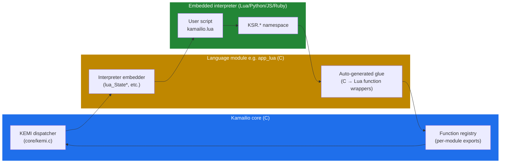

# 5.2 The bridge — embedding Lua, Python, JS, Ruby

> [!IMPORTANT]
> The bridge is what makes `KSR.tm.t_relay()` in a Lua script the same as `t_relay()` in cfg. It's not a translation layer; it's a thin **FFI shim** that hands the running interpreter direct access to Kamailio's C functions. Understanding it is what lets you reason about why some module functions have KEMI bindings and others don't, and why per-call overhead is what it is.

## Three pieces

The KEMI integration in any given Kamailio worker has three distinct pieces:



**The KEMI dispatcher** lives in Kamailio's core (`core/kemi.c`). Its job is straightforward: when something needs to call a route, the dispatcher looks up which language module is currently active and calls into that module's per-language dispatcher with the function name and the `sip_msg` pointer.

**The language module** (e.g. `app_lua`) is responsible for embedding the actual interpreter. When `mod_init()` runs at startup, the language module:
1. Reads its script-file parameter from the cfg (e.g. `modparam("app_lua", "load", "/etc/kamailio/kamailio.lua")`).
2. Sets up the language-specific embedding boilerplate (Lua's `luaL_newstate()`, Python's `Py_InitializeEx()`, etc.).
3. Registers the **glue functions** that expose Kamailio's C APIs into the interpreter's global namespace.

**The user script** is just a file in whatever language you chose. It defines functions like `ksr_request_route()` (Lua) or `ksr_request_route(msg)` (Python) that Kamailio will call when an incoming request needs routing.

## The function registry — what's exposed

Not every C function in Kamailio is callable from KEMI. Module authors have to **explicitly export** their functions into the KEMI registry. The mechanism is a struct array of "KEMI function descriptors":

```c
static sr_kemi_t sl_kemi_exports[] = {
    { str_init("sl"), str_init("send_reply"),
      SR_KEMIP_INT, ki_sl_send_reply,
      { SR_KEMIP_STR, SR_KEMIP_INT, ... } },
    /* …more entries… */
    { {0,0}, {0,0}, 0, NULL, { 0 } }   /* terminator */
};
```

Each entry says: "module `sl`, function `send_reply`, returns an int, implemented by C function `ki_sl_send_reply`, takes one string and one int." Kamailio walks these registries at startup and exposes every entry as `KSR.<module>.<function>` in every loaded interpreter.

This is why some module functions are KEMI-callable and others aren't: the author of the module wrote the export. If you're staring at the wiki saying "module X has a function Y that I want to call from Lua but it doesn't show up in `KSR`," it's because the module's KEMI export table doesn't list it. A pull request to that module's KEMI table will usually fix it.

## What the bridge call looks like

When `request_route` runs and dispatches into the interpreter — i.e. when the cfg says something like `cfg_run_route("ksr_request_route");` — what actually happens:

1. **Core dispatcher** receives the call with the route name and the current `sip_msg`.
2. **Language module's per-thread state** is looked up. (Each worker has its own interpreter instance — see [the next chapter](14-kemi-lifecycle.md).)
3. **`sip_msg` is bound** to the interpreter's per-call context. This is *not* a copy — the interpreter gets a handle that's effectively a pointer back to the C struct.
4. **The named function is invoked** in the interpreter's namespace. The interpreter runs the script.
5. **Each `KSR.xyz` call from the script** goes through the auto-generated glue: the script's argument list is converted from interpreter values (Lua strings, Python objects) into Kamailio's `str` / `int` / `sip_msg*` types, the registered C function is called, the return value is converted back.
6. **When the function returns**, control comes back to the dispatcher and back to cfg. The `sip_msg` reflects whatever modifications the script queued (lumps, transactions, etc.).

The cost of step 5 is what you pay over native cfg: argument marshalling between two type systems, plus interpreter overhead from however many script-side operations happened. For a route that calls four functions and does a couple of conditionals, this overhead is typically 1-2 microseconds per message in Lua, 5-20 microseconds in Python. Not free, but small enough that 90% of deployments never notice.

## The `KSR` namespace, schematically

The script-side API has a consistent shape:

```lua
-- Lua example
KSR.info("Got a request to " .. KSR.pv.get("$ru"))

KSR.hdr.append("X-Trace: from-kamailio\r\n")

if KSR.is_method("INVITE") then
    if KSR.auth_db.www_authenticate("realm", "subscriber") then
        return KSR.tm.t_relay()
    else
        KSR.sl.send_reply(401, "Unauthorized")
    end
end
```

- `KSR.<module>.<function>` — call a registered C function from a Kamailio module.
- `KSR.pv.get("$ru")`, `KSR.pv.sets("$ru", "...")`, `KSR.pv.geti("$rs")` — read and write pseudo-variables, statically typed (string / int).
- `KSR.hdr.*` — header manipulation shortcuts.
- `KSR.x.exit()`, `KSR.x.drop()` — script control flow that escapes back into cfg's lifecycle.
- `KSR.info(...)`, `KSR.warn(...)`, `KSR.err(...)`, `KSR.dbg(...)` — logging at the standard Kamailio log levels.

The above is Lua syntax; the Python and JS forms are identical except for method-call syntax (`KSR.tm.t_relay()` is the same in all three).

## Bidirectional dispatch — cfg ↔ script

The bridge can go either way:

- **cfg dispatches to script** by naming a script function in `cfg_run_route` or by setting `event_route_callback("event:name", "ksr_event_handler")`.
- **Script dispatches back to cfg** by calling `KSR.cfg.route_inv("route_name")` — runs a named cfg route block from inside the script.

This makes a hybrid pattern possible: keep the hot path (sanity, simple routing) in cfg for speed, hand off to the script for complex decisions, then call back into cfg sub-routes for the actual relay. The cost is one bridge crossing per hand-off, which is small if you don't do it on every byte.

## Why bindings sometimes diverge per-language

A practical gotcha: although the `KSR.*` API is *meant* to be identical across languages, in practice each language module has its own glue code generator. When a new C-side KEMI export is added, it might be exposed in Lua and Python within the same release but not yet in JS or Ruby. The wiki's [KEMI function list](https://www.kamailio.org/wiki/cookbooks/devel/pseudovariables) is the authoritative source for "what's actually exposed where."

If you're picking a language for a new project: **Lua** has the broadest KEMI coverage and the fastest interpreter overhead. **Python** is widely chosen for ecosystem reasons (existing Python tooling at your shop) and is fine for anything that isn't a tight inner loop. **JS** and **Ruby** are functional but lag slightly behind in coverage.

The next chapter takes the interpreter's per-worker lifecycle apart — when it's created, how state survives messages, what happens at reload, and the failure modes you only see in production.

---

<p align="center">
  <a href="./">← Table of contents</a> · <a href="12-kemi-overview.md">← 5.1 What KEMI solves</a> · <a href="14-kemi-lifecycle.md">Next: 5.3 KEMI lifecycle →</a>
</p>
