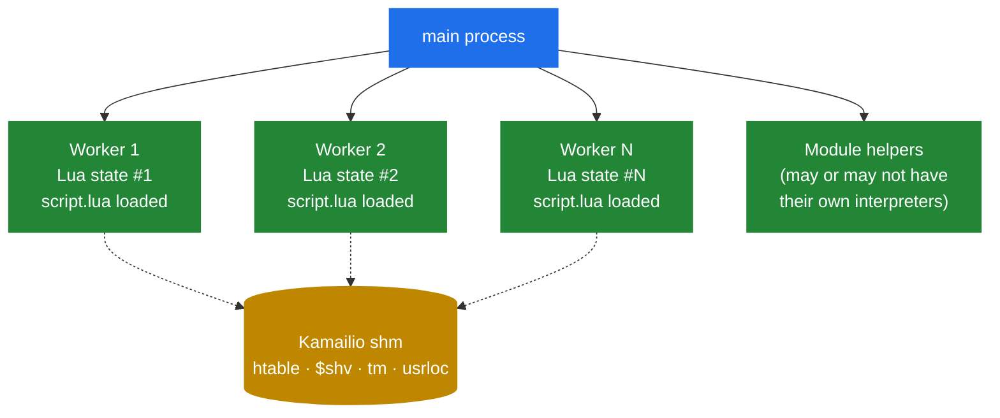

# 5.3 KEMI lifecycle — when it runs, what it sees

> [!IMPORTANT]
> Each Kamailio worker has its **own interpreter instance**. They don't share state through the interpreter. They share state through Kamailio's shm, exactly like cfg-only deployments. Forgetting this and reaching for a Lua global to "remember" something across calls is the most common KEMI bug in production.

## Where the interpreter lives

The KEMI integration follows the same per-process discipline as everything else in Kamailio (see [chapter 2.1](02-process-model.md)):



Every worker is forked from main with its own copy of the C-level address space, then in `child_init()` the language module bootstraps a fresh interpreter inside that worker. The script file is loaded into that interpreter. The interpreter persists for the lifetime of that worker — it doesn't get rebuilt per message.

Consequences:
- **A Lua global set in worker 3 is invisible to worker 7.** They literally have different Lua states. There is no way to share Lua-level state directly between workers.
- **Anything that needs to be shared has to be in shm.** That means `htable`, `$shv`, or a database. Same rule as cfg.
- **The interpreter survives across messages within a worker.** A `local cache = {}` defined at the top of the script does retain state between calls — but only for messages that happen to be handled by *that worker*. Worker affinity is a fiction (see [chapter 2.1](02-process-model.md)), so you cannot rely on consecutive messages going to the same interpreter.

## The startup sequence

When Kamailio starts with KEMI configured, the order is the same one from [chapter 2.4](05-lifecycle.md), with the language module's hooks slotted in:

1. **Parse cfg** — the cfg file mentions `loadmodule "app_lua.so"` and `modparam("app_lua", "load", "/etc/kamailio/kamailio.lua")`.
2. **Allocate shm**, **load modules**.
3. **`mod_init()` in `app_lua`** — initialises the language module's own state. Does **not** create the per-worker interpreters yet.
4. **Bind listeners**.
5. **Fork workers.**
6. **`child_init()` in `app_lua`** — runs *inside each worker*. This is where the actual interpreter is created (`luaL_newstate()`, `Py_InitializeEx()`, etc.), the registered glue functions are bound into the global namespace, and the script file is read and executed. After this point, all script-level globals (functions, local-but-toplevel state) are in the interpreter.

If the script has syntax errors or fails to load, the worker exits with a startup error. The main process logs which worker failed to init and **does not re-fork** — a broken script is not a recoverable runtime failure. You restart after fixing.

> [!TIP]
> Most language modules call a special top-level function during `child_init` if it's defined: `ksr_mod_init()` in Lua, `mod_init()` in Python, etc. This is the place to set up per-interpreter caches, parse config files your script reads, or open file handles. It runs **once per worker**, after globals are loaded.

## What happens per message

When a request arrives and `request_route` in cfg dispatches into the script:

1. The KEMI dispatcher in the worker's address space looks up the per-worker interpreter handle (a small C struct).
2. The current `sip_msg*` is stashed into the interpreter's "context for this call" — accessible from the script through the `KSR.*` namespace, which knows to find it.
3. The named function (`ksr_request_route`) is called inside the interpreter.
4. While running, the script can call any `KSR.*` function, can call other Lua/Python functions defined in the script, can read and write the `sip_msg` through pseudo-variables, can queue lumps, can dispatch back to cfg sub-routes.
5. When the function returns, the interpreter stays alive — only the per-call context is cleared.

A few non-obvious details:

- **The interpreter is single-threaded inside its worker.** That's fine, because the worker is single-threaded too. No GIL drama, no locking inside the script.
- **Script-level state survives.** A `local count = 0; function ksr_request_route() count = count + 1; ... end` will increment `count` on every message handled by *this* worker. Useful as a per-worker counter, useless as a global counter.
- **Memory used by the interpreter comes from libc's malloc, not Kamailio's pkg.** The language module embeds the interpreter using whatever the interpreter's default allocator is. That memory is bounded by the interpreter's own GC; it doesn't get freed when the message ends.
- **Lump queuing works exactly the same.** Calls into `KSR.hdr.append(...)` queue a lump on the C-side `sip_msg`. The lump applier doesn't care whether the lump was queued from cfg or from a script.

## State across messages — the right and wrong ways

Three patterns for sharing data between messages in a KEMI script:

| Pattern | Lifetime | Scope | When to use |
|---|---|---|---|
| Local variable inside a function | One call | One stack frame | Anything per-message |
| Top-level script variable | Worker's lifetime | One interpreter | Per-worker caches, statistics, **never** for state you need to be consistent across workers |
| `KSR.htable.sht_get(...)` / `sht_set(...)` | Until restart or expiry | All workers in this instance | Cross-worker state — auth caches, rate limiters, per-call decisions |
| `$shv(...)` via `KSR.pv.sets("$shv(x)", ...)` | Until restart | All workers | Small named globals, less flexible than htable |
| Database | Forever | All workers, all instances | Persistent state |

The wrong-way pattern that bites people: thinking the Lua global is shared. It isn't. Two consecutive REGISTERs from the same user will *probably* hit different workers, will *definitely* have different interpreter states, and any Lua-side cache you built will give one answer in worker 3 and a different answer in worker 7.

## Script reload — how to update without restart

KEMI scripts can be reloaded at runtime without restarting Kamailio. The mechanism depends on the language module but is exposed uniformly via RPC:

```bash
kamcmd app_lua.reload
kamcmd app_python3.reload
```

What happens: each worker, on its next message, throws away its current interpreter state and re-bootstraps the interpreter from the (now-reread) script file. Globals are re-initialised, per-worker caches are lost. Any in-flight transactions in `tm` are unaffected — they live in shm and don't depend on the interpreter state.

> [!WARNING]
> **Reload is not transactional across workers.** Workers re-bootstrap independently as they each pick up their next message. If worker 3 reloads and immediately handles an `INVITE`, while worker 7 hasn't yet reloaded, the two will run different versions of your script for a few seconds during the rollover. For changes that need to be atomic across all workers, restart.

## Failure modes that only happen in production

A short catalogue of what surprises people:

- **Lua/Python exceptions inside the script** are caught by the language module and logged, then the script function effectively returns "do nothing." A message can be silently dropped because an unexpected exception fired three lines into your handler.
- **An infinite loop in the script** parks one worker forever (it can't be interrupted by `SIGTERM` easily). One bad message that triggers an infinite loop kills 1/N of your throughput until restart.
- **Memory leaks in the script** accumulate over time. Lua's GC is automatic but circular C-referenced objects can leak; Python's reference counter handles most cases but not all. Watch worker RSS growth over days, not minutes.
- **A `KSR.*` function name typo** is not a syntax error — it's a runtime `nil` dispatch. Lua silently does nothing on a `nil:call()`; Python raises and you see it in the log; JavaScript depends on the interpreter.

The next chapter looks at when this whole edifice — the embedded interpreter, the bridge, the per-worker state — is worth its cost and when the native cfg path is simply faster.

---

<p align="center">
  <a href="./">← Table of contents</a> · <a href="13-kemi-bridge.md">← 5.2 The bridge</a> · <a href="15-kemi-tradeoffs.md">Next: 5.4 KEMI tradeoffs →</a>
</p>
