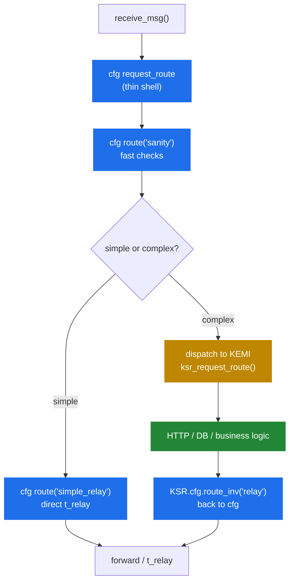

# 5.4 KEMI tradeoffs — when it wins, when cfg wins

> [!IMPORTANT]
> KEMI is not always the right choice, and "use KEMI" is not the answer to "my cfg is getting complicated." Sometimes it is; sometimes the right move is to push complexity into a database, a module, or an external service instead. This chapter is the decision framework.

## The cost model, in numbers and in shape

The native cfg path executes a pre-compiled AST. Per-message overhead from the script itself is dominated by the cost of the function calls into module C code — typically nanoseconds per call. A trivial cfg `request_route` (sanity, lookup, relay) costs **single-digit microseconds total** on commodity hardware.

The KEMI path adds:
- One **interpreter-call entry** at dispatch time. ~0.5–2 µs in Lua, ~5–10 µs in Python.
- One **glue marshalling step** per `KSR.*` call. ~0.5–2 µs in Lua, ~1–5 µs in Python.
- Whatever the interpreter does on its own — string allocations, table lookups, GC pressure.

For a route that calls `KSR.*` five times and does a couple of conditionals, the script-side overhead is somewhere between **5 µs (Lua) and 50 µs (Python)** on top of the cfg path's couple of µs. Whether that matters depends entirely on your throughput target and your routing complexity. At 1 k CPS, 50 µs per call is 50 ms of CPU per second — nothing. At 50 k CPS, that's 2.5 seconds of CPU per second — you need more cores or a faster path.

> [!TIP]
> The honest rule: **measure**. Drive realistic load (chapter 2.5) against both implementations and compare. KEMI's overhead is workload-dependent in ways that can't be predicted from the cfg complexity alone.

## When KEMI is clearly the right answer

**You need real data structures.** Per-call decision tables, multi-level routing graphs, anything you'd naturally model as a hash-of-arrays-of-strings. cfg can do flat dispatcher tables and `htable` lookups; it can't do "for each entry in this dynamic list, check these three conditions."

**You need to call an HTTP API and parse a JSON response.** It is possible to do this in cfg with `http_async_client` plus `json` module, but the script-side ergonomics are awful: you end up writing pseudo-regex against the response and managing async callbacks with named cfg routes. In KEMI:

```python
ok, resp, _, _ = KSR.http_client.curl_obj("https://billing.internal/check", json.dumps({"call_id": call_id}))
if ok != 1:
    KSR.sl.send_reply(503, "Billing unavailable")
    return KSR.x.exit()
result = json.loads(resp)
if not result["allowed"]:
    KSR.sl.send_reply(403, "Call not authorised")
    return KSR.x.exit()
```

That's 8 lines. The cfg equivalent is a multi-route mess with named async resumption points.

**Logic that changes weekly.** If your routing rules are business-driven and change often, KEMI's faster development loop (script reload via `kamcmd`, no Kamailio restart) is worth the per-call cost on its own.

**You're integrating with non-SIP systems.** Auth against an internal API, fraud scoring with a Redis-backed model, custom CDR pipelines — KEMI gives you the libraries and the testing tools (unit tests for your Lua/Python files) that cfg cannot.

## When cfg wins

**Hot-path proxying with simple logic.** A stateless or low-state proxy that just routes based on dispatcher tables: cfg, no question. KEMI's per-call overhead at this complexity is pure waste.

**Registrar servers.** REGISTER handling is dominated by `usrloc` and `auth_db` calls, both of which are equally fast from cfg or KEMI. The cfg version is shorter and clearer.

**Anything where the routing is genuinely a small decision tree.** If your `request_route` is 50 lines of `if-elif-else` against `is_method`, `$ru =~ pattern`, and module function calls, it's already the right shape for cfg.

**Performance-critical sub-routes.** Even in a KEMI-driven deployment, you can keep the hottest sub-route in cfg and call it from the script via `KSR.cfg.route_inv("hot_path")`. This is the **hybrid pattern** and is often the right answer at scale.

## The hybrid pattern

In a large deployment, the practical structure is rarely "all cfg" or "all KEMI." It's:



- cfg owns the **fast-path sanity and routing**.
- KEMI owns the **business logic**: authentication, authorisation against external systems, fraud scoring, anything that wants real data structures.
- cfg owns the **forwarding decision and the relay**.
- Both can call into each other; the bridge is bidirectional.

The cost of this is one bridge-crossing per complex call. At ~5 µs per crossing in Lua, this is essentially free even at high CPS — and you keep cfg's speed for the 90% of routing that doesn't need a script.

## Choosing a language, in one paragraph

If you have no other constraint: **Lua**. It has the most complete KEMI binding coverage, the lowest per-call overhead, and is small enough that the interpreter footprint per worker is negligible. **Python** if your team's expertise is overwhelmingly Python and the per-call cost (5x Lua's typically) is acceptable for your throughput — usually true. **JavaScript** if you're trying to share business logic between Kamailio and a JS-heavy backend. **Ruby** if you have a specific reason to want it. Don't choose based on language preference alone if you're at the very high end of throughput; the gap between Lua and Python matters at 10 k+ CPS.

## What you should not use KEMI for

A few anti-patterns worth flagging:

- **Don't move performance-critical logic into KEMI "because it's easier to write."** Easier to write does not mean better in a system that runs at 10 k CPS. Profile first, decide second.
- **Don't use Lua globals as a cross-worker cache.** They aren't shared. Use `htable` (covered later in chapter 8.3) or a database.
- **Don't replace short cfg routes with longer KEMI equivalents** for ergonomics alone. A clear 20-line cfg `if-elif` is usually better than a clever 60-line Python class.
- **Don't try to wrap every cfg primitive in a KEMI helper.** If you find yourself rewriting `is_method()` in Python because "the cfg version is awkward," you're fighting the architecture. Just call `KSR.is_method("INVITE")`.

The handbook moves next into state — how `tm` and `dialog` keep transactions and calls alive across messages, which is what the routing engine and KEMI both ultimately interact with.

---

<p align="center">
  <a href="./">← Table of contents</a> · <a href="14-kemi-lifecycle.md">← 5.3 KEMI lifecycle</a> · <a href="16-tm-internals.md">Next: 6.1 Transactions (tm) →</a>
</p>
