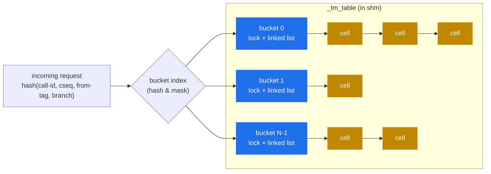

# 6.1 Transactions (`tm`) internals

> [!IMPORTANT]
> `tm` is the most architecturally consequential module in Kamailio. It maintains the per-call state in shm that lets every other piece — failure recovery, forking, retransmission, reply routing — work. Almost everything covered in earlier chapters (lumps, branches, failure_route, the reply path) ultimately depends on `tm`'s data structures.

## What a transaction actually is

In SIP terms, a transaction is **one request plus everything that's a response to it** — provisional responses, retransmissions, and exactly one final response. The same UAC/UAS pair can have many transactions per call: the `INVITE` is one transaction, the `BYE` is another, an in-dialog `re-INVITE` is a third.

Kamailio's `tm` module tracks transactions from a proxy's point of view: when a request arrives, `tm` creates a **cell** that holds enough state to:

- Match incoming responses back to the originating request.
- Retransmit the request if the next hop doesn't acknowledge within T1 (UDP only).
- Run the right route blocks (`branch_route`, `failure_route`, `onreply_route`) at the right times.
- Track which branches are in flight and which have terminated.

A cell lives in **shm** so any worker can find it. The pkg-allocated `sip_msg` that triggered the cell's creation is gone by the time the first reply arrives — the cell has copied everything it needed.

## The hash table



The data structure is exactly the per-bucket-sharded hash from [chapter 2.3](04-concurrency.md): `hash_size` buckets, one lock per bucket, each bucket holds a linked list of cells. The default `hash_size` is 1024; for high-CPS deployments, bump it to 4096 or higher (see [chapter 2.5](06-sizing-and-tuning.md)).

The hash key is computed from request identifiers that uniquely identify the transaction per RFC 3261:
- `Call-ID`
- `CSeq` number and method
- `From` tag
- top `Via` branch parameter

For requests where the branch parameter is present and starts with the magic cookie `z9hG4bK` (any RFC-3261-compliant SIP stack), the branch alone is sufficient. The older fallback hashing exists for non-compliant peers and ACKs to 2xx (which by spec are matched differently).

## Inside a cell

A `cell` struct is dense. The fields that matter architecturally:

- **The original request, copied into shm.** Headers, body, buffer — all duplicated from the pkg `sip_msg` so they survive after the pkg is freed.
- **A branch array** (`MAX_BRANCHES`, typically 16). Each branch holds: destination URI, the outgoing buffer (with lumps already applied), per-branch retransmission state, the per-branch lump augmentations, the branch's transport.
- **Timer slots.** One for retransmission (re-send the request after T1, T2, T3, … with exponential backoff), one for the **final response timer** (max time to wait for any final response — typically `tm_max_inv_lifetime`, default 180 s), one for the **wait timer** (linger after final response to absorb retransmissions, typically 30 s).
- **Atomic refcount.** Each worker that touches the cell increments before working, decrements when done; the cell is freed when count reaches zero.
- **Route hooks.** Which `branch_route[N]`, `failure_route[N]`, `onreply_route[N]` to fire. Set by `t_on_branch()` / `t_on_failure()` / `t_on_reply()` before `t_relay()`.
- **Flags.** Local-vs-relayed (was this transaction initiated by Kamailio itself or proxied?), canceled, replied, etc.

## Timer wheels

Retransmissions and timeouts need to fire at precise intervals across thousands of concurrent transactions. Kamailio doesn't use a sleep-per-cell approach — it uses **timer wheels**.

A timer wheel is an array of buckets indexed by deadline modulo the wheel size. When a timer is set for "fire 500 ms from now," the cell goes into the bucket at offset `(now + 500ms) / tick`. The timer process wakes up every tick (typically 100 ms for the fast timer), walks the current bucket, and fires every timer in it.

The cost is O(1) to set a timer and O(N) per tick where N is "timers expiring this tick" — not "all timers." A million in-flight transactions cost the same per-tick CPU as ten, as long as the deadlines are spread out.

`tm` runs two timer processes (introduced in [chapter 2.1](02-process-model.md)): one ticking fast (sub-second timers, retransmissions), one ticking slow (the wait timer at ~30 s, cleanup). Splitting them avoids slow housekeeping starving fast retransmissions.

## Retransmission, concretely

For UDP transactions only (TCP transport is reliable by definition):

1. Worker sends the request, sets retransmission timer to T1 (500 ms).
2. Timer fires, worker re-sends the same outgoing buffer (already constructed in [chapter 3.5](11-forwarding.md)), doubles the interval to T2 (1 s).
3. Timer fires again at T2; re-send; double to T3 (2 s), and so on up to `tm_max_T2_timer` (default 4 s).
4. Continue at `T2` cap until either a response arrives or the final-response timer fires (default 180 s), at which point the transaction times out and `failure_route` runs.

For non-2xx **responses** (4xx-6xx), the proxy also retransmits the response back to the UAC until the UAC sends ACK. 2xx responses are special: by RFC the UAS retransmits them, the proxy doesn't.

## Lookup, lock discipline, refcount

Every operation on a cell follows the same pattern:

```c
hash = hash_request(msg);
bucket = &_tm_table->buckets[hash & mask];

lock_get(&bucket->lock);
cell = find_cell(bucket, msg);     // walk linked list
if (cell) {
    atomic_inc(&cell->ref_count);   // pin while working
    lock_release(&bucket->lock);
    /* … do work on cell, may take cell->lock if mutating state … */
    if (atomic_dec_and_test(&cell->ref_count)) {
        free_cell(cell);
    }
} else {
    lock_release(&bucket->lock);
}
```

The bucket lock is held *only* for the linked-list walk. The per-cell lock (also embedded in the cell) protects internal mutations. The refcount keeps the cell alive even after the bucket lock is released, so a slow worker can't have the cell yanked out from under it by a peer worker's cleanup.

## What goes wrong, and where to look

Two classes of `tm`-related production issues:

> [!WARNING]
> **shm exhaustion from leaked cells.** Every cell that doesn't terminate (because a buggy `failure_route` returns without calling `t_reply()`, or `t_continue()` is missed on a suspended transaction) keeps its shm allocation indefinitely. `kamcmd tm.stats` shows `current` vs `historic`; if `current` grows monotonically, you're leaking.

- **Hash contention at high CPS** — every `t_relay()` takes a bucket lock briefly, and if `hash_size` is too small, those locks contend. Symptom: `perf top` shows `lock_get` near the top, `kamcmd tm.stats` shows uneven bucket-depth distribution.
- **Retransmission storms** — if the next hop doesn't respond and you have thousands of UDP transactions, each retransmits independently. Bandwidth and CPU spike. Mitigate with `pike` or downstream rate-limiting.

The next chapter takes the cell, adds dialog tracking on top of it, and explains how Kamailio maintains call-level state across multiple transactions.

---

<p align="center">
  <a href="./">← Table of contents</a> · <a href="15-kemi-tradeoffs.md">← 5.4 KEMI tradeoffs</a> · <em>Next: 6.2 Dialogs (coming)</em>
</p>
