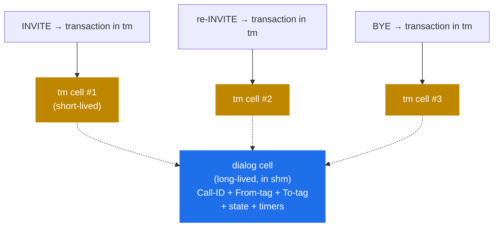

# 6.2 Dialogs — call-level state across transactions

> [!IMPORTANT]
> A SIP **call** is multiple transactions: the `INVITE` that sets it up, in-dialog `re-INVITE`s, the `BYE` that ends it. `tm` tracks each transaction independently. **`dialog`** is the module that ties them together — so the proxy can answer "is this `BYE` part of a call I authorised earlier?" and "how long has this call been going on?" without re-running the auth check on every message.

## What a dialog adds on top of `tm`

`tm` alone can't answer call-level questions. It only knows about transactions: a `BYE` arriving an hour after an `INVITE` is a *new* transaction, and `tm` has no idea the two are related. The relationship lives in the SIP dialog identifiers — Call-ID, From-tag, To-tag — and somebody has to remember them.

That "somebody" is the `dialog` module. When you `dlg_manage()` on a request in `request_route`, `dialog` opens a dialog record for the call, keyed on those identifiers, that survives every transaction in the call's lifetime:

A dialog record outlives the transaction that created it. The `INVITE`'s `tm` cell exits its WAIT timer ~30 seconds after the 200 OK; the dialog stays alive for the duration of the call — typically minutes or hours.

## The dialog state machine

A dialog cycles through three states:

- **EARLY** — `INVITE` sent, provisional responses received, no final answer yet.
- **CONFIRMED** — `INVITE` received a 2xx final response. ACK exchanged. The call is up.
- **TERMINATED** — `BYE` received and answered, or the dialog timed out.

Each `dlg_manage()` call hooks into `tm` to be notified when the dialog should advance:

- On 1xx response → stay EARLY, update timestamps.
- On 2xx final + ACK → move to CONFIRMED, start the inactivity timer.
- On BYE final response → move to TERMINATED, free the dialog cell.
- On `tm`'s final-response timer firing without a 2xx → fail back to TERMINATED, free.

The state transitions are why `dialog` is a "stateful" module in a way `tm` isn't. `tm` only knows "transaction is in progress" or "transaction is done." `dialog` knows the difference between "the call is ringing" and "the call is up and someone is talking."

## What the dialog cell holds

A dialog cell in shm has:

- **Identifiers.** Call-ID, From-tag, To-tag. These are the lookup keys.
- **Endpoint URIs.** Caller's contact, callee's contact, the request URIs as they were when the call set up.
- **Route set.** The `Record-Route`/`Route` headers as established by the proxy chain. Needed to route in-dialog requests correctly.
- **Timestamps.** Creation, last activity, time of confirmation.
- **State.** EARLY / CONFIRMED / TERMINATED.
- **Variables.** Per-dialog scratchpad — `$dlg_var(name)` in cfg. Useful for sticking data on the call that should outlive individual transactions.
- **Profile membership.** Which `dlg_profile`s this dialog is counted in — for things like "how many concurrent calls per gateway."

The cell uses the same shm allocator and the same per-bucket-locked hash as `tm`. `dialog`'s `hash_size` is separately configurable from `tm`'s.

## Sticky vs. transient — picking what to track

`dialog` is expensive in shm if you turn it on for every call. The decision is per-call: a `dlg_manage()` call in `request_route` opts in. Most deployments don't track every call — they track the ones that matter.

Reasons to track a dialog:
- **In-dialog request routing.** Re-INVITEs and BYEs that need to take the same path as the original INVITE.
- **Call accounting.** Per-call duration, billing, CDR generation.
- **Per-call rate limiting.** `dlg_profile_get("calls_per_user")` to enforce per-user concurrent call limits.
- **Call hijacking detection.** Verifying the BYE comes from a party that was in the original INVITE.
- **Topology hiding state.** When `topos` is in play, the dialog is the natural place to hang the mapping (more in chapter 8.1).

Reasons *not* to track a dialog:
- The call is a stateless forward where Kamailio doesn't need to recognise BYEs.
- shm budget is tight and the call count is huge (think LSR — Least-Cost-Router proxies).

## Keepalive — detecting silent failures

A SIP call can go silent for hours. The UAC is registered, the UAS picked up, both endpoints are sending RTP somewhere — and Kamailio has no idea whether the dialog is still alive. If the BYE gets lost (UDP, network partition, NAT timeout), the dialog will sit in shm forever.

`dialog` solves this with **OPTIONS-based keepalive**: optionally, periodically send a SIP `OPTIONS` ping to each endpoint in CONFIRMED dialogs. If the endpoint doesn't respond within a configurable timeout, the dialog is marked dead and terminated.

Cost: one in-flight `tm` transaction per dialog per keepalive interval. At thousands of concurrent calls and 5-minute keepalives, this is meaningful traffic — but it's the only way to detect partition-induced dead calls without a database join against the UAS.

## Persistence across restart

By default, dialog records live in shm and are lost on Kamailio restart. For long-lived calls this is bad: you restart, and any call that was active at the moment becomes uncancellable from Kamailio's side — a BYE will not match any dialog record and may be forwarded incorrectly.

The fix is `dialog`'s **database backing**, similar to `usrloc`'s pattern (next chapter). Dialogs are written to a `dialog` table either on every state change (synchronous, expensive) or periodically (asynchronous, the common production mode). On restart, the table is read back into shm at `child_init()` time and active dialogs are reconstructed.

> [!WARNING]
> **Database-backed dialog state is "best-effort," not transactional.** Between the last DB flush and the restart, recently-confirmed dialogs may be lost. For most operators this is acceptable — calls that happen to be ringing during a restart will resume normally via the endpoints' own state, and Kamailio simply has nothing to say about them.

## Where dialogs and `tm` interact

The two modules collaborate explicitly:

- `dialog` registers callbacks with `tm` for the transaction events it cares about (final responses to INVITE, ACK arrival, BYE termination).
- When `tm`'s cell-cleanup runs, it notifies `dialog` so the dialog record can update its state.
- `dialog` does *not* touch `tm` cells directly; it goes through the registered callback API.

This separation means you can run `tm` without `dialog` (stateless-ish proxy with no call tracking), but you cannot run `dialog` without `tm` — `dialog`'s state transitions are driven by transactions that `tm` is observing.

The next chapter takes the other long-lived shm-backed structure — the registrar's contact cache — and shows how `usrloc` keeps an in-memory state in sync with a database without taking a lock on every REGISTER.

---

  [← Table of contents](../) · [← 6.1 Transactions (tm)](16-tm-internals.md) · [Next: 6.3 usrloc pattern →](18-usrloc.md)

