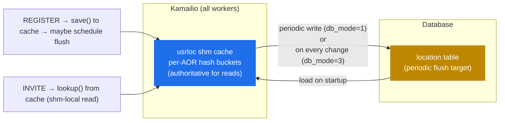

# 6.3 The `usrloc` pattern — in-memory cache, DB sync

> [!IMPORTANT]
> Every registered SIP user has a **contact** — an IP, port, and expiry — that tells the proxy where to send their next INVITE. With 100 000 active users, looking that up in a database on every routing decision would be murder. `usrloc` solves this with a pattern that recurs throughout Kamailio: in-memory cache, periodic DB sync, lock-cheap read path. The pattern itself is worth understanding more than the module specifically — variants of it underpin `dialog` persistence, `dispatcher` gateway lists, and `htable` itself.

## The problem `usrloc` solves

A SIP UA registers by sending REGISTER with a Contact header. The proxy records the binding `AOR → [contact, contact, …]` (Address Of Record → one or more contact URIs, because users can register the same identity on multiple devices). For every subsequent INVITE addressed to that AOR, the proxy does a lookup, finds the contact list, and forwards.

The performance constraint: REGISTER refreshes are constant (~every 30–600 seconds per user), lookups are bursty (every INVITE). Both paths must be cheap. Doing this purely in a database means:

- Every REGISTER → one UPDATE + one COMMIT.
- Every INVITE → one SELECT against an indexed table.

At 100 k users with 5-minute refresh, that's ~333 UPDATEs/sec just for keepalive REGISTERs, plus all the lookup load. Database becomes the bottleneck.

`usrloc` short-circuits this by keeping the entire contact table **in shm**, treating the database as a backup rather than the source of truth on the hot path.

## The architecture



Three things to notice:

1. **The cache is the source of truth at runtime.** Lookups never touch the database. Inserts go to the cache first; the database is updated asynchronously (or not at all, in `db_mode=0`).
2. **The database is for persistence, not consistency.** It exists to repopulate the cache after a restart and to share state between multiple Kamailio instances if you've configured cross-instance replication. The cache leads, the DB follows.
3. **DB mode is a knob.** `db_mode=0` (no DB), `db_mode=1` (write-back, periodic flush), `db_mode=2` (write-through on every change), `db_mode=3` (write-back with realtime cache → DB), with several variants. Production almost always uses 1.

## The cache structure

The cache is a per-bucket-sharded hash, the same shape as `tm` (see [chapter 6.1](16-tm-internals.md)) and `dialog`. Buckets are keyed on a hash of the AOR string. Each bucket holds a linked list of `urecord` structs:

```c
struct urecord {
    str aor;                    // "alice@example.com"
    struct ucontact *contacts;  // linked list of bindings
    /* … flags, refcount … */
};

struct ucontact {
    str contact;                // "sip:alice@1.2.3.4:5060;…"
    time_t expires;             // when this binding goes stale
    str received;               // the source IP/port (for NAT'd users)
    str user_agent;             // the User-Agent header from REGISTER
    /* … many more fields … */
};
```

A single AOR can have multiple `ucontact` entries (user is registered on phone + softphone + WebRTC client; an INVITE will fork to all three). The `lookup()` function returns this list, the script does `t_relay()` with the appropriate fork strategy.

## REGISTER processing

When a REGISTER arrives:

1. Parse the request, authenticate (auth/auth_db), find the AOR.
2. Take the bucket lock for that AOR.
3. Find or create the `urecord`.
4. For each Contact header in the REGISTER:
   - If `expires=0`, remove the matching `ucontact`.
   - Otherwise, insert or update, setting `expires = now + Expires header`.
5. Release the bucket lock.
6. **Maybe** schedule a DB write — if `db_mode=1`, the write is deferred to the next flush tick; if `db_mode=2`, it's done synchronously here (slow path); if `db_mode=0`, it's skipped.
7. Build a 200 OK reply with the current contact set.

The lock is held only during steps 2–5, which are pure shm operations. The DB write in step 6 (if any) happens outside the lock.

## Lookup processing

When an INVITE arrives and the script calls `lookup("location")`:

1. Hash the request URI's user-part to find the bucket.
2. Take the bucket lock.
3. Walk the linked list to find the `urecord`.
4. Iterate `ucontact`s, skipping expired ones.
5. For each valid contact, call `append_branch()` to add a fork destination to `tm`.
6. Release the bucket lock.

That's it. No database, no network round-trip, no IPC — just an in-memory hash lookup with a per-bucket lock. At 1024 buckets and 100 k contacts, the per-bucket linked-list walk is ~100 entries on average, manageable. Bumping `hash_size` makes lookups proportionally cheaper if your scale is higher.

## The expiry sweeper

Expired contacts have to be cleaned up eventually. `usrloc` spawns a **dedicated worker process** (one of the module-helper processes introduced in [chapter 2.1](02-process-model.md)) that:

1. Wakes up on a timer (typically every minute).
2. Walks every bucket, every `urecord`, every `ucontact`.
3. Deletes contacts where `expires < now`.
4. If `db_mode=1`, writes the deletions to the DB in the same pass.

The sweeper takes per-bucket locks one at a time, briefly. It doesn't block lookups or REGISTER processing for more than a fraction of a millisecond per bucket.

> [!TIP]
> If a UAC stops sending REGISTERs (turns off the phone, loses network), its contacts will sit in the cache for up to one sweep interval after their expiry. Lookups during that window still return the stale contact, which Kamailio will try to forward to. For most setups this is harmless — `tm`'s retransmission timeout will fail the call quickly. Tune the sweep interval if your environment expects very fast detection of dropped UAs.

## DB sync mechanics

In `db_mode=1` (the production default), `usrloc` keeps a **per-record dirty flag**. When a REGISTER mutates a contact, the corresponding `urecord` is marked dirty. The flush worker (a second helper process, or the sweeper if configured) walks the cache periodically and writes only the dirty records to the database. Clean records are skipped.

This is the win: at 333 REGISTERs/sec, the DB only sees the actual changes, not the keepalive refreshes that don't change a binding. A REGISTER that comes in with the same Contact and a refreshed expiry is *not* dirty in the sense of "needs DB write" — `usrloc` updates the in-memory expiry but doesn't flush unless the binding itself changes.

The trade-off: **between flushes, the DB lags reality**. If Kamailio crashes between two flushes, the bindings in shm that happened in that gap are lost. On restart, the cache is rebuilt from the DB and users whose registrations happened in the gap will have to re-REGISTER. For most operators this is acceptable; for stricter SLAs, push `db_mode=2` (write-through) and accept the per-REGISTER DB cost.

## The pattern, generalised

The `usrloc` design — **in-shm cache + per-bucket lock + dirty-flagged DB sync** — appears repeatedly in Kamailio:

- `dialog` uses essentially the same pattern for call records and DB-backed persistence.
- `dispatcher` keeps the gateway list in shm, reloads from DB on `dispatcher.reload`.
- `htable` is the explicit "do this pattern for your own data" module — generic key-value cache in shm with optional DB backing.
- `permissions`' address tables follow the same shape.

When you see "this module is fast on read because state lives in shm, but persists to a DB" — that's the `usrloc` pattern. The trade-offs (lookup speed vs. consistency, DB-mode choices, fragmentation under churn) are the same wherever it appears.

The next chapter moves out of the state-tracking modules and into the control plane — RPC, `kamcmd`, and how the runtime exposes its insides to the operator.

---

<p align="center">
  <a href="./">← Table of contents</a> · <a href="17-dialogs.md">← 6.2 Dialogs</a> · <a href="19-topos.md">Jump to 8.1 Topology hiding →</a>
</p>
