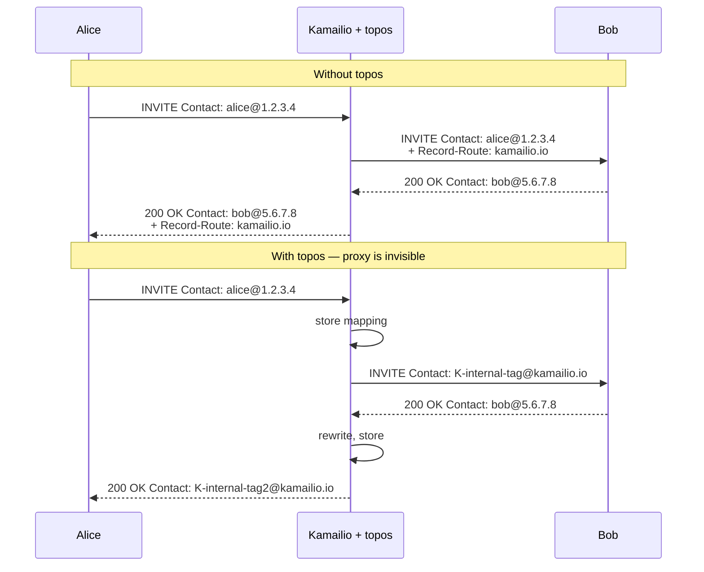

# 8.1 Topology hiding (`topos`)

> [!IMPORTANT]
> A SIP proxy is, by RFC, visible: it adds `Via` and `Record-Route` headers, and its IP propagates into the Contact information of every call. **`topos`** is the module that rewrites every in-dialog message so that the proxy chain becomes invisible to the endpoints. Useful for hiding internal topology from external peers, for routing in-dialog requests through specific paths, and for transparent gateway insertion.

## What you're actually hiding

When Kamailio proxies an INVITE, the outgoing message has at minimum:

- A **`Via`** header added by Kamailio, listing its own IP and a branch parameter.
- A **`Record-Route`** header if `record_route()` was called, asking subsequent in-dialog requests to traverse this proxy.
- The `Contact` header from the UAC, unmodified.

The endpoints save all of this in their dialog state. When the callee sends a BYE, it uses the route set built from `Record-Route` — meaning it sends the BYE *to* Kamailio, by IP, with Kamailio's hostname in the Route header. Kamailio's existence is permanently advertised in the dialog.

For some operators that's fine. For others — voice carriers, enterprise gateways, anyone where the proxy's IP is internal infrastructure that mustn't leak — it's not. `topos` rewrites the messages so the dialog state at each endpoint refers only to *itself*, not the proxy.

## What `topos` actually does

On the outgoing INVITE to Bob, `topos` strips Alice's Contact and replaces it with a Kamailio-managed identifier. On the 200 OK back to Alice, it strips Bob's Contact and replaces it with another Kamailio-managed identifier. Bob's BYE sends to "alice via Kamailio-identifier," but the identifier resolves only inside Kamailio — Bob never learns Alice's real IP.

In-dialog requests work by **lookup**: every BYE, re-INVITE, etc. carrying a topos-managed identifier triggers Kamailio to look up the original Contact in its mapping table, restore it, and forward.

## The mapping table

`topos` keeps its mapping in shm, keyed on a token that it embeds into the rewritten headers. The table holds:

- The token (Kamailio's identifier).
- The original Contact URI on both sides.
- The original Record-Route set.
- The dialog identifiers (Call-ID, From-tag, To-tag) for matching.
- Timestamps for expiry.

The table is per-bucket-locked exactly like `tm` and `usrloc` (chapter 6) — same pattern. Hash size and lock count are configurable.

In the basic `topos` module, the table is shm-resident only. **`topos_redis`** is the variant that keeps the mapping in an external Redis instance, so multiple Kamailio instances can share the topology-hiding state and a call surviving an instance restart can still have its in-dialog requests rewritten correctly.

## Why this matters architecturally

`topos` is one of the clearest examples of why Kamailio's lump system (chapter 3.3) is load-bearing. Topology hiding requires the proxy to rewrite Contact and Record-Route on **every** message of a call — INVITE outgoing, 200 OK incoming, ACK in both directions, BYE in both directions, every re-INVITE. Without lumps, that would be a buffer copy per rewrite per message. With lumps, each rewrite is a queued operation and the assembly happens in one pass at send time.

It also shows the value of `dialog`. The natural place to keep the mapping is keyed on dialog identifiers — and `dialog` already keeps a record per call. `topos` can hang its data off the existing dialog record (or maintain a parallel structure, depending on configuration).

## When to use it

Use `topos` when:
- You're at a peering boundary and don't want internal IPs leaking to external peers.
- You need every in-dialog message to take a specific path through your infrastructure regardless of what endpoints would naturally do.
- You're inserting a proxy transparently into an existing topology and need both endpoints to act as if it isn't there.

Skip `topos` when:
- Your topology is internal and visibility is harmless.
- shm budget is tight and call concurrency is high — `topos` costs ~hundreds of bytes per active dialog.
- The endpoints depend on seeing each other's real Contact (rare but happens with some custom SIP clients).

## Operational gotchas

> [!WARNING]
> **Without `topos_redis`, a restart of Kamailio kills all in-flight topos-managed calls.** Each call's mapping is in shm; restart wipes shm; the next BYE for that call hits an empty mapping table and Kamailio doesn't know where to send it. With `topos_redis`, the mapping survives restart because Redis does.

- **`topos` adds latency.** Every rewritten message costs a mapping lookup or insert. Sub-millisecond, but real.
- **The token format is internal.** Don't rely on it being parseable by external tools.
- **Pair with `dialog`.** Without dialog tracking, `topos` has no natural place to expire mappings other than its own internal timers — easier to leak.

The next chapter is about a different kind of architectural trick: making a route asynchronous so the worker doesn't block.

---

  <a href="./">← Table of contents</a> · <a href="18-usrloc.md">← 6.3 usrloc pattern</a> · <a href="20-async-transactions.md">Next: 8.2 Async transactions →</a>

