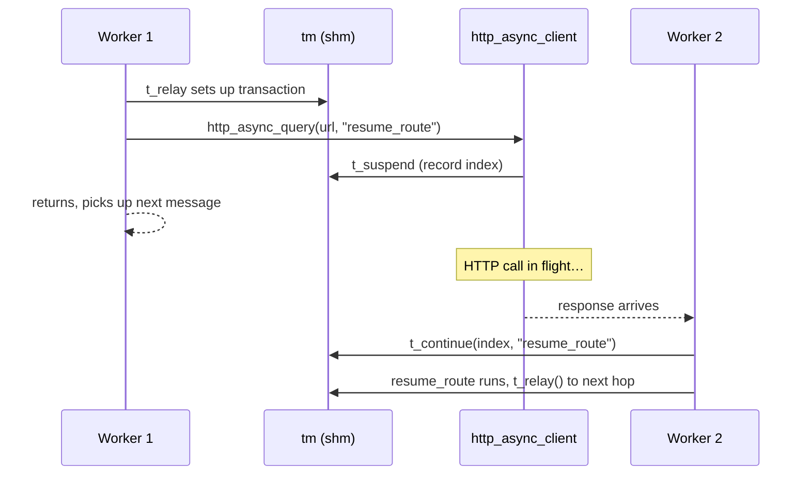

# 8.2 Async transactions — `t_suspend` / `t_continue`

> [!IMPORTANT]
> Kamailio's worker model (chapter 2.1) says: one worker is busy for one message, start to finish. The async transaction primitive — `t_suspend()` / `t_continue()` — is the architectural escape hatch from that rule. It's what lets a route make a slow external call (HTTP, database, custom protocol) without parking the worker until it returns.

## The problem

A worker that calls `http_client.curl(...)` in cfg synchronously blocks. The whole `request_route` is on hold until the HTTP server responds. With `children=8` and an upstream HTTP service that takes 200 ms to respond, you can handle at most **40 messages per second across the whole instance** while making that HTTP call — because eight workers × 5 messages/sec each is the entire capacity.

Worse, the kernel keeps stacking incoming SIP packets in the socket queue while the workers are stuck. If the queue fills, you start dropping at the kernel level — invisible to the application.

You can throw more workers at the problem, but more workers means more shm pressure, more locks contention on every hot path, and ultimately a wall around 64–128 children.

The architectural answer is to **release the worker** while the slow call is in flight, and re-enter the route only when the result is ready.

## `t_suspend()` and what it actually does

`t_suspend()` is a C function (exposed to the script as `t_suspend()` and to KEMI as `KSR.tm.t_suspend()`) that does this:

1. Tells the current `tm` transaction "I'm pausing — don't time out yet, don't relay anything, don't fire branch/failure routes until I say so."
2. Allocates a small **suspension index** — a token that identifies this paused state.
3. Returns to the script.

The script can now record the index somewhere external (in the HTTP request as a callback ID, in a job queue, etc.), call `exit`, and **the worker returns to its `recvfrom` loop** to handle the next message. The transaction is still alive in `tm`'s hash table; nobody is waiting for it; nothing happens to it until somebody calls `t_continue()`.

## `t_continue()` and the resume path

Some time later — milliseconds or seconds — the async operation completes. The result is some event in the system: an HTTP response arrived, a database query finished, a timer fired. Whatever module handles that event calls:

```c
t_continue(suspension_index, "resume_route", "result_arg")
```

This:
1. Finds the suspended transaction by index.
2. Wakes it back up in `tm`.
3. Schedules the named cfg route (`resume_route`) to run, with the result as a `$avp` or `$var`.
4. The next worker to pick up the wakeup runs that route — typically `t_relay()`, `t_reply()`, or another async hop.



Importantly, **`t_continue()` may run on a different worker than the one that called `t_suspend()`**. The transaction is in shm; any worker can resume it. This is what makes the model scale — async work can be picked up by whichever worker happens to be free when the result lands.

## The modules that use this

Several modules are built around `t_suspend` / `t_continue`:

- **`http_async_client`** — fire-and-forget HTTP request, route resumes with the response body in an AVP.
- **`db_redis`** (with its async variants) — Redis queries that don't block the worker.
- **Custom protocols via `tm_async`** — anyone implementing an external call can wire it through this same primitive.
- **Event routes** in general — `event_route[some:trigger]` running on a `t_continue`'d transaction.

The pattern is uniform: a "fire" call that records the suspension and returns immediately, plus a "result handler" that calls `t_continue()` when the answer arrives.

## What suspension does to the transaction's timers

`tm`'s normal final-response timer (`tm_max_inv_lifetime`, default 180 s) is still ticking during suspension. If you `t_suspend()` and never `t_continue()`, the transaction will eventually time out and run its `failure_route` (or fail silently if none is set).

This is a **leak-protection** feature: an async operation that goes missing won't pin shm forever. But it also means you must size your timeouts so the longest plausible async resume happens well within `tm_max_inv_lifetime`. An HTTP call to a flaky upstream that takes 60 s to time out is fine; one that takes 5 minutes will get reaped by `tm` before its result arrives.

## State across the boundary

What survives the suspend/resume gap:

- **The transaction in shm.** Including its branches, its lumps queued so far, its hooks.
- **AVPs and `$var(...)`** — wait, no. `$var()` is per-process, pkg memory; it does **not** survive across the boundary. AVPs *do*, because they live on the transaction.
- **The `sip_msg`** — kind of. `tm` has copied the message into shm; the resumed route operates on that copy.

> [!TIP]
> If you need to pass data from before-suspend to after-resume, **use AVPs** (`$avp(name)`), **dialog variables** (`$dlg_var(name)` if `dialog` is enabled), or pass it through the async module's callback args. Don't rely on `$var()` — it will be gone.

## Cost and limits

The cost of one suspend/resume cycle is:
- One small shm allocation for the suspension index.
- Two more hash-table touches in `tm`'s table (one to suspend, one to resume).
- The cost of re-entering the cfg route at the resume point.

Total: tens of microseconds, plus whatever the external operation takes. Cheap.

The limit: `tm_max_inv_lifetime` (default 180 s) and shm capacity. You can have tens of thousands of concurrent suspended transactions if shm has room.

## When to use it

Use `t_suspend`/`t_continue` when:
- A route needs to make a slow external call (>10 ms).
- You're integrating with a system whose response time you don't fully control.
- Throughput targets require more concurrent calls in flight than your worker count can hold synchronously.

Skip it when:
- The external call is fast and bounded (<1 ms, like a local memcached) — the bookkeeping cost may outweigh the benefit.
- The route doesn't need to make any external calls — async adds complexity without payoff.

The next chapter is about a different kind of cross-message state: `htable`, the generic shm hash table that backs many of these async resume patterns.

---

<p align="center">
  <a href="./">← Table of contents</a> · <a href="19-topos.md">← 8.1 Topology hiding</a> · <a href="21-htable.md">Next: 8.3 htable →</a>
</p>
