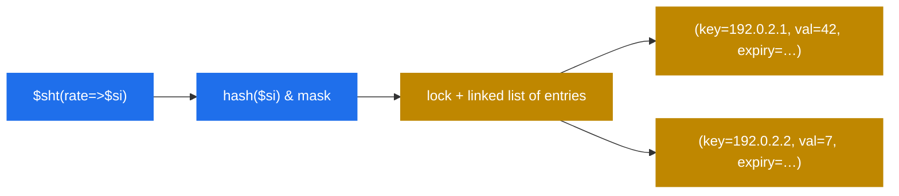

# 8.3 `htable` — shared-memory hash tables as a poor man's Redis

> [!IMPORTANT]
> Every Kamailio deployment eventually needs "a place to put some state that's shared across workers and lives a bit longer than a single message." Auth caches, rate limiters, per-call decision tags, dedup counters. `htable` is the answer: a generic key-value store in shm, with per-bucket locks, per-entry TTLs, optional DB backing, and direct script and KEMI access. It is **the most-reused architectural pattern in any non-trivial Kamailio config**.

## The shape

```kamailio
modparam("htable", "htable", "auth_cache=>size=10;autoexpire=300;")
modparam("htable", "htable", "rate=>size=8;autoexpire=60;")
modparam("htable", "htable", "cache=>size=12;dbtable=kamailio_cache;dbmode=2;")
```

Each `htable` definition declares an **independent named table**: bucket count (`size=N` means 2^N buckets), expiry policy (`autoexpire` in seconds), and optionally a database table for persistence.

From the script:

```kamailio
$sht(auth_cache=>$au) = "$Ts";
if ($sht(rate=>$si) > 100) {
    sl_send_reply("429", "Too Many Requests");
    exit;
}
$sht(rate=>$si) = $sht(rate=>$si) + 1;
```

`$sht(<table>=><key>)` reads and writes. Reads of missing keys return null; writes insert. The whole expression sits on top of one hash lookup plus one bucket lock acquisition per operation.

## What's actually in shm



The structure should look familiar: per-bucket-sharded hash, one lock per bucket, linked list of entries within. The same pattern that `tm`, `dialog`, and `usrloc` use. `htable` just exposes it as a generic facility instead of tying it to a specific use case.

Entries carry:
- **Key** (string).
- **Value** — string or integer (one of, not both).
- **Expiry** — absolute timestamp; an expiry sweeper process clears entries past their deadline.
- **Update timestamp** — for cache-staleness checks.

## Why script writers reach for it constantly

The cfg DSL has no data structures (chapter 3.4 / 4.1). The only way to remember anything across two messages — and to share that memory across workers — is to put it in shm. `htable` is the easiest path: no schema, no DB, no extra module, no operational ceremony. Common patterns:

**Auth caching.** After a successful digest auth, store `(user → auth-token-with-expiry)` in an htable. Subsequent requests from the same user with the same token skip the DB hit:

```kamailio
if ($sht(auth_cache=>$au) == $hdr(Authorization)) {
    # cached hit, bypass the heavy auth path
    route("post_auth");
}
```

**Per-source rate limiting.** Count requests per source IP per second:

```kamailio
$sht(rate_per_ip=>$si) = $sht(rate_per_ip=>$si) + 1;
if ($sht(rate_per_ip=>$si) > 100) { exit; }
# `autoexpire=1` on this table makes it a rolling 1-second counter
```

**Dedup / replay protection.** Remember a message's Call-ID for a few seconds; reject duplicates:

```kamailio
if ($sht(seen=>$ci) != $null) { exit; }
$sht(seen=>$ci) = 1;
```

**Per-call decision tagging.** Stash a decision early in `request_route` so `branch_route` and `failure_route` can read it back later.

## The DB-backed variant

Two `dbmode` options exist for tables that want persistence:

- **`dbmode=2`** — read-through and write-through. Lookups that miss the cache fall through to the DB; writes go to both. Slowest, most consistent.
- **`dbmode=3`** — write-back. Writes go to shm only; a periodic flush writes dirty entries to the DB. Reads stay shm-only. Fastest, eventually consistent.

The DB-backed mode is useful for tables that:
- Need to survive a Kamailio restart (auth caches, rate-limit windows, allowlists).
- Are populated by external systems (a CRM updates a table; Kamailio reads it).

For ephemeral state (per-second rate counters, in-flight transaction tags), skip the DB and let `autoexpire` clean things up.

## RPC controls

The runtime exposes htable contents via RPC, which is huge for debugging:

```bash
kamcmd htable.dump auth_cache              # print the whole table
kamcmd htable.get auth_cache alice@x.com   # one key
kamcmd htable.sets rate_per_ip 1.2.3.4 0   # set a key (str)
kamcmd htable.setxs rate_per_ip 1.2.3.4 0  # set with expiry
kamcmd htable.delete rate_per_ip 1.2.3.4   # delete
kamcmd htable.reload my_cache              # reload from DB
```

`htable.dump` is what you reach for when something feels wrong in production. It's the "look inside the shared state" command. Cheaper than a debugger; more focused than a log dump.

## Sizing and operational notes

The two knobs that matter:

- **`size`** — bucket count is `2^size`. Set it so the expected number of live entries per bucket is small (≤10 ideally). For 10 000 entries: `size=10` (1024 buckets, ~10 entries per bucket).
- **`autoexpire`** — how long entries live without being touched. Affects shm usage directly.

> [!TIP]
> When debugging a script that uses htable, **dump first, reason second**. The state is observable; you don't have to guess.

## Limits and anti-patterns

`htable` is not a database, not Redis, not a queue. Practical limits:

- **No atomic compare-and-set.** You can read, then write, but between those two operations another worker can intervene. For counters this is usually fine (off-by-one in rate limiting doesn't matter). For more careful state machines, you have to design around it.
- **No iteration from the script.** You cannot loop over the entries of a table in cfg. (KEMI has it via `KSR.htable.dump` callbacks, but it's not zero-cost.)
- **No transactions.** Multi-table updates are not atomic across tables.
- **shm is bounded.** Don't put unbounded data in here — auth caches with no TTL, dedup tables that never clean up, etc.

Use `htable` for what it is: small, fast, observable shm state. For real database needs, real database. For real queue needs, real queue.

The next chapter takes the most common application of `htable`-shaped thinking — distributing call routing across multiple backends — and digs into how `dispatcher` does it well.

---

<p markdown="1" align="center">
  [← Table of contents](../) · [← 8.2 Async transactions](20-async-transactions.md) · [Next: 8.4 dispatcher →](22-dispatcher.md)
</p>
