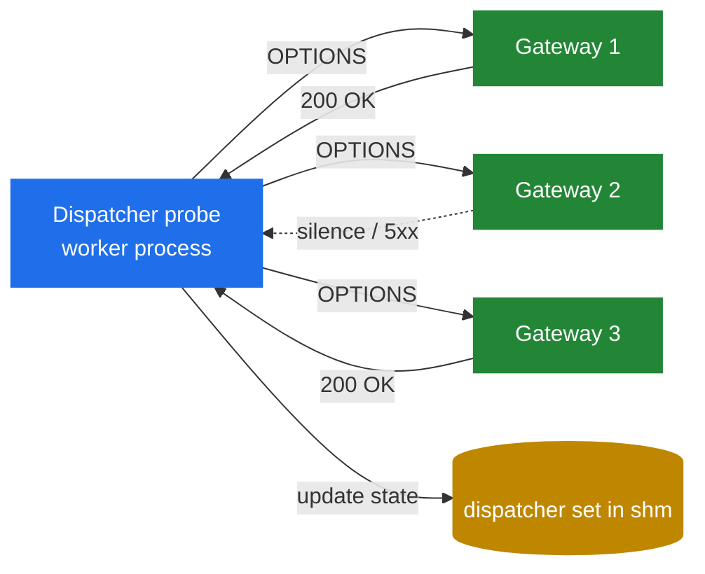

# 8.4 `dispatcher` — algorithms and stickiness

> [!IMPORTANT]
> Distributing calls across multiple back-ends — gateways, PBXes, media servers — is one of the most common things a SIP proxy does. The `dispatcher` module is Kamailio's load-balancing primitive: a set of destinations, an algorithm for picking among them, dead-detection via probing, and the per-call stickiness mechanisms that make sure both halves of a call hit the same back-end. It's not flashy, but the algorithm choices are interesting.

## What dispatcher actually is

A **dispatcher set** is a named, numbered group of destinations:

```
1 sip:gw1.internal:5060 0 60 "uri=sip:check@gw1.internal"
1 sip:gw2.internal:5060 0 60 "uri=sip:check@gw2.internal"
1 sip:gw3.internal:5060 0 60 "uri=sip:check@gw3.internal"
```

Set 1 has three destinations. Per row: address, flags, priority, attributes. The set is loaded from a database table (or a flat file) at startup and held in shm. `dispatcher.reload` RPC can refresh it without restart.

From the script:

```kamailio
ds_select_dst("1", "4");   # set 1, algorithm 4 (round-robin)
t_relay();
```

That call picks one destination from set 1 using algorithm 4, sets the request URI accordingly, and returns. The next `t_relay()` sends to the chosen destination.

## The algorithms

`dispatcher` ships with a dozen+ algorithms. The architecturally interesting ones:

| Algorithm | What it does | When you want it |
|---|---|---|
| 0 — hash over Call-ID | Same Call-ID → same destination | Per-call stickiness for stateless dispatch |
| 1 — hash over From URI | Same caller → same destination | Per-user stickiness |
| 2 — hash over To URI | Same callee → same destination | Anti-affinity for cases where calls to the same callee should consolidate |
| 4 — round-robin | Every call goes to the next destination in sequence | Pure load distribution, no stickiness |
| 7 — hash over Authorization | Same auth identity → same destination | Auth-aware stickiness |
| 8 — random | Pick at random | Stateless distribution with no patterns |
| 10 — priority + weight | Pick by configured priority, with weights | Active/standby with primary preference |

The **hashing algorithms (0–3, 7)** all use the same mechanism: hash the input, modulo the number of *active* destinations, pick that one. They give per-call stickiness *as long as the destination set doesn't change*. If a destination dies and gets removed from the active list, the modulo changes and all hashes shift — the call is sticky within a stable topology, not across topology changes.

**Round-robin (4)** keeps a single counter per set in shm, incremented per call, taken modulo the destination count. The counter being shared across workers means it needs a lock per increment — cheap (the increment is one atomic op) but it does serialise across workers briefly. At very high CPS (>50 k), the counter can become a contention point.

**Priority+weight (10)** lets you say "send 80% to gateway A, 20% to gateway B, fall back to C if both fail." The algorithm picks a destination by weight; if it's down (per probing), tries the next priority bucket.

## Probing — knowing what's alive

For load balancing to make sense, you need to know which destinations are actually up. `dispatcher` does this by **periodically pinging** every destination with a SIP OPTIONS request (a "is this thing alive?" probe).



A dedicated worker process (introduced in chapter 2.1) handles probing. The interval (`ds_ping_interval`), the threshold for marking a destination dead (`ds_probing_threshold`), and the criteria for marking it alive again (`ds_inactive_threshold`) are all configurable.

A destination's state lives in the in-shm dispatcher set: active, probing (temporarily disabled), or trying (came back from dead, on probation). Routing decisions look at this state and skip inactive destinations.

## The stickiness mechanism, in detail

If algorithm 0 (Call-ID hash) is in use, the algorithm guarantees that:
- Every message with the same Call-ID lands on the same destination.

This matters because:
- For the call setup (INVITE → 200 OK → BYE), all three messages need to go to the same back-end so the back-end has consistent state.
- For a re-INVITE in the middle of a call, same back-end again.
- For a follow-up call to the same destination AOR (Bob calls Alice, then Alice calls Bob back), routing should preferably go through the same gateway for accounting.

The algorithm achieves this **without keeping per-call state** — it's pure hashing. No shm cost for the stickiness, just the existing dispatcher table. This is critical at scale: a million concurrent calls would cost a million entries in any stateful-stickiness scheme; with hash-based stickiness, it costs nothing.

The cost of hash-based stickiness is the topology-instability problem mentioned above. If `dispatcher.reload` runs while calls are in progress and the destination list changes, hashes shift. New calls go to new destinations; in-flight in-dialog requests may continue to find the right destination (because their Call-ID still hashes to the same gw *if* the set hasn't shrunk) or may not.

## Sets and gateways

A `dispatcher` deployment usually has multiple sets, each with its own algorithm and its own purpose:

- **Set 1** — outbound carriers (round-robin or weighted priority).
- **Set 2** — internal PBX gateways (hash by Call-ID for stickiness).
- **Set 3** — media servers (hash by To URI for callee-affinity).

The script chooses which set to dispatch to based on routing rules — outbound calls go to set 1, internal calls to set 2, recording inserts go to set 3.

## Operational use

```bash
kamcmd dispatcher.list                  # show all sets and destination states
kamcmd dispatcher.set_state ai 1 sip:gw1:5060   # mark active and inactive
kamcmd dispatcher.reload                # reload table from DB
```

`dispatcher.list` is the operational dashboard. It shows each destination's state, last probe result, and last-success timestamp. If a destination has been flapping, the timestamps reveal it.

## Beyond dispatcher

`dispatcher` is the "static load balancer in shm" pattern. For more dynamic needs, the same architectural ideas show up elsewhere:

- **`uac_redirect`** — re-route based on 3xx responses.
- **DNS SRV-based routing** — let DNS provide the destination set; cache results in shm.
- **External service discovery** — KEMI script calls Consul/etcd, populates an htable, dispatcher reads it.

The architectural pattern that's shared across all of these: **destinations in shm, probing or DNS or HTTP for liveness, algorithm picks one, lookup is lock-cheap**. Once you've internalised the shape, it shows up everywhere.

The next chapter is about coordinating state across multiple Kamailio instances — `dmq`.

---

<p align="center">
  <a href="./">← Table of contents</a> · <a href="21-htable.md">← 8.3 htable</a> · <a href="23-dmq.md">Next: 8.5 dmq →</a>
</p>
