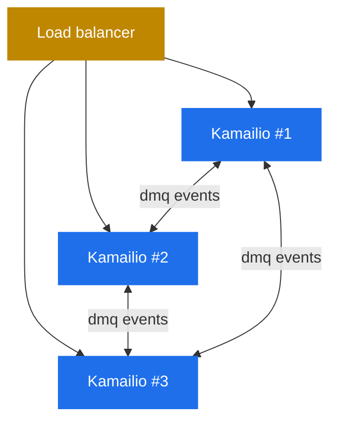

# 8.5 `dmq` — distributed state across instances

> [!IMPORTANT]
> Everything described so far in part 6 — `tm` transactions, `dialog` records, `usrloc` contacts, `htable` entries, `dispatcher` state — lives in **one Kamailio instance's** shm. The moment you run two Kamailio instances behind a load balancer, those shm regions are independent, and nothing keeps them in sync. **`dmq`** — Distributed Message Queue — is the fabric that propagates state changes between instances.

## The problem of multiple instances

Three Kamailio instances behind a load balancer share inbound traffic. A REGISTER from Alice happens to land on instance #1. Alice's contact ends up in instance #1's `usrloc` cache. Five seconds later, Bob calls Alice. The INVITE lands on instance #2 (different worker, different machine).

Instance #2 looks up Alice in its `usrloc` — and finds nothing. Alice is registered, but only on instance #1. The call fails.

The fix is to make state replicate. Every state change on any instance has to fan out to all the others. `dmq` is the bus that does it.

## What `dmq` actually is

A peer-to-peer mesh over SIP. Each Kamailio instance is a `dmq` node. Nodes know about each other (configured statically, or discovered) and exchange messages over a dedicated SIP transport — actually the same listening sockets, just on a different SIP method/route.



When a module on one node wants to broadcast state, it publishes a message on a named `dmq` "channel" (usrloc, dialog, htable, dispatcher each have their own). Every other node subscribed to that channel receives the message and applies the update to its own shm.

The transport is normal SIP. A `KDMQ` (a custom SIP method) request goes from one node to another. The receiver parses, dispatches by channel name to the appropriate module, and the module updates its in-memory state.

## Channels and what they replicate

Each module that supports dmq registers its own channel handler. The well-known ones:

| Module | Channel | What gets replicated |
|---|---|---|
| `usrloc` | `usrloc` | Contact inserts, updates, deletes |
| `dialog` | `dialog` | Dialog state transitions (early → confirmed → terminated) |
| `htable` | per-table channel | Entry inserts and deletes (configurable per table) |
| `dispatcher` | `dispatcher` | Destination state changes (active/inactive) |
| `dmq_usrloc` | dedicated | Specialised usrloc-only replication with stronger ordering |

The list grows as modules add dmq support. The pattern is the same: when the module mutates its in-shm state, it serialises the change and publishes; receivers deserialise and apply.

## Cluster topology and membership

A `dmq` cluster is configured by:

1. **Listing the peer URIs** (each node knows the SIP addresses of every other node).
2. **Identifying yourself** (each node has its own URI it publishes from).
3. **Subscribing to channels** (which modules participate in replication).

When a node starts up, it greets its peers with a `KDMQ` registration. Peers add it to their list of recipients. When a node goes down, peers notice (via probing or failed sends) and stop sending to it.

There's no leader election, no quorum — it's a flat mesh. Every node has equal status. The cost is **O(N²) connections** for N nodes; the simplicity is worth it up to a few dozen nodes.

For larger clusters, the architectural answer isn't a more complex dmq topology — it's to shard the load balancer in front of Kamailio (consistent-hashing the inbound traffic by user) so each shard is a small dmq cluster.

## Consistency model

`dmq` is **eventually consistent**. There is no transactional guarantee that all nodes apply an update at the same instant. The order of operations:

1. Module on node A mutates its shm.
2. Module publishes the change to dmq.
3. Some milliseconds later, nodes B and C receive the message and apply it.

During step 2-3, node B and C have stale state. For most replicated state — registrations, dialog state, dispatcher liveness — this is harmless. A REGISTER that hasn't propagated yet just means a slightly delayed first call from that user. A dialog termination that hasn't propagated yet just means a slightly delayed cleanup on the other nodes.

What's not okay is **anything that depends on a strictly consistent view across nodes**. dmq is not a coordination primitive; it's a replication bus. If you need locks across nodes, an external system (Redis, ZooKeeper) is the right place. dmq does not replace that.

## Failure modes

A few things to watch:

> [!WARNING]
> **A network partition between dmq peers causes split-brain in state.** Each side keeps mutating its shm and publishing locally, but the partition prevents propagation. When the network heals, both sides try to push their accumulated changes — and the order in which they're applied is undefined. State may converge unpredictably.

- **A slow dmq peer can back up the local queue.** If node B is sluggish, node A's publish-to-B may take longer. Module behaviour during this varies — some modules block, some drop, some queue with bounded size.
- **Replication amplifies write load.** Every REGISTER you handle locally also fires N-1 dmq sends to peers. For high-CPS REGISTER traffic across many nodes, the dmq traffic alone can be substantial.
- **Modules don't all replicate everything.** `dialog` replicates state transitions, not the full dialog contents. If you need rich per-call state on every node, `dialog`'s dmq replication may not be sufficient — `topos_redis` or a real distributed store is.

## When to use dmq, when to use Redis instead

`dmq` is the right answer when:
- You're running 2–10 Kamailio instances.
- The state to replicate is small per item (contacts, dialog identifiers, htable keys).
- Eventual consistency is fine.
- You don't want to add an external dependency.

A real external store (Redis, often) is the right answer when:
- You have lots of instances (20+).
- The state is large (full call recording metadata, deep auth caches).
- You need stronger consistency or query capabilities (TTLs, atomic ops, range queries).
- You're sharing state with non-Kamailio services.

In practice, large operators use **both**: dmq for the cheap fast-replicating state (registrar contacts, dispatcher liveness), Redis (or similar) for the things that need real persistence and strong queries.

## Operational use

```bash
kamcmd dmq.list_nodes      # show the dmq cluster membership from this node's POV
kamcmd dmq.process         # trigger one round of message processing manually
```

`dmq.list_nodes` is the operational equivalent of "is the cluster healthy?" — it shows each peer's known state (`up`, `pending`, `disabled`) and the time of last contact. A peer that's been silent for too long is the first sign of a propagation problem.

## Why this is the right closer for the tricks chapter

`dmq` is the architectural piece that turns Kamailio from "a powerful single-box SIP server" into "a scale-out SIP platform." Every other piece you've read about — process model, shm, lumps, transactions, dialogs, KEMI, topos, async, htable, dispatcher — exists at the scale of one instance. `dmq` is the seam that lets you operate many of those instances as if they were one. None of them designed for distribution from the start; `dmq` adds it as an opt-in retrofit, which is honest and which works.

The final part of the handbook is the reference material — process role glossary and a term map.

---

<p align="center">
  <a href="./">← Table of contents</a> · <a href="22-dispatcher.md">← 8.4 dispatcher</a> · <em>Next: Reference (coming)</em>
</p>
