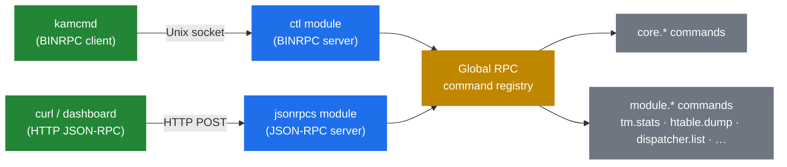

# 7.1 RPC architecture

> [!IMPORTANT]
> Everything operators do to inspect or manipulate a running Kamailio — `kamcmd`, HTTP-based health checks, dashboards, reload scripts — goes through one of two RPC layers: **BINRPC** (binary, over a Unix socket, fast) or **JSON-RPC** (text, over HTTP, integrations-friendly). Both expose the same set of registered commands. Picking between them is purely about the transport, not the capability.

## The shape

Every module that wants to expose runtime functionality registers a **command table** at startup, much like the KEMI exports table (chapter 5.2):

```c
static const char* tm_stats_doc[] = {
    "Print tm transaction statistics.",
    NULL
};

static rpc_export_t tm_rpc[] = {
    {"tm.stats", rpc_tm_stats, tm_stats_doc, 0},
    /* … more commands … */
    {0, 0, 0, 0}
};
```

Each entry says "command name, C function to call, doc strings, flags." At module init, Kamailio walks every loaded module's `rpc_export` table and stuffs every entry into a global command registry. After init, the registry is sealed.



The two server modules — `ctl` (for BINRPC) and `jsonrpcs` (for JSON-RPC) — both ultimately dispatch to the same registered commands. A `tm.stats` call lands on the same C function regardless of whether you invoked it via `kamcmd` or a `curl` to `/RPC`.

## BINRPC — the operator's path

BINRPC is a compact binary format spoken over a Unix domain socket (typically `/run/kamailio/kamailio_ctl` or `/var/run/kamailio/kamailio_ctl`). The `ctl` module owns the socket. A small dedicated worker process listens on it and dispatches incoming requests to the registry.

Why BINRPC matters:
- **It's fast.** No HTTP framing, no JSON parsing — just a length-prefixed binary message.
- **It's local-only.** Unix sockets are filesystem objects with permissions; no firewall needed.
- **It's the default for `kamcmd`.** Every operator tool reaches for it first.

When you run `kamcmd core.shmmem` on the Kamailio host, the tool:
1. Connects to the Unix socket.
2. Serialises the command and arguments to BINRPC.
3. Writes them.
4. Reads the BINRPC response.
5. Renders to text.

Sub-millisecond round-trip locally. No surprises.

## JSON-RPC — the integration path

`jsonrpcs` exposes the same registry over HTTP, with requests and responses in JSON. Configurable to listen on a TCP port, a Unix socket, or a FIFO. Typical configuration:

```kamailio
modparam("jsonrpcs", "transport", 7)        # bitmask: 1=fifo, 2=datagram, 4=http, 7=all
modparam("xhttp", "url_match", "^/RPC")
```

A call looks like:

```bash
curl -X POST http://kamailio:5060/RPC \
  -d '{"jsonrpc":"2.0","method":"tm.stats","id":1}'
```

Why this one matters:
- **External monitoring talks HTTP natively.** Prometheus exporters, dashboards, alerting tools.
- **It's scriptable from anywhere.** Not just from the host Kamailio runs on.
- **It plays with API gateways** — auth, rate-limiting, audit logs all live on the HTTP path.

The cost is real, though: every JSON-RPC call parses HTTP, allocates objects for JSON, and dispatches through a longer code path than BINRPC. For high-frequency polling, BINRPC is meaningfully cheaper.

## What commands exist

A few categories worth knowing exist:

| Prefix | Owner | What it does |
|---|---|---|
| `core.*` | Kamailio core | shm/pkg stats, process info, log level, uptime |
| `tm.*` | tm module | Transaction stats, in-flight count, hash distribution |
| `dialog.*` | dialog module | Dialog stats, dump, profile counters |
| `usrloc.*` (`ul.*`) | usrloc module | Contact dump, count per AOR, reload from DB |
| `dispatcher.*` (`ds.*`) | dispatcher module | Set listing, mark active/inactive, reload |
| `htable.*` (`sht.*`) | htable module | Get/set/delete entries, dump table, reload |
| `dmq.*` | dmq module | Peer status, manual trigger of processing |
| `cfg.*` | core | Runtime-mutable module parameters (chapter 2.4) |
| `app_lua.*`, `app_python3.*` | KEMI modules | Reload script, run code |

`kamcmd rpc.entries` enumerates the entire registry of commands currently loaded — useful when you don't remember the exact name.

## Authentication and authorisation

This is where the two transports diverge.

BINRPC over a Unix socket is **gated by filesystem permissions** — typically the socket is owned by the `kamailio` user and group, and only processes running as that user can talk to it. There is no in-protocol auth.

JSON-RPC over HTTP has **no built-in auth either**, by design. You're expected to put it behind something that authenticates: a reverse proxy with basic auth, a VPN, network ACLs, an authenticating API gateway. **Never expose `jsonrpcs` directly on a public interface.**

> [!WARNING]
> Many commands let you mutate state — change log level, drop a registration, modify htable entries, mark dispatcher destinations down. Anyone who can speak RPC to Kamailio can do operationally meaningful damage. Treat RPC access as administrative privilege.

The next chapter looks at `kamcmd` specifically and the operational dashboard it gives you over BINRPC.

---

<p markdown="1" align="center">
  [← Table of contents](../) · [← 8.5 dmq](23-dmq.md) · [Next: 7.2 kamcmd →](25-kamcmd.md)
</p>
