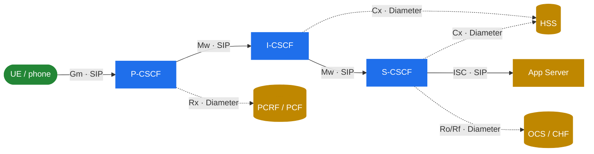

# 10.1 What IMS is — and where Kamailio fits

> [!IMPORTANT]
> Everything before this part treated Kamailio as a SIP router you program however you like. IMS is the opposite stance: a **standardised** architecture (3GPP TS 23.228) where every box has a defined role, a defined neighbour, and a defined protocol on each link. Kamailio doesn't stop being a SIP router — it gets *cast* into specific IMS roles called CSCFs. This part is about that casting: which roles Kamailio plays, what it talks to, and what you still have to bolt on around it to get a working VoLTE/VoWiFi core.

## IMS in one paragraph

IMS — the **IP Multimedia Subsystem** — is the 3GPP-standardised way to deliver SIP services (voice, video, messaging) over a mobile or fixed packet core. It's the signalling brain behind **VoLTE** (voice over LTE), **VoWiFi**, and **VoNR** (voice over 5G NR). When your phone makes a "normal" call on a 4G/5G network, that call is a SIP session set up through an IMS core, with the media carried over RTP on a dedicated bearer. IMS is what makes a packet-only network behave like a phone network.

## Why a SIP router becomes "CSCF nodes"

A plain SIP proxy is a blank slate — you write the routing logic. IMS instead splits the proxy function into three standardised roles, collectively the **CSCF** (Call Session Control Function):

- **P-CSCF** — Proxy CSCF: the first hop the device (UE) talks to. Security and access edge.
- **I-CSCF** — Interrogating CSCF: the entry point into a home domain. Picks which S-CSCF serves a user.
- **S-CSCF** — Serving CSCF: the registrar and the brain. Authenticates users, holds registration state, and triggers application services.

Kamailio implements all three. Instead of *you* deciding the routing in `request_route`, the standard fixes the call flow and you configure Kamailio to conform. The `ims_*` modules implement that conformance.

Kamailio owns the SIP reference points (Gm, Mw, ISC) end to end. The Diameter ones (Cx, Rx, Ro/Rf) it does not implement — it queries an external peer and acts on the answer. The operational surprises concentrate on that boundary; see [10.3](33-ims-diameter.md).

## The reference-point model

IMS describes the network as boxes connected by named links called **reference points**. Each reference point fixes both the protocol and the messages allowed on it. You cannot understand an IMS deployment without this map — every config decision traces back to "which reference point is this?"

| Reference point | Protocol | Between | Carries |
|---|---|---|---|
| **Gm** | SIP | UE ↔ P-CSCF | Registration and calls from the device |
| **Mw** | SIP | CSCF ↔ CSCF | SIP between the three CSCF roles |
| **Cx** | Diameter | I/S-CSCF ↔ HSS | Subscriber data, auth vectors, S-CSCF selection |
| **Rx** | Diameter | P-CSCF ↔ PCRF/PCF | Media authorisation, QoS, dedicated bearer requests |
| **Ro / Rf** | Diameter | S-CSCF ↔ OCS | Online (Ro) and offline (Rf) charging |
| **ISC** | SIP | S-CSCF ↔ Application Server | Service triggering (SMS, voicemail, supplementary services) |

The blue boxes are Kamailio. The gold boxes are everything else you need — and the rest of this part is largely about them.

> [!NOTE]
> In 5G core (SBA — Service-Based Architecture), the Diameter reference points have HTTP/2 equivalents: Cx→N70, Rx→N5, Ro/Rf→N40/N45. The IMS core itself stays SIP+Diameter in most real deployments; the SBA mapping is how IMS plugs into a 5G control plane. We touch this only where it matters.

## What this part covers — and what it doesn't

**Covers:** the role each CSCF plays, how the `ims_*` modules implement them, the registration flow end-to-end, how Kamailio speaks Diameter, the surrounding components a full solution needs, and a concrete software lab that wires it all together.

**Doesn't cover:** an RFC/TS walkthrough, a module-by-module parameter reference, IPSec or Diameter byte-level encoding, or any claim that this handbook's author runs a production IMS. For the standards themselves, the TS 23.228 / 24.229 documents are the authority; this part is the *map*, not the territory.

---

  [← Table of contents](../) · [← 9.3 What's new](30-whats-new.md) · [Next: 10.2 CSCF roles →](32-ims-cscf.md)

