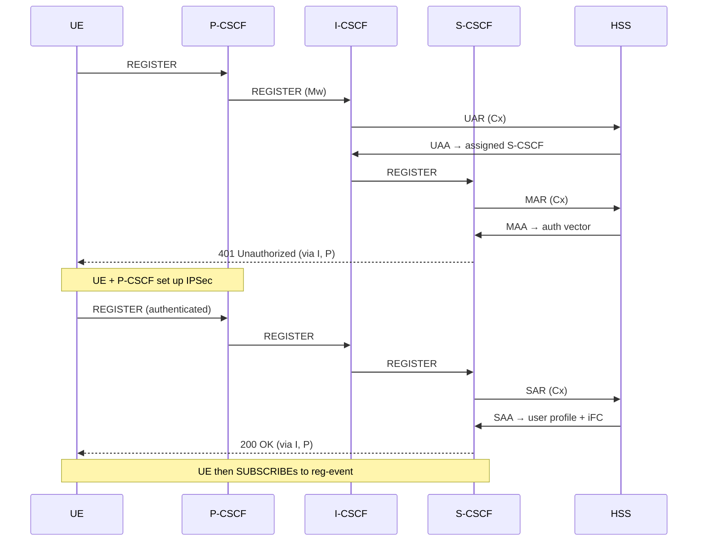

# 10.2 The CSCF roles on Kamailio

> [!IMPORTANT]
> The CSCF is one logical function split into three roles. In a real deployment each role is usually a **separate Kamailio process** (often a separate container) with its own config and its own listening sockets — they talk to each other over the Mw reference point as if they were different vendors' boxes. This separation is the whole point: it lets you scale and secure each role independently.

There is no "P-CSCF binary" and no "S-CSCF binary." It's the same Kamailio; the role is set by which `ims_*` modules are loaded and how they're configured. A P-CSCF is `kamailio -f proxy.cfg`; an S-CSCF is `kamailio -f serving.cfg`. The process model, shm, and routing engine are unchanged — IMS is modules on the same core.

## The three roles

### P-CSCF — the access edge

The Proxy-CSCF is the only IMS box the device ever talks to directly (over **Gm**). Everything the UE sends goes here first, and everything coming back goes out from here. Its jobs:

- Terminate the **IPSec** security association with the UE (the device and P-CSCF negotiate it during registration).
- Be the anchor for **media policy** — it talks **Rx** to the PCRF to authorise the media and request a dedicated bearer with the right QoS.
- Insert/verify the headers IMS relies on (`P-Asserted-Identity`, `Service-Route`, `Path`).

Modules: `ims_registrar_pcscf`, `ims_usrloc_pcscf`, `ims_ipsec_pcscf`, `ims_qos`.

### I-CSCF — the domain entry point

The Interrogating-CSCF is the front door to a home network. It's deliberately thin and stateless-ish: when a REGISTER or an incoming call arrives for a user in this domain, the I-CSCF asks the HSS (over **Cx**) *which S-CSCF should handle this user*, then forwards there. On registration it issues a **UAR** (User-Authorization-Request); on a terminating call it issues an **LIR** (Location-Info-Request).

Module: `ims_icscf`.

### S-CSCF — the registrar and the brain

The Serving-CSCF is where the real work lives. It is the **SIP registrar** for the user, it **authenticates** them, it holds the registration state, and it executes the user's service profile by triggering Application Servers over **ISC**. Its jobs:

- Pull the user's authentication vector from the HSS (**MAR**/**MAA** over Cx) and challenge the UE.
- Store registration state in `ims_usrloc_scscf` (keyed by IMPU/IMPI, see below).
- Download the user's **iFC** (initial Filter Criteria) from the HSS and apply them — these decide which Application Servers get invited into which calls.
- Drive charging via `ims_charging` (Ro/Rf).

Modules: `ims_registrar_scscf`, `ims_usrloc_scscf`, `ims_auth`, `ims_isc`, `ims_charging`, `ims_dialog`.

## Module map

| Role | Modules | Talks to |
|---|---|---|
| **P-CSCF** | `ims_registrar_pcscf`, `ims_usrloc_pcscf`, `ims_ipsec_pcscf`, `ims_qos` | UE (Gm), PCRF (Rx) |
| **I-CSCF** | `ims_icscf` | HSS (Cx) |
| **S-CSCF** | `ims_registrar_scscf`, `ims_usrloc_scscf`, `ims_auth`, `ims_isc`, `ims_charging`, `ims_dialog` | HSS (Cx), AS (ISC), OCS (Ro/Rf) |
| **all** | `cdp`, `cdp_avp` | the Diameter peers (see [10.3](33-ims-diameter.md)) |

> [!NOTE]
> These modules came into Kamailio from the **OpenIMSCore** project, the original open-source IMS reference implementation. Much of the ongoing IMS work in Kamailio has been driven by NG Voice (Carsten Bock). They are GPLv2 like the rest of the non-core modules.

## Registration — the canonical flow

IMS registration is famously a **two-pass** exchange: the first REGISTER gets challenged (401), the device sets up IPSec, and the second REGISTER completes. Following one registration end-to-end is the fastest way to understand how the three roles cooperate.

The four Cx commands you see here are the heart of it:

| Command | Issued by | Purpose |
|---|---|---|
| **UAR** / UAA | I-CSCF | "Is this user allowed here, and which S-CSCF serves them?" |
| **MAR** / MAA | S-CSCF | Fetch the authentication vector to challenge the UE |
| **SAR** / SAA | S-CSCF | Register the S-CSCF address in the HSS, download the user profile + iFC |
| **LIR** / LIA | I-CSCF | (terminating calls) "Which S-CSCF is this user registered on right now?" |

After a successful registration the UE immediately **SUBSCRIBEs to the `reg` event package**. This is not optional decoration: SIP has no network-initiated DEREGISTER, so the network deregisters a user by sending a `NOTIFY` on that subscription with `Subscription-State: terminated` (TS 23.228 §5.3, RFC 3680). Without the subscription, the network could never tear down a stale registration on its own terms — the reg-event subscription *is* the network's only handle on a registration it didn't end.

> [!TIP]
> Two scale-relevant facts not visible in the diagram. **Every successful registration costs a 401 round-trip:** the first REGISTER is always challenged, so the path is two REGISTERs and two Cx exchanges (UAR+MAR, then SAR) — 2× the SIP and Diameter load per registration at storm time. **The P-CSCF's IPSec is real kernel `xfrm` state:** `ims_ipsec_pcscf` programs the Linux IPSec stack with SAs bound to the ports negotiated in the 401. That's why the P-CSCF needs privileged networking in a container, unlike I-CSCF and S-CSCF.

## Where state lives

IMS identities come in two flavours, and the S-CSCF keys its state on both:

- **IMPI** — IP Multimedia *Private* Identity: the credential identity (one per subscription, used for auth). Think "the SIM".
- **IMPU** — IP Multimedia *Public* Identity: the dialable identity (`sip:` / `tel:` URIs). A subscription can have several.

One IMPI can own multiple IMPUs, and IMPUs are grouped into an **implicit registration set** — register one and the whole set registers together. The S-CSCF's `ims_usrloc_scscf` holds this graph: which IMPUs are registered, against which contacts, with which iFC attached. This is the IMS-specific cousin of the plain [`usrloc` pattern](18-usrloc.md) from Part 6 — same in-memory-plus-DB idea, far richer schema, and the same trick for clustering it: replicate the cache across S-CSCF instances with [`dmq`](23-dmq.md) rather than hammering the DB.

Service triggering works off the same state. The **iFC are downloaded once, in the SAR/SAA at registration, and cached** on the S-CSCF. Deciding whether a call detours through an Application Server is then a local match against those cached rules; invoking the AS is the S-CSCF SIP-routing the request out over ISC and back. ISC is plain SIP — "IMS service control" is the S-CSCF proxying the INVITE through an AS selected from the cached rule set.

> [!WARNING]
> `ims_usrloc_scscf` with DB persistence currently relies on **hardcoded SQL** in the module, which is why a relational DB (MySQL/MariaDB) is the well-trodden path for S-CSCF state even though Redis/Valkey is lighter. Plan for that when sizing — see [10.4](34-ims-full-solution.md).

---

  [← Table of contents](../) · [← 10.1 IMS overview](31-ims-overview.md) · [Next: 10.3 The Diameter side →](33-ims-diameter.md)

