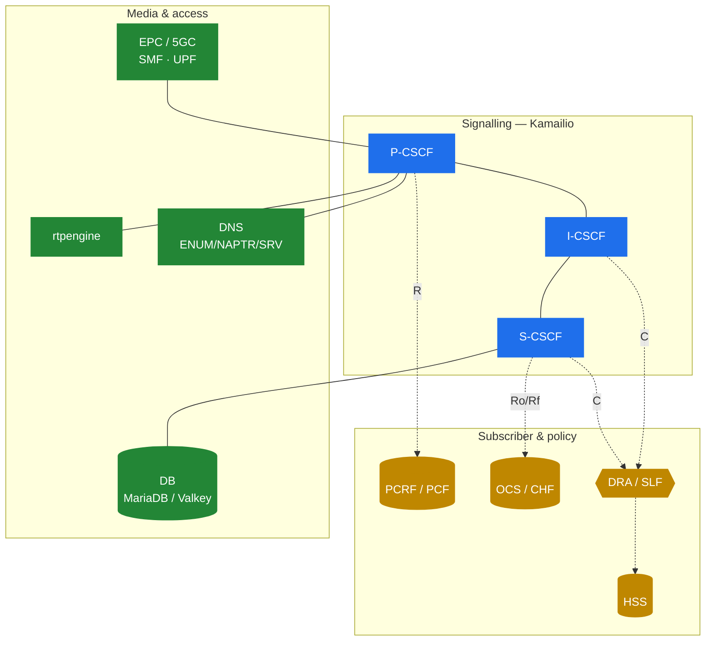

# 10.4 What you still need around Kamailio

> [!IMPORTANT]
> Be honest about the boundary: **Kamailio is the CSCF signalling plane, and nothing else.** It registers users, routes SIP, and speaks Diameter to ask other systems for answers. It does not store subscribers, it does not decide policy, it does not rate calls, and it never touches a single RTP packet. A working IMS is Kamailio *plus* a ring of other systems — and knowing what those are is the difference between "I configured a CSCF" and "I have a phone network."

## The honest scope line

| Kamailio (CSCF) does | Kamailio does **not** do |
|---|---|
| SIP registration & routing (P/I/S-CSCF) | Store the subscriber database |
| Authentication challenge (using HSS vectors) | Generate the auth vectors |
| Trigger services via iFC/ISC | Be the application server |
| Ask for QoS/media policy (Rx) | Decide or enforce policy |
| Ask for charging (Ro/Rf) | Rate or bill the call |
| — | Relay or transcode media (RTP) |

Everything in the right-hand column is a separate system. Here's the ring.

## The surrounding components

**HSS — Home Subscriber Server.** The subscriber database and the auth-vector generator. Kamailio talks to it over Cx. Open-source choice that works: **open5gs** (its HSS function).

**PCRF / PCF — Policy.** Decides whether a media flow is allowed and what QoS it gets, and tells the core to set up a dedicated bearer. P-CSCF talks to it over Rx. open5gs again.

**OCS / CHF — Charging.** Online charging (prepaid balance, credit reservation) and offline (CDR generation). S-CSCF talks to it over Ro/Rf. Open-source choice: **CGRateS**, a capable real-time rating engine with a Diameter agent.

**DRA / SLF — Diameter routing.** In anything beyond a single-HSS lab you put a **Diameter Routing Agent** between the CSCFs and the HSS/PCRF/OCS, so the CSCF has one Diameter peer to point at instead of N. Open-source choice: **freeDiameter** as a relay/DRA.

**rtpengine — media.** This is the box that actually relays (and optionally transcodes/encrypts) the RTP. Kamailio steers it via the `rtpengine` module but never carries media itself. It also handles ICE/SRTP for WebRTC-style access.

**DNS.** IMS routing leans hard on DNS: **NAPTR/SRV** to find CSCFs, **ENUM** to turn `tel:` numbers into SIP URIs. A misconfigured resolver breaks call routing in ways that look like CSCF bugs. **CoreDNS** is a clean choice (and it's already the default in Kubernetes).

**DB.** S-CSCF registration state needs persistence to survive restarts. **MariaDB/MySQL** is the tested path for `ims_usrloc_scscf` (hardcoded SQL — see [10.2](32-ims-cscf.md)); **Valkey/Redis** is lighter and is what rtpengine wants for HA, but needs schema handling on the Kamailio side.

**EPC / 5GC core.** None of the above matters until a device can get an IP bearer and reach the P-CSCF. That's the packet core — **SMF/UPF** in 5G, PGW in 4G — which also discovers the P-CSCF address and (with the PCRF) sets up the dedicated voice bearer. open5gs covers this too.

**Monitoring.** Diameter and SIP both fail quietly; you want **Prometheus/Grafana** for metrics and **Loki**-style log aggregation from day one, plus packet capture (`sip || diameter || gtpv2`) for the inevitable flow debugging.

## The shape of a full stack

Put together, a minimal-but-complete software IMS is roughly:

> **Kamailio** (P/I/S-CSCF) + **open5gs** (HSS, PCRF, SMF, UPF) + **CGRateS** (OCS) + **freeDiameter** (DRA) + **rtpengine** (media) + **CoreDNS** + a **DB** + **Prometheus/Grafana/Loki** + a **test UE**.

That's exactly the component list assembled in the lab walked through next — which is why [10.5](35-ims-lab.md) is a concrete payoff for this whole part rather than yet another diagram.

---

  [← Table of contents](../) · [← 10.3 The Diameter side](33-ims-diameter.md) · [Next: 10.5 A software IMS lab →](35-ims-lab.md)

