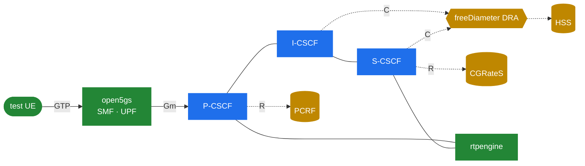

# 10.5 A worked reference — a software IMS lab

> [!IMPORTANT]
> The [**`lyatanski/ims`**](https://github.com/lyatanski/ims) project is a complete, entirely software-based IMS — Kamailio CSCF plus the full supporting cast — wired together with Docker Compose and Helm, runnable on one machine. This chapter maps its components onto the rest of this part.

> [!NOTE]
> `lyatanski/ims` is a third-party, MIT-spirited lab maintained independently of this handbook. Treat it as a teaching/testing reference, not a production blueprint — and check the repo for current state, since it's actively developed.

## What it is

A reproducible, all-open-source IMS core brought up with one `docker compose` command, or redeployed on Kubernetes via the bundled Helm charts. It targets VoLTE/5G flows and tracks the 3GPP specs (TS 23.228, 24.229, Cx 29.228/229, Rx 29.214, charging 32.299).

## The components, mapped to this part

The stack is split across Compose profiles — IMS, core network, billing, monitoring, test — which line up almost one-to-one with [10.4](34-ims-full-solution.md):

| Layer | Component | Plays the role of | Covered in |
|---|---|---|---|
| IMS signalling | **Kamailio** (P/I/S-CSCF) | the CSCF | [10.2](32-ims-cscf.md) |
| Media | **rtpengine** | media relay | [10.4](34-ims-full-solution.md) |
| Routing | **CoreDNS** | NAPTR/SRV/ENUM | [10.4](34-ims-full-solution.md) |
| State | **MariaDB / Valkey** | S-CSCF / rtpengine store | [10.2](32-ims-cscf.md) |
| Subscriber/policy | **open5gs** | HSS, PCRF | [10.3](33-ims-diameter.md) |
| Packet core | **open5gs** | SMF, UPF (CUPS) | [10.4](34-ims-full-solution.md) |
| Diameter routing | **freeDiameter** | DRA | [10.3](33-ims-diameter.md) |
| Charging | **CGRateS** | OCS | [10.3](33-ims-diameter.md) |
| Monitoring | **Prometheus · Grafana · Loki · cAdvisor · Promtail** | observability | [10.4](34-ims-full-solution.md) |
| Test UE | **Doubango** fork + **go-gtp** | the phone | — |



## How Kamailio is set up inside it

The lab keeps the three CSCF roles as separate Kamailio configs sharing a common base:

- `common.cfg` — shared module loads and defaults
- `proxy.cfg` — the **P-CSCF**
- `interrogating.cfg` — the **I-CSCF**
- `serving.cfg` — the **S-CSCF**
- `5g.cfg`, `monitor.cfg` — 5G-specific glue and a metrics/health endpoint

Across those configs you can read the exact `ims_*` module set this part has been describing — the loadmodule list includes:

```
cdp            cdp_avp            ims_auth
ims_icscf      ims_registrar_pcscf  ims_registrar_scscf
ims_usrloc_pcscf  ims_usrloc_scscf  ims_ipsec_pcscf
ims_isc        ims_qos            ims_charging
ims_dialog     rtpengine          db_redis
```

plus the usual workhorses (`tm`, `rr`, `sl`, `sanity`, `siputils`, `textops`, `pv`, `presence`/`pua` for the reg-event subscription, and `xhttp_prom` for Prometheus metrics). Loaded together in role-specific files, they are the role→module map from [10.2](32-ims-cscf.md) in concrete form.

## What to do with it

The repo ships flow docs (`doc/registration.md`, `doc/session.md`, `doc/transaction.md`) and a reference-points doc that mirrors [10.1](31-ims-overview.md)'s table. The productive loop:

1. Bring it up (`docker compose --profile test up -d` — it loads a kernel module, so a VM is recommended).
2. Watch the wire: `wireshark -i any --display-filter 'gtpv2 or sip or diameter.cmd.code != 280'` (filtering out Diameter watchdogs).
3. Trigger a registration and follow the two-pass flow from [10.2](32-ims-cscf.md) packet by packet — REGISTER, UAR/UAA, MAR/MAA, 401, IPSec, SAR/SAA, 200, then the reg-event SUBSCRIBE.

Following that one exchange on the wire maps the whole part onto real packets.

## Another angle — a single-VM academic lab

A contrasting, teaching-oriented setup is the UPM **[IMS-Kamailio-Tutorial](https://github.com/anabelen-garcia/IMS-Kamailio-Tutorial)** by Ana Belén García Hernando (Universidad Politécnica de Madrid): a full IMS on a **single VM**, optimised for clear Wireshark flows rather than realism.

- **All three CSCF roles are Kamailio.** P-CSCF (`:5060`), S-CSCF (`:6060`) and I-CSCF (`:4060`) run as three separate Kamailio processes on one host (the [herlesupreeth fork](https://github.com/herlesupreeth/kamailio) with its `Kamailio_IMS_Config` templates) — one binary covering the whole CSCF layer. Each role keeps its own `kamailio_*.cfg`, `*.xml` (the `cdp` Diameter peer config), and a defines file.
- **A different component cast.** Kamailio with **FHoSS** (the FOKUS Java HSS from the OpenIMSCore lineage) instead of open5gs, **bind9** for DNS, **PJSUA** as the test UA — a contrast to [10.4](34-ims-full-solution.md)'s choices: the roles matter more than the products.
- **Pure IMS, no EPC.** No packet core, so **no Rx interface** and no bearer setup — the SIP+Cx core of IMS in isolation.
- **Capture-first.** Each function gets its own `127.0.0.X` loopback; cgroups + iptables SNAT + nflog give a single capture with correctly-addressed, causally-ordered traces.

Both labs descend from the upstream recipe, Sukchan Lee's **[Open5GS "VoLTE Setup with Kamailio IMS and Open5GS"](https://open5gs.org/open5gs/docs/tutorial/02-VoLTE-setup/)**.

## Summary

IMS puts Kamailio in a constrained role: a conformant CSCF that owns the SIP reference points and delegates Cx/Rx/Ro/Rf to external Diameter peers. The two labs wire that role two ways — cloud-native (Compose/Helm, open5gs core) and single-VM (FHoSS, capture-focused). Both are read-the-configs, run-the-flows references for everything in 10.1–10.4.

---

<p markdown="1" align="center">
  [← Table of contents](../) · [← 10.4 The full solution](34-ims-full-solution.md) · [Next: 11.1 Process roles →](27-process-roles.md)
</p>
