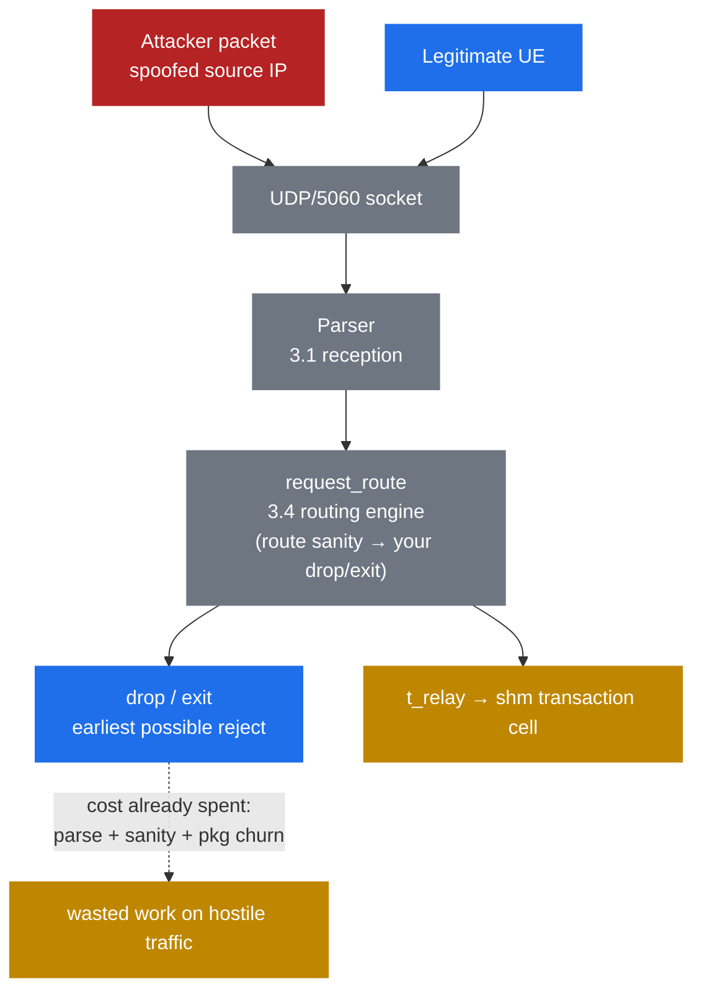

# 11.1 SIP attack surface — and why UDP/5060 is exposed

> [!IMPORTANT]
> Every prior part of this handbook assumed friendly input — a UE you provisioned, a peer you trust, a config you wrote. Part 11 drops that assumption. The internet is talking to your `5060` socket right now, and most of what it sends is hostile. The angle here is internals: *where* attacker bytes live inside Kamailio, and *what* does — and does not — sanitize them before your script gets a say.

## A public UDP/5060 socket has no front door

UDP has no handshake. There is no SYN/ACK, no connection state, nothing that proves the sender is who the `Via` and source IP claim. A datagram arrives, the kernel hands it up, and Kamailio's receive loop reads it — the source IP in the packet header is whatever the sender wrote, and on UDP it is trivially spoofed. An attacker can forge any source address that isn't ingress-filtered between them and you.

So anyone who can route a packet to your port can send a syntactically valid `INVITE`, `REGISTER`, or `OPTIONS`. Nothing about the transport gates that. The only thing standing between a stranger and your routing logic is the logic you wrote.

And they are looking. Automated scanners sweep the IPv4 space continuously — `sipvicious` (the tool that still stamps `friendly-scanner` into `User-Agent` on a lot of forks) and its descendants probe every reachable `5060` looking for a server that answers. A freshly exposed Kamailio gets its first unsolicited `OPTIONS` within minutes, not days. Exposure is not a question of being targeted; it's the ambient state of a public SIP port.

## The classic abuse cases

| Attack | What the attacker does | Goal |
|---|---|---|
| REGISTER hijack | Brute-forces or replays credentials to bind their own contact to your AOR | Steal an identity — intercept calls, place calls as the victim |
| INVITE toll fraud | Gets an unauthenticated `INVITE` relayed toward the PSTN gateway | Make expensive calls on someone else's dime |
| OPTIONS/UA recon | Sends `OPTIONS` (or `REGISTER`/`INVITE` probes) to read `Server`/`Allow` and enumerate extensions | Fingerprint the stack and map valid AORs before attacking |
| Flood / DoS | Fires a high rate of requests — often malformed or half-completing transactions | Exhaust CPU, memory, or bandwidth until service degrades |

## What an unauthenticated message already costs you

Here is the internals hook that makes early filtering matter: a hostile message does real work inside Kamailio *before* your script can reject it.

Every datagram that reaches the socket walks the same path as a legitimate one. The receive loop parses the first line and indexes the header boundaries ([3.1 reception](07-reception.md)), then `request_route` executes ([3.4 the routing engine](10-routing-engine.md)). Your defenses live *inside* that route — an early in-route check like a source-IP ban-table lookup or `route("sanity")`, then your first `drop`/`exit`. The cheapest possible rejection still happens *after* parse and *after* routing has already begun — there is no "reject before parse" hook in the script.

Lazy header parsing keeps that cost bounded most of the time. Kamailio parses headers on demand, not eagerly ([3.2 the parsed message](08-parsed-message.md)), so a probe that you drop after one `$rm` check is cheap. But the attacker controls the headers. Crafted, oversized, or pathological header sets can force a full parse — and a body with a `Content-Length` you trust pulls more work in. The attacker, not you, decides how much of the parser runs.

Then there's memory. Every message in flight churns `pkg` (per-process private memory), and the instant you handle anything statefully — `t_relay`, auth challenges, anything that creates a transaction — you allocate a transaction cell in `shm` ([2.2 memory architecture](03-memory-architecture.md)). A flood of half-open transactions that never complete is not a bandwidth attack; it's a memory-exhaustion DoS. The packets can be small and the rate modest, and you can still run `shm` dry holding transaction state for calls that will never finish.

## Trust boundaries

The load-bearing rule: **on UDP, source IP is not an identity.** Without digest auth, you cannot conclude anything about *who* sent a packet from *where* it appears to come from. Source-IP allowlists are useful only where the path between you and the source is trusted (a private link to a known peer), never on the open access edge.

That splits your topology into two zones:

- **The access edge** — UEs out on the internet. Untrusted by default. Everything here must be authenticated (digest) or filtered before it earns any expensive handling.
- **The core** — gateways, media servers, peer SIP servers. Trusted because they're reached over controlled links and/or authenticated as peers, not because of where their packets seem to originate.

This framing drives the rest of Part 11: **filter cheap and early, authenticate the rest.** Reject the obvious garbage with the least possible work, then spend real CPU only on traffic that has earned it.

The diagram's point is the dashed line: the hostile packet rides the *same* pipeline as the good one, and the earliest reject point is still downstream of the parse — inside `request_route`, once your early in-route checks have run. Everything before `drop` is work you did on behalf of an attacker.

So the goal is to move that reject point as far left — and make it as cheap — as possible. That's [11.2](37-security-modules.md): the modules that let you reject earlier and cheaper, starting with source-IP rate limiting in `pike` and progressively more selective filters before you ever spend a transaction.

---

  [← Table of contents](../) · [← 10.5 The IMS lab](35-ims-lab.md) · [Next: 11.2 Defensive modules →](37-security-modules.md)

