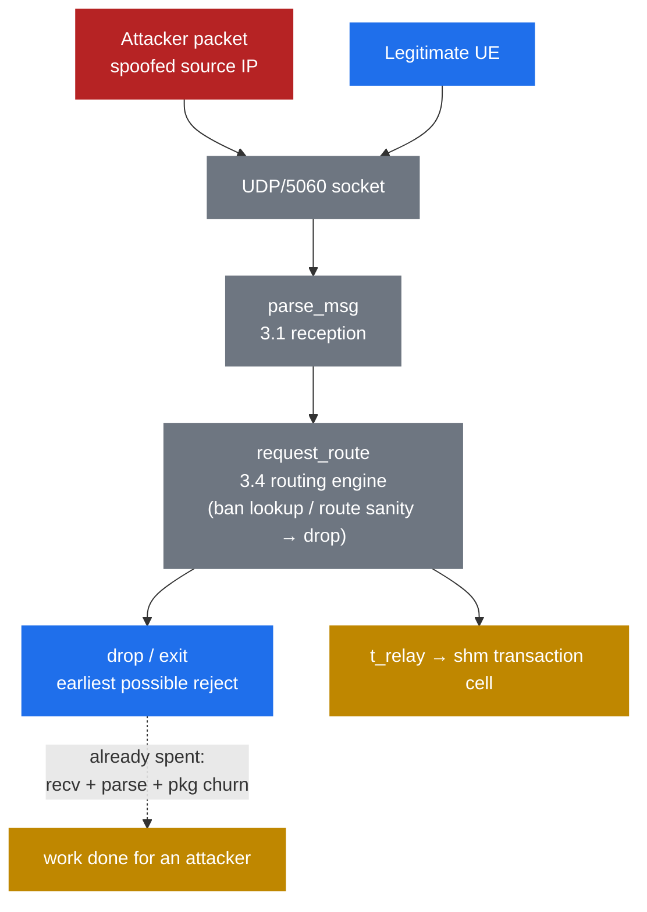

# 9.1 SIP attack surface — and why UDP/5060 is exposed

> [!IMPORTANT]
> Every prior part assumed friendly input. Part 9 drops that. Your `5060` socket is taking hostile traffic right now; the real question is how much work a stranger's packet extracts from Kamailio *before* your script can say no. The angle is internals: where attacker bytes land, and what touches them on the way to your first `drop`.

## No handshake, no identity

UDP carries no connection state. The source IP is whatever the sender wrote, spoofable to anything not ingress-filtered between you and them — so apparent origin proves nothing, and anyone who can route to your port lands a syntactically valid `INVITE`/`REGISTER`/`OPTIONS` straight in `request_route`. The transport gates nothing; your config is the whole perimeter.

The scans are constant: `sipvicious` and its forks (still stamping `friendly-scanner` into `User-Agent`) sweep the IPv4 space for anything that answers, and a freshly exposed instance fields its first unsolicited `OPTIONS` in minutes. Exposure is the ambient state of a public SIP port, not an event.

| Attack | Mechanism | Goal |
|---|---|---|
| REGISTER hijack | brute/replay credentials, bind attacker `Contact` to your AOR | impersonate — intercept and place calls as the victim |
| INVITE toll fraud | get an unauthenticated `INVITE` relayed toward a PSTN gateway | calls on someone else's bill |
| UA/OPTIONS recon | read `Server`/`Allow`, enumerate AORs | fingerprint the stack, map targets |
| Flood / half-open DoS | high rate, often malformed or never-completing | exhaust CPU, `pkg`/`shm`, or bandwidth |

## What a rejected packet already cost you

There is no reject-before-parse hook. Every datagram — hostile or not — is read into the receiver's buffer, run through `parse_msg()` (first line, plus a first-pass index of each header's name and value byte-range, [3.1](07-reception.md)), and only then *enters* `request_route` ([3.4](10-routing-engine.md)). Your earliest possible `drop` — a source-IP ban-table lookup, `route("sanity")` — fires once routing is already underway. The cheapest rejection in Kamailio is still post-parse, post-dispatch.

Lazy parsing ([3.2](08-parsed-message.md)) caps the usual cost: header *values* stay unparsed until something reads them, so a probe you drop after one `$rm` test is cheap. But the attacker picks the headers — oversized, deeply folded, or pathological sets push `parse_headers()` into real work, and a trusted `Content-Length` drags a body in. The attacker, not you, decides how much parser runs per packet.

Memory is the sharper edge. Each in-flight message churns per-process `pkg`; the instant you go stateful — `t_relay`, an auth challenge — `tm` allocates a transaction cell in shared `shm` ([2.2](03-memory-architecture.md)) and pins it until a final reply or a timer. An `INVITE` that never receives its final response holds that cell until `fr_inv_timer` (default **120 s**) expires. A modest rate of never-completing transactions therefore parks thousands of cells in a fixed `-m` pool — not a bandwidth attack but `shm` exhaustion, after which allocations fail and *legitimate* calls drop. Small packets, modest rate, real outage.

## Trust boundaries

**On UDP, source IP is not identity.** Without digest auth you can conclude nothing about who sent a packet, so a source-IP allowlist is meaningful only on a path you control (a private link to a known peer), never at the open edge. That splits the topology: the **access edge** — untrusted UEs, authenticate or filter before any expensive handling — and the **core** — gateways and peers, trusted via controlled links and peer auth, not apparent origin. Hence the doctrine for the rest of Part 9: **filter cheap and early, authenticate the rest.**

The dashed edge is the point: hostile and good packets share one pipeline, and the first reject is downstream of the parse. Moving it left and making it cheap is [9.2](37-security-modules.md) — `pike` rate-limiting and progressively selective filters before you ever spend a transaction.

---

  [← Table of contents](../) · [← 7.3 Event routes](26-event-routes.md) · [Next: 9.2 Defensive modules →](37-security-modules.md)

