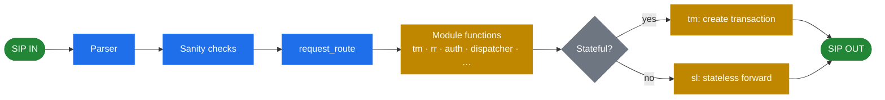

<h1 align="center">Kamailio Handbook — English</h1>

  <em>Architecture deep-dive for the Kamailio SIP server.</em>

  
  
  

---

> [!NOTE]
> This handbook explains *how Kamailio is built* and *why* — design decisions, internal machinery, architectural patterns. It's a companion to the [official docs](https://www.kamailio.org/wikidocs/), not a substitute.

## How a SIP request flows through Kamailio

A single received SIP message walks through this pipeline — and most of what looks like "magic" in a Kamailio config is just deciding which way it branches.

## Table of contents

### 1. Preface
- [1.1 Introduction](01-introduction.md) — what Kamailio is, why it matters ✅
- 1.2 Getting started (brief) — minimum needed to follow the architecture chapters

### 2. Architecture (main focus)
- 2.1 Overview — high-level picture, where Kamailio sits in a VoIP stack
- 2.2 SIP fundamentals — the protocol shape that drives every design choice
- 2.3 Process model & concurrency — workers, timers, shared memory
- 2.4 Request processing pipeline — how a SIP message flows through the server
- 2.5 Configuration language — the DSL, why it exists, what it solves
- 2.6 Module system — loading, lifecycle, exported functions, dependency model
- 2.7 State management — `tm`, `dialog`, `usrloc` and how state is held
- 2.8 Transport layer — UDP, TCP, TLS, WebSocket, listeners, connections
- 2.9 Database abstraction — `db_*` API, decoupling logic from storage
- 2.10 Control plane — RPC, MI, `kamcmd`, observability hooks

### 3. Configuration patterns
- 3.1 Core parameters worth understanding
- 3.2 Routing logic — `request_route`, branch/failure/onreply routes
- 3.3 Pseudo-variables & transformations

### 4. Key modules (architectural deep-dives)
- 4.1 Modules overview — categories and selection logic
- 4.2 `tm` — transaction layer
- 4.3 `dialog` — stateful call tracking
- 4.4 `dispatcher` — load balancing and failover
- 4.5 `rtpengine` — media plane integration
- 4.6 `registrar` + `usrloc` — location service

### 5. Deployment patterns
- 5.1 Registrar server
- 5.2 Outbound proxy
- 5.3 Load balancer
- 5.4 WebSocket gateway

### 6. Operations (architecture-aware)
- 6.1 Logging
- 6.2 Monitoring
- 6.3 Troubleshooting from first principles

### 7. Reference
- 7.1 Pseudo-variables cheat sheet
- 7.2 RPC commands
- 7.3 Glossary

---

  <a href="../uk/README.md">🇺🇦 Українська</a> · <a href="../../README.md">↑ Back to root</a>

