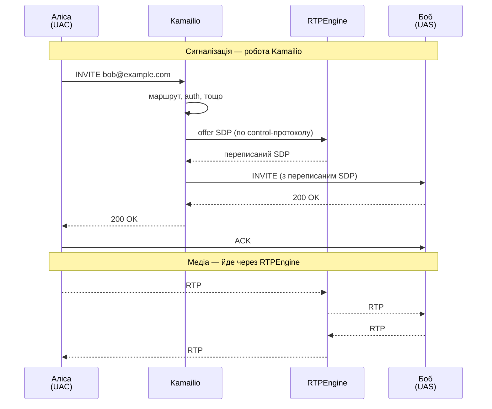

# 1.1 Вступ

> [!NOTE]
> Якщо з цього розділу варто винести одну думку — ось вона: **Kamailio — це сигнальний SIP-сервер, а не медіасервер.** Майже кожне архітектурне рішення в коді випливає саме з цього обмеження.

## Що таке Kamailio

Kamailio — це SIP-сервер з відкритим кодом, написаний на C. Він обробляє **сигнальний рівень** real-time комунікацій у масштабі: маршрутизує SIP-повідомлення (`INVITE`, `REGISTER`, `BYE` тощо) між юзер-агентами — телефонами, софтфонами, шлюзами, транками — за правилами, які ви описуєте у його мові конфігурації.

Це несуча конструкція телеком-інфраструктури для багатьох операторів. Продакшн-розгортання спокійно обробляють **тисячі викликів на секунду** на звичайному залізі. Все тому, що рантайм Kamailio мінімалістичний: невелике ядро плюс рій завантажуваних модулів, які поділяють спільну пам'ять між заздалегідь форкнутими воркер-процесами.

## Поділ signalling vs media

Це фундаментальна ментальна модель. Як тільки вона у вас є — решта архітектури перестає виглядати випадковою.



Kamailio торкається **кожного SIP-повідомлення** в розмові, але **нуля RTP-пакетів**. Медіа делегується окремому процесу — зазвичай це [RTPEngine](https://github.com/sipwise/rtpengine), яким Kamailio керує через окремий control-протокол. Саме цей розподіл і дає Kamailio можливість масштабуватися: сигналізація — це сплески й купа правил, медіа — це стабільний потік байтів. Профіль навантаження у них зовсім різний.

## 30-секундна історія

Походження Kamailio пояснює багато дивацтв у кодовій базі:

| Рік | Подія |
|------|-------|
| 2001 | Випущений **SER** (SIP Express Router) від Fhg Fokus / iptel.org |
| 2005 | **OpenSER** форкнутий з SER для community-розробки |
| 2008 | OpenSER перейменований на **Kamailio** (через суперечку щодо торгової марки) |
| 2008 | Паралельний проєкт — **SIP-Router** — об'єднує кодові бази SER і Kamailio |
| 2012 | Злиття завершено: Kamailio і SER сходяться на спільній кодовій базі |

Ви досі будете бачити взаємозамінне використання `ser` і `kamailio` у назвах директорій, API модулів і старій документації. Сьогодні це один і той самий проєкт.

## У чому він сильний

- **Маршрутизація великих обсягів.** Stateless- або stateful-проксі великого SIP-трафіку з передбачуваною затримкою.
- **Реєстрація та сервіс локації.** Робота як SIP-реєстратор поверх БД, із сотнями тисяч онлайн-контактів.
- **Балансування навантаження та failover.** Розподіл трафіку між PBX-ами, медіасерверами чи транками через модуль `dispatcher`.
- **WebRTC-шлюзи.** Термінація SIP-over-WebSocket, зазвичай у парі з RTPEngine для ICE / DTLS-SRTP.
- **Автентифікація та облік.** Digest-аутентифікація через БД, генерація CDR, інтеграція з біллінгом.

## Чим він не є

- **Не B2BUA за замовчуванням.** Kamailio проксіює повідомлення, він не започатковує і не термінує діалоги сам по собі (хоча модулі типу `uac` чи `topos` це міняють).
- **Не медіасервер.** Жодного транскодингу, жодного RTP, жодного MoH «з коробки».
- **Не PBX.** Жодної логіки IVR, черг, voicemail — це територія Asterisk чи FreeSWITCH.
- **Не готовий продукт «під ключ».** Це інструментарій. Логіку маршрутизації пишете ви самі. Винагорода за ці зусилля — повний контроль над кожним повідомленням.

## Ментальна модель

Все, що робить Kamailio, вкладається в цей патерн:

```
SIP-повідомлення прийшло → парситься і sanity-чекається
                          → заходить у routing-скрипт (request_route)
                          → routing-скрипт викликає функції модулів
                          → функції модулів вирішують: forward / reply / drop
                          → повідомлення йде назовні (або ні)
```

**Routing-скрипт** — це місце, де живе намір оператора. Все інше — модулі, рушій транзакцій, шар БД, транспортний рівень — це машинерія, якою скрипт диригує. Наступні розділи розбирають цю машинерію по частинах.

> [!TIP]
> Наступні розділи припускають, що ви хоча б раз встановили Kamailio і подивилися, як він обробляє повідомлення. Якщо ні — [офіційний quick-start](https://www.kamailio.org/wikidocs/) зробить це швидше за будь-який текст у цьому посібнику. Повертайтесь сюди, коли захочете зрозуміти, *чому* щойно сталося те, що сталося.

---

<p align="center">
  <a href="README.md">← Зміст</a> · <a href="02-process-model.md">Далі: 2.1 Процесна модель →</a>
</p>
