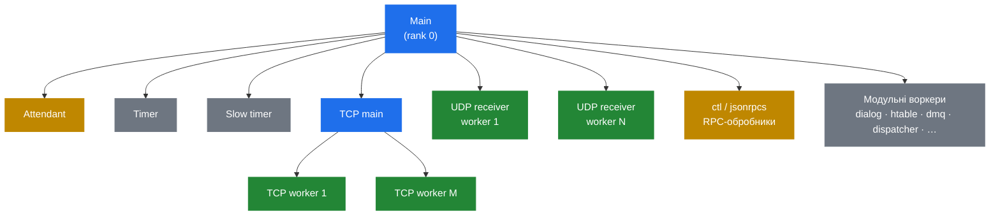

# 2.1 Процесна модель

> [!IMPORTANT]
> Kamailio — це **багатопроцесний** сервер, а не багатопотоковий. Кожне «Kamailio робить X» насправді означає «якийсь конкретний процес усередині групи процесів Kamailio робить X». Забути про це — найпоширеніше джерело плутанини при дебагу.

## Що ви бачите коли він працює

Виконайте `ps -ef | grep kamailio` на живій машині — і побачите близько десятка процесів, а не один. Усі вони ділять той самий бінарник і батька, а кооперуються через ділянку **спільної пам'яті**, замаплену в усіх них. Канонічний розклад виглядає так:



Кожен прямокутник — це справжній OS-процес. У кожного — свій PID. У кожного — свій **rank**, ціле число, призначене при форку: модулі використовують його для seed'у RNG, вибору слотів у таймерах і для ідентифікації себе в логах.

## Що робить кожна роль

**Main-процес.** Той, який стартує по `kamailio` з командного рядка. Парсить `kamailio.cfg`, виділяє пул спільної пам'яті, форкає всіх дітей нижче — і далі сидить у циклі, реапаючи мертвих воркерів через `SIGCHLD`. SIP-трафік він **не** обробляє. Якщо зайти в нього через `gdb`, очікуючи побачити код обробки повідомлень, ви побачите супервайзер.

**Attendant.** Другий, теж супервайзерний процес, що обробляє підмножину lifecycle-сигналів — історично тягнеться з SER і живе через зворотну сумісність. У повсякденній роботі можна не зважати.

**UDP receiver workers.** Основна маса флоту, що обробляє SIP-трафік. Їх — `children` штук на кожен UDP-listener (за замовчуванням `8`). Кожен крутиться в щільному циклі:

```c
for (;;) {
    n = recvfrom(udp_sock, buf, ...);
    receive_msg(buf, n, &from);   // парсинг, request_route, форвард
}
```

Той другий виклик — це місце, де відбувається **все**, що ви написали в `request_route`. Одне повідомлення → один воркер → один повний прохід скрипта → повідомлення йде назовні (або дропається). Жодних handoff'ів. Жодного work-stealing. Воркер зайнятий увесь час обробки.

**TCP main.** Слухає на TCP-сокеті, акцептить нові з'єднання й передає file descriptors TCP-воркерам. Виділення `accept()` в окремий процес — це те, що дозволяє Kamailio тримати довгоживучі TCP/TLS-з'єднання без застрягання одного воркера на одному з'єднанні.

**TCP workers.** Їх — `tcp_children` штук (за замовчуванням `4`). Кожен веде набір з'єднань, парсить вхідні стріми у SIP-повідомлення й проганяє через ту саму `receive_msg()`-точку, що й UDP-воркери. Зі скрипта вже не видно, по якому транспорту повідомлення прилетіло — це просто псевдо-змінна.

**Timer process** і **slow timer**. Прокидаються через регулярні інтервали (за замовчуванням раз на секунду й раз на ~100 мс відповідно), щоб ганяти таймерні модулі. Логіка retransmission'у й тайм-аутів у `tm`, keepalive в `dialog`, probing у `dispatcher`, expiry в `htable` — усе живе тут. Двох таймерів — щоб повільні задачі не з'їдали стартове вікно швидких.

**ctl / jsonrpcs.** Слухають UNIX-сокет (`/run/kamailio/kamailio_ctl`) і/або HTTP для RPC-команд від `kamcmd` та інших тулів. SIP-у не торкаються — лише читають внутрішній стан, просять інших воркерів щось зробити й віддають назад JSON або binrpc.

**Модульні воркери.** Багато модулів форкають собі ще й окремих допоміжних процесів. `dialog` ганяє keepalive-сендери. `htable` робить sweep протермінованого. `dmq` приймає повідомлення від peer-інстансів. `dispatcher` пінгує шлюзи на dead-gateway detection. Кожен з них — це просто ще один `fork()` з main-процесу, але з module-specific entry point.

## Чому багатопроцесна, а не багатопотокова

Це свідомий дизайнерський вибір, а не лінь. Tradeoff'и, що мають значення:

| Багатопроцесна (як у Kamailio) | Багатопотокова |
|---|---|
| Ізоляція збоїв — segfault в одному воркері логується, воркер пере-форкається. Решта продовжує обслуговувати трафік. | Segfault кладе весь сервер. |
| Проста модель пам'яті всередині процесу — жодного thread-safe-кружіння навколо per-message-стану. | Кожна змінна, що бачиться більше ніж одним потоком, потребує локу або атомарок. |
| Спільний стан живе в **одному** очевидному місці (shm-пул), де правила прозорі. | Спільний стан — будь-де, куди може дотягнутися будь-який потік. |
| Дорожчий context switch. | Дешевший context switch. |
| Овергед пам'яті на процес. | Менший footprint. |

Для сигнального SIP-сервера — високий темп повідомлень, мало CPU на повідомлення, чутливість до latency, недопустимість падінь — перші три рядки коштують ціни останніх двох. Телекоми палять багатопотокові SIP-стеки з початку 2000-х; модель Kamailio — це те, що випадає, коли вирішуєш, що «має жити роками без рестартів» — це найжорсткіше обмеження.

## Що це означає для скрипта

Кілька практичних наслідків, на яких часто спотикаються:

> [!WARNING]
> **`$var(x)` — per-process, per-message.** Не переживає переходу між воркерами. Якщо воркер 3 поставив `$var(call_id)`, а наступне повідомлення з того ж діалогу прилетіло воркеру 7 — воркер 7 нічого не побачить. Щоб ділити стан, потрібна спільна пам'ять: `$shv(...)`, `htable` або БД.

- **Не можна покладатися на те, хто обробляв попереднє повідомлення.** ОС балансує `recvfrom()` між заблокованими воркерами — жодної affinity немає.
- **Блокуючий виклик у скрипті блокує весь воркер.** Цей воркер не зможе обробляти інші повідомлення, поки ви не повернетеся. Саме тому існують async-модулі — `http_async_client`, `t_suspend` / `t_continue` (про це далі, в розділі 8.2).
- **Логи переплетені між воркерами.** Використовуйте `$pp` (PID процесу) або rank, щоб розплести.

## Скільки воркерів треба насправді

Чесна відповідь: рівно стільки, щоб `recvfrom` ніколи не чекав у черзі на вільного воркера, але не настільки багато, щоб вони товклися на shm-локах. На практиці:

- Стартуйте з `children=8` і `tcp_children=4` для помірного навантаження.
- Дивіться `kamcmd core.shmmem` і `kamcmd core.pkgmem all` під піковим трафіком.
- Якщо `ps` показує UDP-воркерів застряглими в `recvfrom`, а черга росте — мало воркерів.
- Якщо воркери більшість часу проводять у lock contention — забагато.

Наступний розділ розбирає архітектуру пам'яті, яка робить можливою цю кооперацію.

---

<p markdown="1" align="center">
  [← Зміст](../) · [← 1.1 Вступ](01-introduction.md) · [Далі: 2.2 Архітектура пам'яті →](03-memory-architecture.md)
</p>
