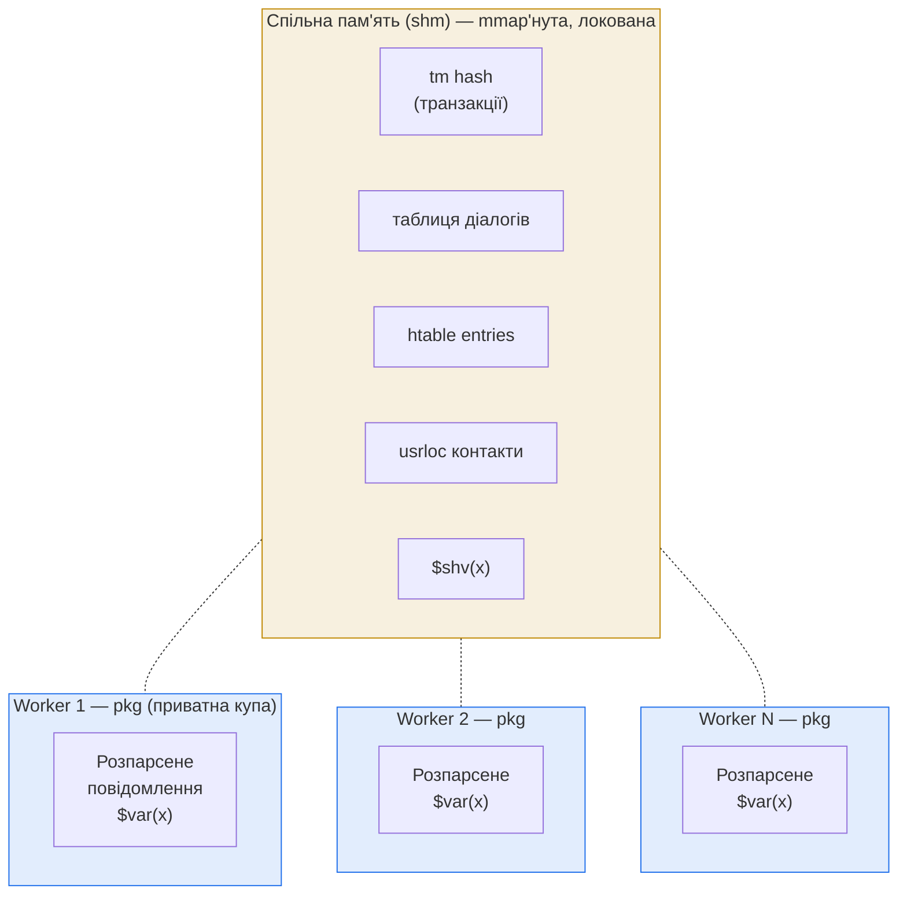

# 2.2 Архітектура пам'яті

> [!IMPORTANT]
> У Kamailio **дві купи** (heap'и), а не одна. Плутанина між ними — звільнити pkg-вказівник через shm-функцію, тримати pkg-вказівник між повідомленнями, ділити структуру між воркерами без розміщення її в shm — це джерело приблизно половини всіх продакшн-крешів.

Двокупкова модель випливає з [процесної моделі](02-process-model.md): якщо Kamailio — це N незалежних OS-процесів, які мають кооперуватися по стану викликів, то **частина** пам'яті має бути досяжна з усіх них, а **частина** — лишатися приватною, щоб її не треба було лочити на кожен дотик.

## Дві купи



**`pkg` (package memory).** У кожного воркера — своя pkg-купа, розмір задається стартовим прапором `-M <megabytes>` (за замовчуванням `8`). Це приватна область: жоден інший процес туди не дотягнеться, лочити не треба, alloc/free — швидкі. Тут живуть **розпарсене SIP-повідомлення**, увесь per-message scratch space і ваші скрипт-змінні `$var(x)`. Купа перевикористовується між повідомленнями: ніщо в pkg не переживає виходу воркера, та навіть у межах одного воркера всі алокації попереднього повідомлення звільняються до того, як прийде наступне.

**`shm` (спільна пам'ять).** Один `mmap()`-нутий регіон, який створюється main-процесом на старті, **до** будь-яких форків. Розмір — `-m <megabytes>` (за замовчуванням `64`). Після форка кожен child має той самий регіон, замаплений за тією самою адресою — тож вказівник у shm з одного воркера валідний у будь-якому іншому. **Кожна** алокація, звільнення, читання та запис у shm проходить через лок. Тут має жити **все, що переживає кордон одного воркера**: транзакції, діалоги, `htable`-записи, кеш `usrloc`, змінні `$shv`, набори шлюзів у `dispatcher`.

| | pkg | shm |
|---|---|---|
| Видна для | одного воркера | всіх воркерів |
| Чи потрібен лок | ні | так |
| Розмір через | `-M MB` (на воркер) | `-m MB` (загалом) |
| Час життя | одне повідомлення | до звільнення або виходу всієї групи процесів |
| Алокація через | `pkg_malloc` / `pkg_free` | `shm_malloc` / `shm_free` |
| Що тримає | розпарсене повідомлення, скрипт `$var`, тимчасові буфери парсингу | tm hash, dialog, htable, usrloc, `$shv` |

## Чому власний алокатор (а їх кілька)

Kamailio не використовує `malloc` з libc — ні для однієї купи, ні для іншої. У сирцях лежать **кілька** реалізацій алокатора — `q_malloc`, `f_malloc`, `tlsf_malloc` і ще пара варіантів — обирається на стадії компіляції. Дистрибутиви зазвичай беруть `q_malloc` або `f_malloc`.

Тримати свій алокатор — це робота, але є три причини, чому це окупається:

1. **Інтроспекція через RPC.** `kamcmd core.pkgmem` і `kamcmd core.shmmem` ходять по купі й видають фрагментацію, розміри free-list'ів, найбільший вільний блок, хто що алокував. З libc-malloc вам довелося б читати `/proc/<pid>/smaps` і вгадувати.
2. **Детермінізм для shm.** Алокатор для shm треба локувати так, щоб це працювало між **процесами** (не тільки між потоками). libc-malloc для цього не зроблений — його локи внутрішньопроцесні.
3. **Контейнмент збоїв.** Корупція в купі Kamailio не обов'язково спалює всі структури libc. Поганий алокатор — це власний маленький blast radius.

Подекуди можна зустріти посилання на компіляцію з `-DDBG_QM_MALLOC` або подібним — це вмикає трекінг кожної алокації, щоб алокатор міг сказати, який саме рядок якого файлу леакає, ціною помітного overhead'у. Корисно в dev, не в prod.

## Правила часу життя на практиці

Правила, які — якщо їх порушити — приведуть до segfault через три дні під навантаженням:

> [!WARNING]
> **Усе, що ви алокували в shm, маєте звільняти у shm.** Виклик `pkg_free()` на shm-вказівнику корумпує обидві купи. У C API є `shm_malloc`/`shm_free` і `pkg_malloc`/`pkg_free`; вони **не** взаємозамінні.

- **Per-message структури живуть у pkg.** Коли `request_route` виходить — розпарсене SIP-повідомлення й усе, що на ньому висить, чиститься. Не зберігайте pkg-вказівники в shm: до моменту, коли інший воркер їх прочитає, вони вже вказують у сміття.
- **`$var(x)` — pkg, per-message.** Звільняється на виході з route. (І per-process — див. [попередній розділ](02-process-model.md).)
- **`$shv(x)` — shm.** Переживає повідомлення та воркерів, але кожне читання й запис беруть лок. Використовуйте для речей, що **дійсно** мають бути спільними, а не як general-purpose-змінну.
- **`htable`-записи — це shm.** Запис у клітинку htable з одного воркера видно всім іншим. Це *той самий* механізм, до якого люди тягнуться, коли хочеться розділеного стану без походу в БД.
- **Стан транзакцій (`tm`) — shm.** Коли `t_relay()` створює транзакцію, структура падає в hash-таблицю у shm — щоб відповідь (яка може прилетіти на інший воркер) могла її знайти.

## Розмір і спостережуваність

Два числа, які насправді треба підібрати:

- **`-M <megabytes>`** — pkg-купа на воркер. За замовчуванням маленька (8 MB). Якщо у вас багато логіки в скрипті (довгі route'и, багато `$var(...)`, великі тіла) — підіймайте. Симптом замалого pkg: помилки `parse: out of memory` або `pv_get_var: cannot get pv value`.
- **`-m <megabytes>`** — загальний shm-пул, на весь інстанс. За замовчуванням консервативний. Симптом замалого shm: `shm_core_malloc: not enough free shm memory` і збої при створенні транзакцій. Цей провал — *катастрофічний*: під трафіком ви просто не можете створювати нові виклики.

Дві RPC-команди, які варто тримати під рукою:

```bash
kamcmd core.shmmem
# друкує total / free / used / fragments / largest_free для shm-пулу

kamcmd core.pkgmem all
# проходить по pkg-купі кожного воркера і друкує те ж per-process
```

У продакшні алертіть на `free < 20%` для будь-якого з пулів і обов'язково — на `largest_free`, що падає нижче за розмір типової алокації. Це фрагментація з'їдає вас живцем, хоча «вільної пам'яті начебто повно».

## Чому такий дизайн виграє

Комбінація — мала приватна купа на воркер плюс один обмежений shm-регіон, який бачать усі — має властивості, що мають значення для SIP-сервера:

- **Споживання пам'яті передбачуване.** Загальний RSS обмежений `(N_workers × pkg_size) + shm_size`. Він **не** росте з трафіком.
- **Memory leak'и локалізовані.** Баг у per-message-коді воркера леакає pkg, який буде «зреапаний» рестартом саме цього воркера. Лік у shm — глобальний, але інспектабельний, і `kamcmd` покаже, який саме виклик алокатора відповідальний.
- **Кросворкерний стан неможливо «зробити випадково».** Ви не можете випадково розділити стан, лишивши вказівник десь у пам'яті — якщо це не у shm, інший воркер його буквально не побачить. Дисципліну забезпечує архітектура, а не конвенції.

Наступний розділ — про примітиви конкурентності (локи, atomic-операції), які роблять shm безпечним для спільного використання.

---

<p align="center">
  <a href="README.md">← Зміст</a> · <a href="02-process-model.md">← 2.1 Процесна модель</a> · <em>Далі: 2.3 Примітиви конкурентності (готується)</em>
</p>
