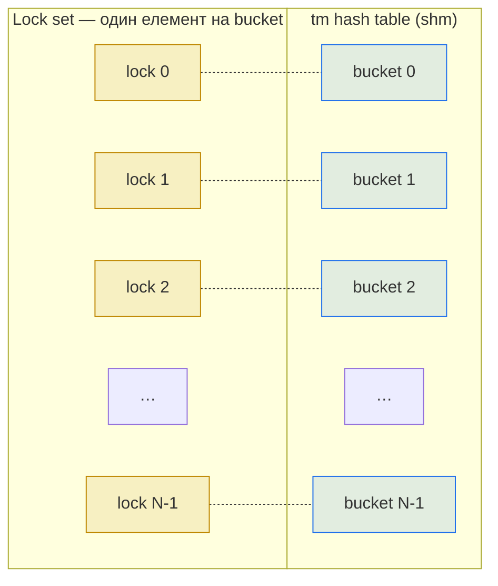

# 2.3 Примітиви конкурентності

> [!NOTE]
> У Kamailio немає потоків, тож і thread-safe-код не потрібен. Що потрібно — це **inter-process** синхронізація: воркери з різних OS-процесів лізуть у ту саму shm-область і змагаються за ті самі структури. Примітиви нижче — це інструментарій, який робить це безпечним.

## Що дає синхронізація і скільки коштує

Усе, що лежить у shm і до чого може дотягнутися більше одного воркера, потребує локу. Без нього два воркери прочитають структуру, обидва вирішать її змінити й запишуть назад — і одне з оновлень тихо загубиться. З локом навколо модифікації другий воркер чекає, поки перший закінчить, бачить пост-стан і реагує правильно.

Ціна — реальна. Локи серіалізують. Якщо ви натягнете один лок на всю tm hash table і сто воркерів захочуть вставити транзакцію, дев'яносто дев'ять із них стоятимуть на одному мьютексі. Throughput падає. Тому правила-орієнтири, що формують внутрішню кухню Kamailio:

1. **Тримайте лок якомога менше часу.** Take → modify → release.
2. **Не беріть локів, які не потрібні.** Atomic-операції бʼють full lock на простих лічильниках.
3. **Шардуйте лок.** Один мьютекс на bucket кращий за один на всю hash table.

## Lock API

C API маленький — поміщається на серветці:

```c
gen_lock_t *lock_alloc(void);          // виділити лок у shm
gen_lock_t *lock_init(gen_lock_t *l);  // проініціалізувати
void        lock_get(gen_lock_t *l);   // взяти (блокуючи)
int         lock_try(gen_lock_t *l);   // взяти (не блокуючи)
void        lock_release(gen_lock_t *l);
void        lock_destroy(gen_lock_t *l);
void        lock_dealloc(gen_lock_t *l);
```

І варіант для масиву:

```c
gen_lock_set_t *lock_set_alloc(int n);
void            lock_set_get(gen_lock_set_t *s, int i);
void            lock_set_release(gen_lock_set_t *s, int i);
```

> [!WARNING]
> **Ці локи не рекурсивні.** Виклик `lock_get()` двічі з того самого процесу на тому самому локу — миттєвий deadlock. Код модулів дотримується строгого take-modify-release патерну, часто з `goto cleanup`, щоб гарантувати release на будь-якому шляху виходу.

## Що під капотом локу

Реалізація обирається на стадії компіляції. Кандидати:

- **Fast lock (`USE_FAST_LOCK`).** Хендмейд-асемблер з x86 `cmpxchg` (або еквівалентом на інших архітектурах) — щось схоже на futex-спінлок. Це дефолт на Linux і найшвидший варіант. Стан локу — один байт у shm; contention розв'язується коротким спіном і потім сном через `futex(2)`.
- **POSIX semaphores (`USE_POSIX_SEM`).** Портабельні, опосередковані ядром, дорожчі на захоплення.
- **SysV semaphores (`USE_SYSV_SEM`).** Старіший інтерфейс із жорсткими kernel-лімітами на кількість, тримається переважно для сумісності.

`fast lock` — те, що використовує практично кожен продакшн-білд. Інші бекенди існують для платформ, де inline-асемблер недоступний, або коли оператор з якихось специфічних причин хоче ядерний примітив.

## Per-bucket locking — патерн, який має значення

Hash-таблиця tm — канонічний приклад. На рівні концепції це «одна hash-таблиця для всіх in-flight транзакцій». Наївно — це потребує одного локу на всю штуку. Kamailio шардує її:



Щоб вставити транзакцію, воркер хешує call-id, обирає bucket, бере **лок тільки цього bucket'у**, мутує його linked list і релізить. Два воркери, які вставляють транзакції з call-id, що хешуються в різні bucket'и, ніколи не блокують один одного. При типовому числі bucket'ів `1024` (налаштовується через `hash_size`) ефективна паралельність — `min(1024, N_workers)`, що під нормальним навантаженням робить lock contention невидимим у профайлах.

Модулі `dialog`, `usrloc` і `htable` використовують той самий патерн зі своїми hash-таблицями та lock-сетами. Коли ви читаєте джерело й бачите `lock_set_get(_set, hash & mask)` біля кожної модифікації — це per-bucket-патерн у дії.

## Atomic-операції

Для речей, які не потребують захисту від конкурентних writer'ів — просто консистентного читання одного int'а — Kamailio використовує atomic-примітиви замість локів. API:

```c
void atomic_set(atomic_t *v, int i);
int  atomic_get(atomic_t *v);
void atomic_inc(atomic_t *v);
void atomic_dec(atomic_t *v);
int  atomic_inc_and_test(atomic_t *v);  // ненуль якщо результат 0
int  atomic_dec_and_test(atomic_t *v);
int  atomic_cmpxchg(atomic_t *v, int old, int new);
```

Це правильний інструмент для refcount'ів, прапорів «чи це ще живе», і будь-якого дешевого стану без структурного інваріанту. `t->ref_count` у `tm` і `dlg->ref` у `dialog` — це atomic. Декілька воркерів можуть інкрементити й декрементити їх, ніколи не беручи локу, а структура звільняється, коли лічильник падає до нуля (зазвичай через `atomic_dec_and_test`).

## Де це ламається

Локінг коректний за замовчуванням, але є два повторюваних режими провалу:

> [!WARNING]
> **Deadlock через порядок захоплення.** Якщо модуль A завжди бере лок X, потім Y, а модуль B — Y, потім X, і вони зустрілися в неправильний момент — вони чекають один одного назавжди. Захист у Kamailio — це конвенція, а не enforcement: для локів є задокументований порядок захоплення. Якщо ви змішаєте модулі, що його не дотримуються, можете отримати deadlock під навантаженням, якого не було в тестах.

- **Lock contention, що маскується під повільність.** Якщо один bucket «гарячий» — скажімо, кожен `INVITE` оновлює ту саму htable-клітинку — ви побачите високий CPU і високу latency, але **низький** throughput. Лікується зазвичай дальшим шардингом (більше bucket'ів, дрібніші ключі), а не доданими ядрами.
- **Забутий release на error-шляху.** Код модуля, що взяв лок і повернувся раніше через помилку, лишає лок захопленим назавжди. Патерн `goto release_and_return` і дисциплінований cleanup — єдиний захист; RAII у C немає.

## Що бачить оператор

Продакшн-діагностика lock contention — переважно непряма. Сигнали, на які варто дивитися:

- **CPU-час у kernel mode росте**, а throughput плато — воркери, що заблоковані у `futex(2)`, проявляються тут.
- **`perf top` на процесі Kamailio**, що показує час у `lock_get` / `lock_set_get` — пряме свідчення contention.
- **Latency під навантаженням зростає**, а час виконання route'у в ізоляції лишається плоским — симптом очікування на захопленні локу.

`kamcmd lock.stats` не існує. Lock contention — це той клас проблем, який знаходиться системними тулзами (`perf`, `bpftrace`, `strace -c`), а не RPC Kamailio.

Наступний розділ — про життєвий цикл рантайму (старт, перезавантаження, shutdown), де всі ці примітиви вперше ініціалізуються і востаннє знищуються.

---

<p align="center">
  <a href="./">← Зміст</a> · <a href="03-memory-architecture.md">← 2.2 Архітектура пам'яті</a> · <em>Далі: 2.4 Життєвий цикл (готується)</em>
</p>
