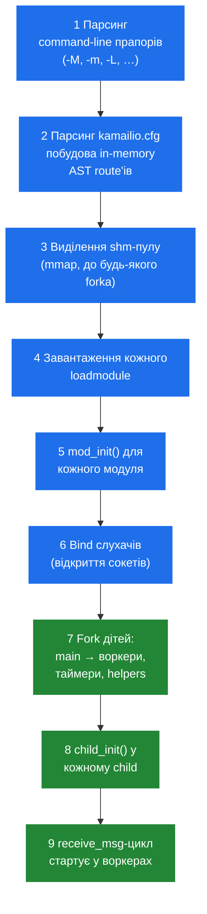

# 2.4 Життєвий цикл

> [!NOTE]
> У Kamailio є три lifecycle-події, що мають значення для оператора: **старт**, **runtime-перезавантаження конфігу** і **завершення роботи**. Кожна з них тонша, ніж здається, і помилитися в будь-якій — це різниця між сервісом, що живе роками без рестарту, і сервісом, що дропає виклики кожного вівторка.

## Старт, по порядку

Коли ви запускаєте `kamailio -f /etc/kamailio/kamailio.cfg`, відбувається не «демон стартує». Це чітко впорядкована послідовність, яка має завершитися **до того**, як прилетить перше SIP-повідомлення:



Два кроки в цій послідовності — несучі:

**`mod_init()` виконується один раз, у main-процесі, до форка.** Кожен завантажений модуль отримує шанс виділити shm-структури, зареєструвати RPC-команди, поставити таймери й розпарсити власні параметри конфігу. Після цієї точки **memory layout усього інстансу зафіксований** — кожна shm-алокація, яку модуль колись зробить, уже порахована. Розмір shm-пулу через `-m` має покрити це плюс runtime-навантаження. Якщо `mod_init()` зафейлився — зазвичай через замалий shm або зіпсований параметр — увесь старт абортиться, до форка справа не доходить.

**`child_init()` виконується раз на child, після форка.** Тут модулі відкривають per-process-ресурси: підключення до БД, file descriptor'и, все, що не можна шарити між процесами. Аргумент — *rank* child'а. Модулі використовують його, щоб робити роботу рівно в одному child'і (`if (rank == PROC_MAIN) { ... }`) або рівномірно розподіляти роботу між дітьми.

Порядок важливий через два інваріанти:

1. **shm виділяється до будь-якого fork'у.** Це й робить той самий вказівник валідним у кожному процесі — усі вони наслідують ту саму mapped область з main'а. Виділення shm *після* fork'у дало б кожному child'у свою копію. Модулі це знають і всю shm-роботу роблять у `mod_init()`.
2. **Сокети bind'аться до fork'у.** Усі child'и наслідують ті самі listening-сокети й викликають `recvfrom()` на них. Kernel балансує вхідні пакети між тими child'ами, що зараз заблоковані в системному виклику. Жодного userspace-диспетчера не треба.

> [!TIP]
> Якщо `kamailio` стартує, друкує кілька рядків і тихо виходить — це майже завжди вичерпаний shm під час `mod_init()`. Підіймайте `-m` і пробуйте ще раз. Помилка осідає в stderr або syslog, не в основному логу: основний лог у цей момент ще не відкритий.

## Runtime-reload — що можна, а що ні

Погана новина: **ви не можете перезавантажити `kamailio.cfg`, поки Kamailio працює.** Routing-скрипт парситься раз на старті, компілюється в AST, і саме цей AST виконує кожен воркер. Змінити cfg-файл на диску й послати сигнал — нічого корисного не дасть. Щоб підхопити зміни конфігу, потрібен рестарт.

Хороша новина: багато з того, що виглядає як «конфіг», насправді ним не є. Є три runtime-mutable осі:

**Параметри модулів (деякі з них).** Багато параметрів модулів оголошені як `MODULE_PARAM_USE_FUNC` або читаються на кожен виклик функції — їх можна міняти через RPC:

```bash
kamcmd cfg.set_now_int dispatcher gw_priority 5
kamcmd cfg.get_now_int dispatcher gw_priority
```

Сімейство `cfg.` — `cfg.set_now_int`, `cfg.set_now_str`, `cfg.commit`, `cfg.rollback` — експонує runtime-mutable-підмножину. Чи входить конкретний параметр у цю підмножину, вирішує автор модуля. `kamcmd cfg.help <module>` дає список кандидатів.

**Module-managed таблиці.** Список шлюзів у `dispatcher`, правила в `permissions`, переписування номерів у `dialplan`, записи в `htable`, контакти в `usrloc` — усе це живе у shm і має RPC-команди для перезавантаження з БД або прямої модифікації:

```bash
kamcmd dispatcher.reload          # перечитати таблицю dispatcher'а з БД
kamcmd htable.dump my_table       # подивитися вміст htable
kamcmd permissions.addressReload  # перезавантажити permissions
```

Це й є операційна «hot-reload»-поверхня — більшість продакшн-змін відбуваються тут, а не в `kamailio.cfg`.

**Рівень логування.** `kamcmd log.level <N>` міняє runtime log level глобально. Значення може бути від'ємним (тихіше) або великим (debug-шум). Корисно, щоб упіймати минущу проблему без рестарту.

Що **не можна** змінити без рестарту:
- Кількість UDP/TCP-воркерів.
- Розміри shm або pkg.
- Набір завантажених модулів.
- Routing-скрипт (`request_route`, `branch_route` і т. д.).
- Слухачі — додати нову IP-адресу чи порт.

Усі ці зміни потребують повного рестарту, що означає дроп in-flight UDP-транзакцій і TCP-з'єднань.

## Graceful shutdown

Послати `SIGTERM` main-процесу. Що далі:

1. Main розповсюджує `SIGTERM` кожному child'у.
2. Кожен воркер виходить з `recvfrom`-циклу — **але тільки після того**, як завершив поточне повідомлення. Воркер, що зараз посеред route'у, тримає лок або чекає DB-запит, доведе цей route до кінця, і лише потім вийде.
3. Функція `destroy()` кожного модуля виконується у main-процесі. Тут модулі флушать in-memory стан у БД (найважливіше — `usrloc`, який синхронізує in-memory cache контактів у таблицю `location`, щоб реєстрації пережили рестарт) і звільняють shm.
4. Main-процес виходить.

Уся послідовність типово займає 1–3 секунди на тихому боксі — довше, якщо є route, заблокований на повільному виклику (HTTP, БД). Тайм-аут shutdown'у обмежений `tcp_wait_data` і `db_*`-тайм-аутами того модуля, що зволікає.

> [!WARNING]
> **`SIGKILL` (`kill -9`) — деструктивний.** Він оминає destroy-хуки. Контакти в in-memory `usrloc`, ще не зафлешені в БД, втрачаються — кожен зареєстрований користувач фактично має заново REGISTER'итися після рестарту. У продакшні використовуйте лише як крайній випадок, а для нормальних рестартів — `SIGTERM`.

`SIGINT` (Ctrl-C у foreground) поводиться як `SIGTERM` і тригерить той самий graceful-шлях. `SIGUSR1` історично дампив стан пам'яті, але сучасно — `kamcmd core.shmmem`.

## Crash-відновлення (неформально)

Що відбувається, коли **один** воркер падає — segfault, abort, OOM-killed:

- Kernel шле `SIGCHLD` main'у з exit-статусом дитини.
- Сигнал-хендлер main'а логує смерть (`child process N exited normally|by signal`).
- Для воркерів, що входять у core-флот обробки повідомлень (UDP, TCP, timer), main **пере-форкає заміну**. Новий воркер виконує `child_init()` і входить у пул.
- Для модульних helper-воркерів (наприклад, dialog'овий keepalive-сендер) поведінка залежить від модуля — багато з них **не** пере-спавняться, і відсутній helper лишається відсутнім до рестарту.

Саме це й робить Kamailio «відчутно стійким»: одне погане повідомлення, що segfault'нуло один воркер, не кладе сервіс. Інші N-1 воркерів продовжують обробляти, мертвий — замінюється, у лог щось пишеться, а ви про це дізнаєтесь на on-call-рев'ю в понеділок.

> [!IMPORTANT]
> Повторюваний crash воркера (раз на кілька секунд) — це **найгірший вид збою**, бо сервіс «начебто живий»: main-процес живий, listener bind'нутий, телеметрія каже, що трафік іде — але кожне N-те повідомлення дропається, тому що воркер, який його підхопив, помер до того, як зафорвардити. Алертіть на rate `SIGCHLD`, а не лише на aliveness процесу.

Наступна частина посібника виходить з рантайму у життєвий цикл SIP-повідомлення — що відбувається між тим, як пакет прилетів на сокет, і викликом функції в routing-скрипті.

---

<p align="center">
  <a href="./">← Зміст</a> · <a href="04-concurrency.md">← 2.3 Примітиви конкурентності</a> · <a href="06-sizing-and-tuning.md">Далі: 2.5 Sizing &amp; tuning →</a>
</p>
