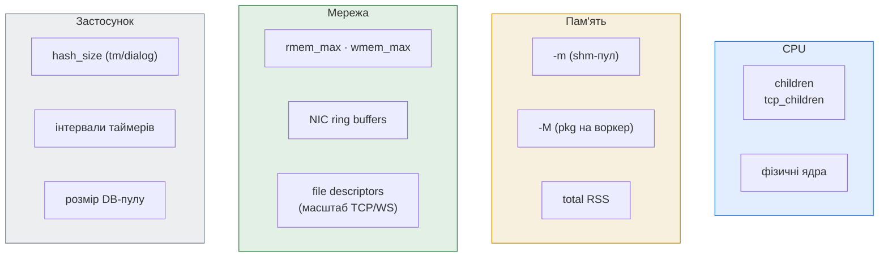

# 2.5 Sizing & tuning під паттерни трафіку

> [!IMPORTANT]
> Жодні два розгортання Kamailio не потребують одних і тих самих чисел. 100-тисячний реєстратор і 100k-CPS stateless-proxy можуть жити на однаковому залізі — але з абсолютно різними `children`, `-m`, `-M` і kernel-tuning'ом. Цей розділ — про те, як читати свій трафік і обирати відповідно, а не про магічний рецепт.

Чотири попередні розділи пояснюють, *як* Kamailio працює зсередини. Цей — про те, як перетворити це розуміння на операційні дефолти: скільки воркерів, скільки пам'яті, які ядерні налаштування, і як ці рішення змінюються від паттерна до паттерна.

## Виміри, які ви насправді налаштовуєте



Кожен із цих knob'ів мапиться на щось із попередніх розділів: `children` — на процесну модель, `-m`/`-M` — на архітектуру пам'яті, `hash_size` — на per-bucket-патерн. Правильне число для кожного залежить від того, що саме є вашим bottleneck'ом — а дізнатися це можна лише подивившись.

## Стартові baseline'и (потім вимірюйте)

Сприймайте числа нижче як дефолти, від яких ви починаєте — і йдете далі, як тільки телеметрія показує реальну картину.

| Knob | Дефолт | Підіймайте коли… |
|---|---|---|
| `children=8` (UDP-воркерів на listener) | 8 | UDP `recvfrom`-черга backlog'ується під навантаженням |
| `tcp_children=4` | 4 | кількість TCP/WS-з'єднань росте, читання стопориться |
| `-M 8` (MB pkg на воркер) | 8 | у логах `out of memory` на парсингу |
| `-m 64` (MB загального shm) | 64 | `kamcmd core.shmmem` показує `free < 30%` на піку |
| `hash_size=1024` для `tm`, `dialog`, `htable`, `usrloc` | 1024 | кількість одночасних викликів / користувачів сильно більша, і `perf` показує lock contention |
| `tcp_max_connections=2048` | 2048 | WebSocket / TCP-важкі сценарії |
| `tcp_connection_lifetime=120` (с) | 120 | хочеться довший idle keepalive |

## Patтерн 1 — Stateless proxy

**Форма трафіку.** Високий request-rate. Маленькі повідомлення. Переважно `INVITE`/`REGISTER`, які фор'юардяться після routing-рішення. Опційно — handling retransmission'ів через `tm`, але per-call стан не тримається.

**Що домінує в ціні.**
- CPU — кожен пакет парситься, проходить route, фор'юардиться.
- Network packet rate (PPS), не bandwidth.
- Майже нульовий ріст shm per call.

**Sizing.**
- `children = 2 × ядер`, до ~32. Stateless-воркери більшість часу проводять у route, не блокуються — тож більше воркерів майже прямо транслюється у більше PPS.
- `-M 8` (дефолту вистачає — транзакцій не тримаємо).
- `-m 64–128` достатньо, якщо ви не маєте `dispatcher` з великими таблицями.
- Тюньте UDP-буфери ядра: `net.core.rmem_max = 16777216`, `net.core.wmem_max = 16777216`. На високому PPS дефолтний 256 KB UDP receive buffer — найпоширеніша причина «дропів, які не пояснити».

**Що вас вбиває.**
- `recvfrom`-дропи на рівні ядра, якщо worker pool не встигає — підіймайте `children` та/або kernel-буфери.
- Повільні DNS-запити всередині route: один поганий upstream-lookup може запаркувати воркера на секунди. Використовуйте кешуючі модулі або pre-resolved IP.

## Patтерн 2 — Registrar-сервер

**Форма трафіку.** Переважно `REGISTER` зі стабільним refresh'ом (типово раз на 30–600 с). Помірний in-flight-transaction count, але великий статичний стан: кожен активний контакт живе в `usrloc`.

**Що домінує в ціні.**
- Розмір shm — `usrloc`-кеш масштабується лінійно з онлайн-контактами. Приблизна ева: ~500 B на контакт.
- DB-writes, якщо `usrloc` налаштований у синхронному режимі (на масштабі — уникайте; беріть `db_mode=1` з періодичним flush'ем).
- Сплески під час *re-registration storms* — коли upstream-peer падає, кожен пристрій може REGISTER'итися заново за секунди.

**Sizing.**
- `children = ядер`, можливо трохи менше. Воркери проводять менше часу на повідомленні, ніж stateless-proxy.
- `-m` під `peak_contacts × 600 B × 2` (×2 — запас на фрагментацію і tm-транзакції в польоті). Для 100 k контактів → ~120 MB → беріть `-m 256` або вище.
- `usrloc hash_size` має бути щонайменше `peak_contacts / 10`, щоб bucket'и лишалися короткими — для 100 k контактів `hash_size=16384` розумно.
- Поставте `usrloc db_mode=1` (write-back) і періодично флушите, а не per-REGISTER.

**Що вас вбиває.**
- Вичерпання shm, коли DB-sync падає, а in-memory-кеш росте безконтрольно — алертіть на розбіжність `kamcmd ul.dump` count і DB-row count.
- Re-registration storms після upstream-failover — розгляньте rate-limiting через `pike` або рандомізацію інтервалів реєстрації на UAC.

## Patтерн 3 — Stateful proxy / маршрутизація викликів

**Форма трафіку.** Потоки `INVITE`/`BYE` з повним відстеженням транзакцій через `tm`, часто `dialog`, щоб бачити виклик end-to-end. Per-call стан живе у shm від `INVITE` до або кінця виклику, або експірації dialog-таймера.

**Що домінує в ціні.**
- shm на конкурентний виклик — `tm` + `dialog` разом коштують приблизно 5–10 KB на виклик. Плануйте відповідно.
- Contention на tm-hash, якщо `hash_size` замалий для call-rate.
- DB-lookup'и на setup'і виклику (auth, accounting).

**Sizing.**
- `children = 2 × ядер` — розумний старт. Виклики чіпають більше коду, ніж stateless-форвард, тож per-message CPU вищий.
- `-m` під `peak_concurrent_calls × 10 KB × 2`. 10 k одночасних викликів → ~200 MB → `-m 512` або `1024`.
- `tm hash_size = 4096` або вище для високого call-rate. Дефолтні 1024 ловлять per-bucket contention десь на 50 k транзакцій/с.
- Розмір DB-пулу (DB-конекцій модуля × кількість воркерів) має бути таким, щоб не стояти в черзі: щонайменше `children` конекцій у пулі.

**Що вас вбиває.**
- Довгі route'и через повільні DB-запити — використовуйте тайм-аути й async-модулі.
- shm-фрагментація, коли concurrent call count сильно скаче — моніторте `largest_free` блок, а не лише `free`.

## Patтерн 4 — WebSocket / WebRTC-шлюз

**Форма трафіку.** Десятки тисяч довгоживучих TCP/TLS-з'єднань, помірний per-connection message rate, у парі з RTPEngine для медіа.

**Що домінує в ціні.**
- File descriptors — кожне з'єднання це один FD плюс ядерний TCP-стан.
- Планування TCP main і tcp_children — кількість TCP-воркерів обмежує, наскільки швидко ви можете висушити зайняті з'єднання.
- CPU на TLS-handshake під час storms.

**Sizing.**
- `tcp_children = 2 × ядер`, якщо WS — домінуючий трафік. WS-читання потребує воркера на сплеск активності з'єднання.
- `tcp_max_connections` ставте на peak connection count + запас.
- `ulimit -n` має бути вищим за `tcp_max_connections + children + DB-pool + slack`. 65535 — поширене дно.
- `tls_max_connections` дзеркальте `tcp_max_connections`, якщо все під TLS.
- Підніміть `tcp_connection_lifetime`, якщо ваші UA шлють WS-keepalive рідше за дефолтні 2 хвилини.
- Для високого TLS-handshake-rate пиньте TLS-воркери до конкретних ядер і вмикайте session resumption.

**Що вас вбиває.**
- `EMFILE: too many open files` — перше, що перевірити — `ulimit -n` і `tcp_max_connections`.
- TCP main стає bottleneck'ом, якщо connection-accept rate великий; рідко, але буває з WebRTC sign-up storms.

## Як вимірювати, а не вгадувати

Три команди, які ви маєте крутити **до того**, як міняти sizing-knob:

```bash
kamcmd core.shmmem          # total / free / largest_free / fragments
kamcmd core.pkgmem all      # per-worker pkg-стан
kamcmd tm.stats             # транзакції в польоті, глибина per-bucket
```

Плюс із боку ОС:

```bash
ss -lntu                    # глибини черг на listen-сокетах
ss -tan state established | wc -l   # активні TCP-з'єднання
perf top -p $(pgrep -f kamailio | head -1)   # де воркери проводять CPU
```

> [!TIP]
> **Єдина найкорисніша операційна метрика — це `largest_free` у `core.shmmem`.** Total `free` може лишатися здоровим, тоді як `largest_free` падає через фрагментацію. Коли `largest_free` падає нижче розміру типової shm-алокації, наступна велика алокація провалюється — навіть якщо «вільної пам'яті ще повно». Алертіть саме на це, не на `free`.

## Workflow тюнінгу

1. **Поставте дефолти.** Стартуйте з таблиці нагорі цього розділу. Не оверінжинірте перше розгортання.
2. **Налийте реалістичне навантаження.** Беріть [SIPp](https://github.com/SIPp/sipp) або capture-replay з продакшну. Синтетичні паттерни вводять в оману.
3. **Дивіться на чотири речі.** CPU (`top`/`perf`), shm (`kamcmd core.shmmem`), pkg (`kamcmd core.pkgmem all`), message rate на listener'і (`ss -lntu` або per-listener counters).
4. **Міняйте по одній кнопці за раз.** Якщо ви подвоїли `children`, додали 1 GB shm і підняли `hash_size` одночасно — ви не зрозумієте, що саме допомогло.
5. **Перебазлайнюйтесь після кожної значущої зміни форми трафіку.** Реєстратор на 10 k користувачів і реєстратор на 100 k — це різні числа, навіть якщо все інше однакове.

Kernel-side tuning, що окупається на всіх паттернах, — невеликий: підвищити UDP-buffer-розміри під високий PPS, підняти `ulimit -n` для TCP-важких сценаріїв, і подумати про `net.core.netdev_max_backlog` на хостах, що бачать сплески трафіку. Все інше — workload-specific.

---

<p align="center">
  <a href="./">← Зміст</a> · <a href="05-lifecycle.md">← 2.4 Життєвий цикл</a> · <a href="07-reception.md">Далі: 3.1 Прийом →</a>
</p>
