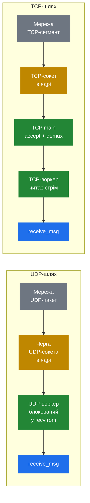

# 3.1 Прийом

> [!NOTE]
> Прийом — найдешевша й найнудніша частина SIP-життєвого циклу, і це навмисно. Цікаве починається у наступному розділі; робота прийому — лише забрати байти з дроту в pkg-пам'ять і передати їх у `receive_msg()`.

## Два шляхи всередину

SIP-повідомлення може прилетіти у двох формах, і Kamailio поводиться з ними по-різному — аж до точки, де вони зустрічаються.

Обидва шляхи сходяться в **`receive_msg(buf, len, source)`** у ядрі Kamailio. Після цієї точки транспорт не має значення — routing-движок, модулі, скрипт бачать ту саму структуру.

## UDP — простий випадок

UDP — це основна маса SIP-трафіку, і це навмисно найпростіший шлях. Кожен UDP-воркер сидить у виклику `recvfrom()`, заблокований. Ядро тримає чергу вхідних пакетів на сокет. Коли пакет приходить, ядро обирає **того воркера, який зараз заблокований**, і будить його. Воркер копіює пакет у свій приватний pkg-буфер, записує source-адресу й викликає `receive_msg()`.

Кілька деталей, що важать:

- **Усі воркери `recvfrom()` на одному й тому ж сокеті.** Вони змагаються за пробудження. Це й дає Kamailio балансування навантаження з нульовим overhead'ом — ядро робить роботу з розподілу пакетів між N воркерами, без userspace-координатора і без contention, окрім того, що є у самому UDP-шарі ядра.
- **Один UDP-пакет — це одне SIP-повідомлення.** SIP-over-UDP визначає «одне повідомлення на datagram», тож на стороні парсера не треба шукати межі повідомлень. Розмір пакета = розмір повідомлення.
- **Пакет — непрозорий до парсингу.** На цій стадії у Kamailio є трійка `(buffer, length, source_addr)` у pkg, і це все. Жоден заголовок ще не прочитаний, жодне поле не витягнуте, жодна структура не наповнена. Просто байти.
- **Воркер тепер commit'нутий.** Від повернення з `recvfrom()` до повернення з `receive_msg()` цей воркер зайнятий цим одним повідомленням. Він не може взяти інший пакет із черги. Якщо скрипт виконується 50 мс, цей воркер сам по собі обробить максимум 20 повідомлень за секунду.

## TCP — складний випадок

TCP важче, бо framing під SIP не той. TCP — це потік байтів, а не record-протокол: немає концепції «один TCP-сегмент = одне повідомлення». Ядро може віддати одне SIP-повідомлення трьома читаннями або три повідомлення одним читанням — залежно від того, як воно посегментувало і пересклеїло потік.

Kamailio розщеплює TCP на дві процесні ролі:

**TCP main** володіє listening-сокетом. Викликає `accept()`, щоб впускати нові з'єднання, потім роздає file descriptor'и нових з'єднань TCP-воркерам. Також обробляє вхідну активність на наявних з'єднаннях — будить потрібного воркера, коли ядро сигналізує, що дані доступні для читання.

**TCP-воркери** володіють file descriptor'ами, які роздав TCP main. Кожен тримає per-connection read-buffer. Коли дані доступні, воркер `read()`ить у буфер і запускає SIP-over-TCP framing-парсер: читає заголовки до порожнього рядка, знаходить `Content-Length`, накопичує задану кількість байтів тіла, оголошує «це повне повідомлення» і викликає `receive_msg()`.

Кілька наслідків цього дизайну:

- **Повільне з'єднання займає воркера.** Якщо peer цідить повідомлення повільно, TCP-воркер, що його тягне, має тримати буфер і дочитувати на кожне пробудження від ядра. Він не може одночасно ловити межі повідомлень в інших з'єднаннях, хоча послідовно обробляти готові повідомлення кількох з'єднань — може.
- **Half-closed і idle-з'єднання коштують пам'яті, але не CPU.** З'єднання без вхідних даних — це просто FD у `epoll`-сеті TCP main'а. Ціна — маленька структура на з'єднання плюс TCP-control-block у ядрі. Саме тому Kamailio може тримати десятки тисяч WebSocket-клієнтів на кількох воркерах.
- **TLS — варіант TCP.** З точки зору воркера TLS — це TCP після того, як OpenSSL-шар все розшифрував. Прийом ідентичний, лише read-шлях йде через `SSL_read()` замість `read()`. Handshake обробляє модуль TLS на встановленні з'єднання.
- **WebSocket — теж варіант TCP.** WS-з'єднання апгрейдиться з HTTP, потім стає frame-orientовим транспортом, який модуль `websocket` декодує назад у SIP-повідомлення. Та сама збіжність у `receive_msg()`.

## Що насправді робить `receive_msg()`

Коли `receive_msg(buf, len, source)` викликаний — байдуже, з якого транспорту — воркер уже міцно всередині домену Kamailio:

1. **Алокує свіжий `struct sip_msg` у pkg**, ставить поле `buf` на отримані байти.
2. **Запускає first-pass-парсер** — рівно стільки, щоб впевнитися, що повідомлення well-formed, і знати, який це метод чи response. Це **не** повний парсинг; це тема наступного розділу.
3. **Ініціалізує lump-список як порожній.** Майбутні мутації будуть висіти на `sip_msg`.
4. **Заходить у відповідний route** — `request_route` для запитів, `onreply_route` для відповідей.
5. **Коли route повертається — звільняє увесь `sip_msg`** і все, що на ньому висить. pkg-купа практично ресетиться під наступне повідомлення.

Cleanup на кроці 5 — це й те, що робить per-message lifetime pkg'а робочим. Воркер не мусить трекати кожну алокацію, яку зробив під час route'у; уся pkg-арена ресетиться однією операцією.

> [!IMPORTANT]
> Якщо скрипт змушує воркера довго сидіти у `receive_msg()` — повільні DB-запити, блокуючі HTTP-виклики, дорогий парсинг — цей воркер **недоступний** увесь цей час. Ядро може й далі складати пакети для нього в чергу, але вони лежатимуть у socket buffer, доки воркер не повернеться. Саме тому існують async-модулі: вони відпускають воркера, поки той чекає на зовнішнє I/O.

Наступний розділ розбирає `struct sip_msg` — що насправді наповнює парсер, що лишає на потім, і як lazy-парсинг робить common-шлях швидким.

---

  <a href="./">← Зміст</a> · <a href="06-sizing-and-tuning.md">← 2.5 Sizing &amp; tuning</a> · <em>Далі: 3.2 Розпарсене повідомлення (готується)</em>

