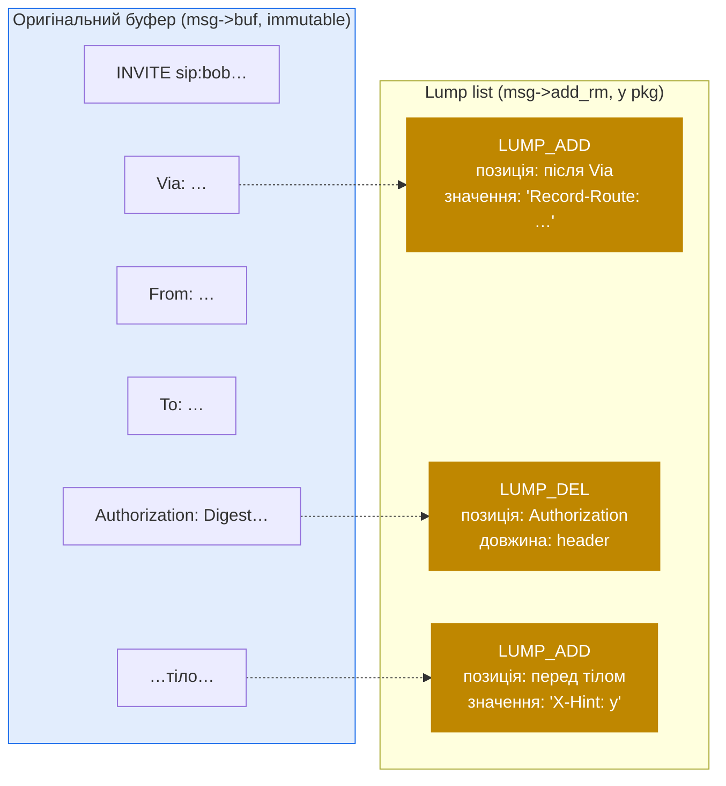

# 3.3 Lumps — мутації в черзі

> [!IMPORTANT]
> Коли ваш скрипт каже «видалити заголовок `Authorization`» або «вставити `Record-Route`» — **буфер повідомлення не модифікується.** Замість цього в список додається невеликий дескриптор («lump»), і весь список застосовується одним проходом, коли повідомлення нарешті форвардиться. Це і є той центральний трюк, який робить мутацію повідомлень у Kamailio дешевою: багато edit'ів — один rewrite буфера.

## Проблема

Попередній розділ завершився на обмеженні: після парсингу **десятки закешованих вказівників**, розкиданих по `sip_msg` і стану модулів, вказують у `msg->buf`. Якщо route каже «видалити From-tag», і Kamailio дійсно зробить `memmove()` на буфері, щоб видалити ці байти, — кожен з тих вказівників стане stale або помилковим.

Наївні альтернативи:

- **Копіювати буфер на кожен edit.** Route з 10 модифікаціями копіює буфер 10 разів. Квадратично за кількістю edit'ів. Смерть на масштабі.
- **Трекати всі закешовані вказівники й корегувати.** Потребує, щоб кожен модуль реєстрував свої вказівники. Крихко, error-prone, не виживає при додаванні нових модулів.

Kamailio не обирає жодну з них. Він обирає: **відкласти edit'и.**

## Що таке lump

Lump — це маленький дескриптор «edit'у, який колись станеться». Структура даних приблизно така:

```c
struct lump {
    unsigned int op;       // LUMP_ADD, LUMP_DEL, LUMP_NOP
    unsigned int type;     // header / body / URI / SDP / ...
    int          u_off;    // offset у msg->buf, де lump застосовується
    int          len;      // для DEL: скільки байтів видалити
    str          value;    // для ADD: байти, які вставити
    struct lump *before;   // ланцюг lumps, вставлених перед цим
    struct lump *after;    // ланцюг lumps, вставлених після цього
    struct lump *next;     // наступний lump у списку повідомлення
};
```

Існують **дві операції**:

- **Add content** — задається позицією в оригінальному буфері і значенням. Значення може бути статичним байт-рядком або **спеціальним маркером**, який резолвиться в момент відправки (наприклад, IP вихідного сокета, який не відомий до форварда). Саме так працює додавання `Record-Route`, `Via` та більшості header-add операцій.
- **Remove content** — задається позицією і довжиною. Байти між `u_off` і `u_off + len` будуть пропущені при реконструкції вихідного повідомлення.

Існують **два класи** lumps, розділені бо у них різні lifecycle'и:

| Клас | Призначення | Source files |
|---|---|---|
| **Message lumps** (`msg->add_rm`) | Мутації повідомлення, що форвардиться. І add, і remove. | `data_lump.c`, `data_lump.h` |
| **Reply lumps** (`msg->reply_lump`) | Контент, який треба вставити у відповідь, що цей запит тригерне. Тільки add — відповіді конструюються з нуля, видаляти нічого. | `data_lump_rpl.c`, `data_lump_rpl.h` |

Коли ви викликаєте `t_reply()` з додатковими заголовками — вони йдуть у `reply_lump`. Коли викликаєте `append_hf()` на запиті — він йде в `add_rm`. Це **не** один і той самий список.

## Як працює список



Lumps додаються через невеликий набір API-функцій:

```c
insert_new_lump_after(after, value, len, type);   // поставити в чергу ADD
insert_new_lump_before(before, value, len, type); // поставити в чергу ADD
del_lump(msg, offset, len, type);                 // поставити в чергу DEL
anchor_lump(msg, offset, len, type);              // NOP як якір
```

`anchor_lump()` — тонкий момент: створює no-op lump у конкретній позиції, щоб *інші* lumps могли причепитися до нього before/after. Так робить модуль, який хоче вставити ланцюг заголовків: ставить якір у позиції, потім `insert_new_lump_after()` повторно, щоб зчепити.

Результат — дерево-зі-списків. Linked list lumps у порядку буфера, і кожен lump може мати свої `before` і `after` ланцюги для того, що треба вставити прямо навколо нього.

## Застосування — що відбувається на send

Коли `forward_request()` (або еквівалент) нарешті має покласти байти на дріт, він запускає **lump applier**. Applier лінійно йде по оригінальному буферу, звіряючись зі списком lumps. На кожній позиції:

- Якщо lump'а немає — копіює байт у вихід.
- Якщо є ADD-lump, прив'язаний сюди — спочатку викидає його значення.
- Якщо є DEL-lump — стрибає на `len` байтів уперед.

Спеціальні маркери в ADD-значеннях резолвляться саме тут — параметр `received` для Via, IP обраного вихідного сокета для Record-Route, branch-id нової транзакції. Це й є причина існування механізму маркерів: на runtime скрипта Kamailio може ще не знати, який інтерфейс буде використано (правила RFC 3261 / DNS / DSCP), а на момент send'у вже знає.

Ціна застосування lumps — `O(buf_size + сума розмірів вставок)`. Порівняйте з наївним `O(buf_size × N_edits)` для in-place-мутацій. Для повідомлення з 5 вставками по кілька десятків байтів — це кілька сотень байтів роботи, не кілька кілобайтів.

> [!TIP]
> Двостороннє обходження lump-списку — це те, що дозволяє вставку заголовка «після Record-Route» і заголовка «після *вставленого* Record-Route» обом працювати дешево: другий `insert_new_lump_after()` чіпляється до `after`-ланцюга першого lump'а, не до позиції в буфері.

## Pitfall, на який рано чи пізно натикається кожен

Найвідоміший наслідок lump-системи:

> [!WARNING]
> Якщо ваш скрипт робить `remove_hf("Authorization")` і одразу тестує `if (is_present_hf("Authorization"))` — **тест поверне true.** Бо буфер реально не змінився — у чергу додався лише lump. Заголовок усе ще лежить у `msg->buf`, парсований вказівник усе ще на місці. «Видалення» проявиться тільки у форварднутому повідомленні.

Це не баг — це архітектура. Скрипт працює з описом того, як має виглядати *вихідне* повідомлення, а не з мутабельною копією вхідного. Asipto devel guide називає це «одним з найбільш обговорюваних issue» саме тому, що людей це дивує.

Escape hatch — `msg_apply_changes()` з модуля `textopsx`:

```kamailio
remove_hf("Authorization");
msg_apply_changes();        # застосувати pending lumps зараз, переоблаштувати msg->buf
if (is_present_hf("Authorization")) { ... }    # тепер це працює як очікується
```

`msg_apply_changes()` проходиться по lump-списку, будує новий буфер із усіма застосованими мутаціями, перепарсює заголовки з нового буфера, перенаправляє `msg->buf` на нього. Дорого — це *рівно та робота*, якої lump-система мала уникнути, — тож вживайте лише там, де подальша логіка скрипта реально мусить бачити пост-мутаційний стан.

## Branching — коли одне повідомлення йде в кілька місць

Stateful-форвардинг (через `tm`) часто форкає запит у кілька branch'ей (наприклад, паралельний дзвінок на кілька телефонів). Кожна branch може хотіти свої мутації — різний Record-Route, різні заголовки — не зачіпаючи інших.

`tm` розв'язує це **клонуванням lump-списку per branch**. Оригінальний `msg->add_rm` — це «спільний» сет; per-branch lumps живуть у branch-struct транзакції. Коли вихідне повідомлення branch'а конструюється, applier йде по оригінальному буферу з мерженими спільними lumps **і** branch-lumps. Так Record-Route, вставлений у `request_route`, буде на кожному branch'і, а заголовок, вставлений у `branch_route[1]`, — лише на branch 1.

## Чому це *той самий* speed-trick

SIP-проксі, що чіпає кожне повідомлення жменею мутацій, був би повільним на наївній реалізації — кожен форвард копіював би буфер, перепарсював закешовані вказівники, забруднював cache line'и. З lumps:

- Буфер парситься раз. Вказівники, закешовані в момент парсингу, лишаються валідними весь route.
- Route може поставити в чергу довільну кількість мутацій за O(1) на виклик.
- Вихідне повідомлення конструюється за один лінійний прохід у момент send'у.
- Branches діляться буфером і більшістю lump-списку — лише дельти per-branch.

Як наслідок — message-processing-шлях Kamailio домінується парсингом (обмеженим розміром повідомлення) і виконанням route'у (обмеженим складністю скрипта), а не overhead'ом мутацій. Це одна з головних причин, чому те саме залізо може пропускати тисячі викликів за секунду через Kamailio-shaped-проксі.

Наступний розділ бере lumps, які ви поставили в чергу, і проводить їх через routing-движок — `request_route`, `branch_route`, `failure_route`, `onreply_route`, `event_route` — і показує, коли спрацьовує кожен.

---

<p align="center">
  <a href="./">← Зміст</a> · <a href="08-parsed-message.md">← 3.2 Розпарсене повідомлення</a> · <em>Далі: 3.4 Движок маршрутизації (готується)</em>
</p>
