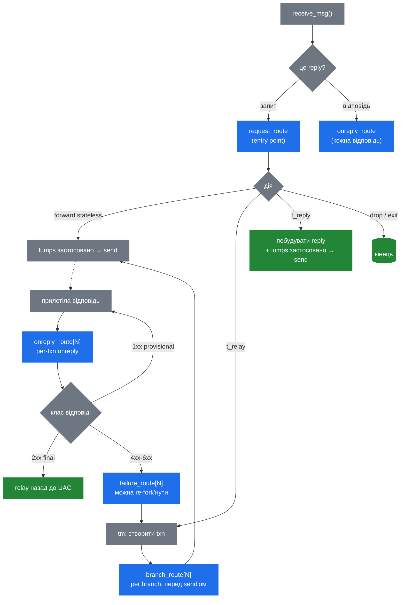

# 3.4 Движок маршрутизації

> [!IMPORTANT]
> Routing-движок — це те, що робить Kamailio *Kamailio*. Усе попереднє — процесна модель, пам'ять, lumps — це сантехніка. Движок — це місце, де ваш `kamailio.cfg` стає виконуваною поведінкою, де повідомлення зустрічається з наміром оператора, і де живе більша частина повсякденної ментальної моделі «що цей сервер зараз робить».

## Route'и пре-компілюються, а не інтерпретуються per-message

Коли Kamailio стартує, cfg-парсер читає `kamailio.cfg` і будує in-memory **AST** кожного route-блока, кожного `if/else`, кожного виклику функції. Цей AST запечатується наприкінці `mod_init()` і більше ніколи не змінюється у рантаймі.

Per-message-виконання — це обхід дерева, а не інтерпретація скрипта. Ціна `if (is_method("INVITE"))` — це порівняння і branch — без жодного парсера в рантаймі, без жодних string-lookup'ів. Саме тому per-message-overhead «від скрипта» в Kamailio мінімальний: він виконує пре-компільовані інструкції, а не інтерпретує сирці.

> [!NOTE]
> Саме тому зміни в `kamailio.cfg` потребують повного рестарту (див. [розділ 2.4](05-lifecycle.md)). AST уже форкнутий у кожен воркер, запечений у регістрації функцій модулів, інлайнений у виконавчий шлях. Шляху перепарсити і підмінити на льоту не існує.

## Які бувають route-блоки і коли вони стріляють

У Kamailio є кілька різних типів route'ів. Кожен викликається рантаймом у конкретний момент життєвого циклу повідомлення:



**`request_route`** — entry point для кожного вхідного **запиту**. Тут живе більшість того, що люди розуміють під «конфігом Kamailio»: routing-рішення, аутентифікація, rewrite, виклик `t_relay()` чи `forward()`. Існує рівно один `request_route`-блок.

**`reply_route`** — стріляє у **core'овому reply-processing-шляху** для *кожної* вхідної відповіді, до того, як tm спробує зматчити її з транзакцією. Корисно для інспекції чи короткого замикання відповідей незалежно від transaction-стану — дропнути malformed-відповідь, лічити метрики на wire-рівні, застосувати політику, що не потребує transaction-контексту. Повернути `0` (drop) з `reply_route` — повністю зупиняє подальшу обробку. Відрізняється від `onreply_route`: цей бігає незалежно від того, чи відповідь належить активній транзакції.

**`onreply_route`** — бігає як частина tm transaction processing, після того, як tm зматчив вхідну відповідь з транзакцією у shm. Голий `onreply_route { … }` беззастережно для matched-відповідей; іменовані `onreply_route[N]` — лише для відповідей транзакцій, що opt-in'ули через `t_on_reply("N")`. Іменовані — спосіб перехопити відповідь конкретного виклику (SDP rewriting, accounting на 200 OK тощо).

> [!TIP]
> Ментальна модель: `reply_route` — **wire-level** (кожен байт, що виглядає як відповідь), `onreply_route` — **transaction-level** (відповіді, що належать `tm`-cell'у). У stateful-проксі з `tm`-усюди більшість reply-логіки живе у `onreply_route`. `reply_route` — правильне місце для фільтрації, rate-limiting'у чи stateless-відповідей, що оминають `tm`.

**`branch_route[N]`** — бігає **один раз на branch**, прямо перед тим, як вихідне повідомлення цього branch'а буде побудоване і відправлене. Тут лежать per-branch-модифікації: різний Record-Route per branch, branch-specific заголовки, рішення на основі того, який gateway буде у branch'а. Активується через `t_on_branch("N")` перед `t_relay()`.

**`failure_route[N]`** — бігає, коли branch видав final negative response (4xx-6xx) або зніс по таймауту. Усередині скрипт може **re-fork'нути** транзакцію на інший destination (поширений патерн: failover на secondary gateway), побудувати кастомну відповідь через `t_reply()`, або просто дати failure поширитися. Активується через `t_on_failure("N")`.

**`event_route[<event-name>]`** — бігає у відповідь на runtime-події, які *не* прив'язані до повідомлення з дроту. Поширені: `event_route[tm:branch-failure]` для branch-specific-failure-хуків, `event_route[xhttp:request]` для HTTP-over-SIP-socket-запитів, `event_route[dispatcher:dst-down]` коли gateway помічений мертвим. Кожен модуль експозить свої події.

**`onsend_route`** — викликається безпосередньо перед тим, як будь-яке повідомлення піде на дріт. Використовуйте економно; бігає поверх уже побудованого outbound-повідомлення, і робити там осмислену роботу — дорого.

## Cfg як DSL — що це насправді

Конфігурайційна мова — не general-purpose-скриптинг. Це domain-specific-діалект, що існує заради одного: добре виражати SIP routing decisions поверх розпарсеного повідомлення.

Що в ньому є:
- **Control flow** — `if/else`, `switch/case`, `while`, `break`, `return`, `exit`, `drop`.
- **Оператори порівняння** разом із regex (`=~`, `!~`).
- **String operations** через псевдо-змінні й трансформації.
- **Виклики функцій** — module-exported функцій (`t_relay()`, `record_route()`, `is_method("INVITE")`).
- **Виклик sub-route** — `route("auth")` викликає інший route-блок, ділиться `sip_msg`'ом.

Чого свідомо немає:
- **Довільних обчислень.** Жодної арифметики поза тим, що дають псевдо-змінні-трансформації. Жодних власних структур даних.
- **Loop'ів по колекціях.** Не можна ітерувати заголовки; можна перевіряти лише іменовані.
- **Рекурсії.** Sub-route'и можуть викликати інші sub-route'и, але глибина обмежена.
- **Closure'ів, модулів, чи будь-чого, що ви б знайшли в справжній мові.**

Це фіча, не обмеження. Обмеження роблять мову tractable для reasoning'у (один route, один шлях, обмежена глибина) і роблять кожну операцію дешевою (жодних динамічних алокацій per loop, жодних name-lookup'ів у рантаймі). Коли потрібні справжні обчислення — credit-чеки, складні routing-таблиці, HTTP-запити — ви виходите в модуль або в KEMI (розділ 5), що вбудовує повний інтерпретатор саме для таких випадків.

## Sub-route'и і як route'и взаємодіють

`route("name")` викликає іменований sub-route — просто інший route-блок, оголошений як `route[name] { … }`. Sub-route бігає з тим самим `sip_msg`, тим самим станом `$var(...)`, тими самими псевдо-змінними. Жодної function-call-ізоляції — це фактично textual inclusion, відкладене до рантайму.

```kamailio
request_route {
    route("sanity");
    route("auth");
    route("routing");
}

route[auth] {
    if (!is_present_hf("Authorization")) {
        auth_challenge("$fd", "0");
        exit;
    }
}
```

### `return`, `exit`, `drop` — примітиви виходу з control-flow

Три ключових слова, що завершують виконання скрипта на різних scope'ах, з різними downstream-наслідками. У тривіальних route'ах виглядають як взаємозамінні; у нетривіальних — ні.

**`return [value]`** — повертає з поточного `route[name]`-блоку у caller. На top-рівні `request_route` — еквівалент випадіння з кінця. Зі значенням — встановлює результат виразу `route("name")`:

```kamailio
route[is_local] {
    if ($si =~ "^10\.") return 1;
    return -1;
}

request_route {
    if (route(is_local)) {
        # сюди заходить, лише коли is_local повернув позитивне
    }
}
```

Tri-state-конвенція діє (позитивне → true, негативне → false, нуль → дропнути повідомлення — див. [розділ про cfg DSL](29-script-engine.md)).

**`exit`** — завершує обробку для цього повідомлення **цілком**, негайно, незалежно від глибини вкладеності. Воркер ламає per-message pkg-стан і повертається у `recvfrom`-loop. **Жодна відповідь не генерується автоматично** — якщо route мав відправити (`sl_send_reply`, `t_reply`, `t_relay`) і не зробив цього до `exit`, UAC нічого не побачить, ретрансмітитиме, врешті — тайм-аут.

**`drop`** — історично відрізняється від `exit`: сигнал «тихо поглинути, нічого не генерувати», що утримує `tm` від emit'у implicit-reply. У сучасному Kamailio часто поводиться ідентично до `exit` на top-level; `drop` читається ясніше, коли намір — «це повідомлення відфільтроване, не релейнуте, не відповідається».

> [!WARNING]
> `exit` *після* `t_relay()` — **безпечно**. `tm` уже поклав транзакцію у shm; воркер вільний повертатися у свій loop. Транзакція йде далі незалежно. Новачки в Kamailio іноді хвилюються, що exit скасує relay — ні. `exit` лише звільняє per-message pkg-арену (розділ 2.2).

Четвертий keyword у цьому сімействі — **`break`**, належить `switch/case` і `while` — не є route-exit-примітивом.

## Що `exit` і `drop` означають у кожному route

Попередня секція описувала `return`, `exit` і `drop` як взаємозамінні. Так і є — але **тільки** на top-рівні `request_route`. Кожен інший вид route'а має «default continuation», яку движок виконає після того, як скрипт повернеться (форвардити reply, відправити branch, поширити failure, покласти повідомлення на дріт), і ці примітиви по-різному цю continuation обрізають.

Механічно всі чотири jump-ключові слова (`exit`, `drop`, `return`, `break`) компілюються в один опкод і різняться лише тим, який біт OR'ять у `run_flags` action-контексту. Ключовий розкол: **тільки `drop` ставить `DROP_R_F`**. `exit` ставить тільки `EXIT_R_F` — control flow, без подавлення. `return 0` авто-промотується до додаткового `EXIT_R_F`, але `DROP_R_F` **не** виставляє. Кожен caller у рантаймі читає свою підмножину цих бітів.

| Route-блок | `exit` | `drop` | `return 0` на top-level |
|---|---|---|---|
| `request_route` | скрипт завершується, авто-форварду немає | те саме | те саме |
| `reply_route` (core) | reply йде далі у `tm`-метчинг | reply відкидається, до `tm` не доходить | відкидається (движок також дивиться на int-return) |
| `onreply_route[N]` | reply усе одно релейниться upstream | reply подавлюється (за замовчуванням — лише provisional) | reply усе одно релейниться |
| `branch_route[N]` | branch відправляється | branch скасований, не відправляється | branch відправляється |
| `failure_route[N]` | движок ігнорує — failure поширюється | движок ігнорує — failure поширюється | движок ігнорує — failure поширюється |
| `event_route[…]` | зазвичай без ефекту | залежить від події; більшість ігнорує, деякі — short-circuit | зазвичай без ефекту |
| `onsend_route` | повідомлення йде на дріт | подавлює send | повідомлення усе одно відправляється (движок промотує 0 → 1) |

Декілька рядків потребують пояснення.

**`onreply_route[N]` — `drop` за замовчуванням лише для provisional.** Чек у `tm` — gated: подавлює upstream-релей лише коли статус reply'я `< 200`. Дропати фінальну відповідь означало б залишити транзакцію в зламаному стані — tm уже зобов'язався щось релейнути. Compile-time-флаг (`TM_ONREPLY_FINAL_DROP_OK`) знімає gate, але stock-білди його не вмикають. Практичний наслідок: 1xx provisional'и можна подавити (наприклад, відфільтрувати небажані 183), але 200/4xx/5xx, що фіналізує дзвінок, не дропнеш.

**`branch_route[N]` — `return 0` ≠ `drop`.** Per-branch-хук у `t_fwd.c` перевіряє лише `DROP_R_F`. `return 0` ставить `EXIT_R_F`, але не `DROP_R_F` — тож sub-route, що повертає 0, попри інтуїтивне «стоп», branch не скасовує. Щоб справді скасувати, треба literal-ключове `drop`.

**`failure_route[N]` особливий — verb'а подавлення тут немає.** Подивіться, як `tm` його викликає (`t_reply.c`):

```c
if(run_top_route(failure_rt.rlist[on_failure], faked_req, 0) < 0)
    LM_ERR("...");
```

Третій аргумент — `NULL`. tm взагалі не дістає action-контекст. Ні `exit`, ні `drop`, ні `return 0` не видимі логіці обробки failure. Поширення керується виключно side-effect'ами, що скрипт виконав *до* повернення: `t_reply()` будує іншу відповідь, `t_drop_replies()` відкидає збережені негативні replies, `append_branch()` + `t_relay()` re-fork'ить на новий destination. Якщо скрипт просто `exit`нув — tm релейнить найкращий збережений negative-reply upstream, як зазвичай. Той самий патерн із `NULL`-ctx — у `event_route[tm:branch-failure]` (branch-failure-колбек).

> [!WARNING]
> `exit` у `failure_route` **не** проковтує failure. Оператори іноді ставлять `exit` «щоб зупинити failure» і дивуються, чому UAC усе одно отримує 4xx/5xx. Відповідь: tm не питав думки скрипта — він уже збирається релейнути негативний reply, якщо ви явно не викликали `t_reply()` чи `t_drop_replies()`.

**`onsend_route` — inverse-trap.** Чек у `core/onsend.c` — лише `DROP_R_F`, і движок явно *промотує* `run_actions()`-return 0 назад до 1 перед рішенням. Тож і `exit`, і `return 0` дають повідомленню піти на дріт; реально подавлює send тільки literal `drop`.

**`event_route[name]` — гетерогенний.** Більшість call-сайтів event-route у core й модулях передають `NULL` ctx — скрипт fire-and-forget. Декілька інспектують `DROP_R_F`: `event_route[core:msg:received]` і `event_route[core:pre-routing]` через нього short-circuit'ять подальшу обробку повідомлення на wire-рівні. Module-specific події відрізняються; коли сумнівно — дивіться на `run_top_route`-call-сайт у джерелах модуля.

### Ті самі правила для KEMI

`KSR.x.exit()` і `KSR.x.drop()` ходять через ту саму machinery, що й cfg-ключові слова: `KSR.x.exit()` ставить тільки `EXIT_R_F`, `KSR.x.drop()` — `DROP_R_F`. Таблиця вище для KEMI-скриптів — застосовна ідентично. Інверсія truthiness, описана у [розділі 5.2](13-kemi-bridge.md), цих примітивів не торкається — вони керування потоком, не предикати.

Поза тим, host-language-деталі різняться залежно від binding'а: у деяких хостах unwind назад до KEMI-диспатчера — через виключення, що рве поточний кадр, у інших — встановлюється стан і скрипт біжить далі до повернення з функції. Форма `return KSR.x.exit()`, що зустрічається в багатьох прикладах, — портативна ідіома: завершує функцію на рівні мови незалежно від того, як хост обробляє cfg-сторонній unwind.

## Як route'и взаємодіють із lumps

Ключове спостереження: кожен route-блок бігає на **тому самому `sip_msg`**, і lump-список — це поле цього структу. Модифікації, зроблені в `request_route`, видимі (як lumps у черзі) у `branch_route`. Lumps, поставлені в чергу у `branch_route`, застосовуються лише до вихідного повідомлення цього branch'а. Lumps, поставлені в `onreply_route`, застосовуються до відповіді, що фор'юардиться назад.

Саме тому `branch_route` — правильне місце для per-destination-кастомізації: побудова вихідного повідомлення кожного branch'а бачить об'єднання `request_route`'их lumps плюс branch'ові lumps. Вони не зливаються в один список — applier композить їх у момент send'у.

## Implicit drop

Тонке, але важливе правило: якщо `request_route` закінчив виконання без явного форвардингу (`t_relay`, `forward`, `t_reply`), Kamailio **тихо дропає повідомлення**. Жодного implicit-форвардингу не існує — скрипт мусить вирішити.

Це неінтуїтивно при першому знайомстві з cfg DSL. Люди очікують «я ж не сказав дропати — то воно ж мало б форвардитися». Працює навпаки: нічого не форвардиться, поки ви не сказали.

Наступний розділ бере routing-рішення, зроблені цим движком, і проводить їх через реальну передачу — як lumps застосовуються, як stateful vs stateless відрізняються у момент send'у, як відповіді знаходять дорогу назад.

---

<p markdown="1" align="center">
  [← Зміст](../) · [← 3.3 Lumps](09-lumps.md) · [Далі: 3.5 Форвардинг і відповіді →](11-forwarding.md)
</p>
