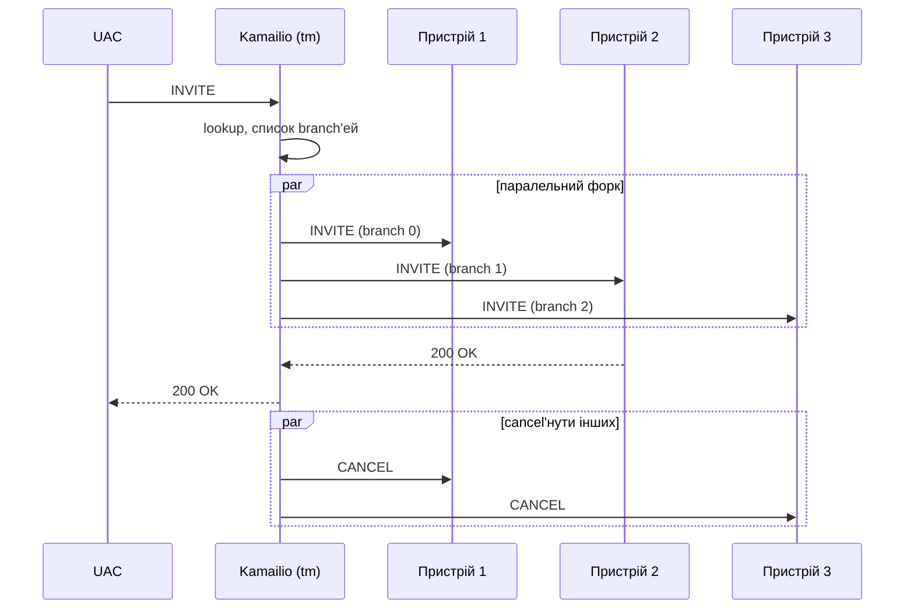

# 3.5 Форвардинг і відповіді

> [!IMPORTANT]
> «Форвардинг» — це момент, коли все накопичене досі — розпарсене повідомлення, lump-список, per-branch-стан — колапсує в реальні байти на сокеті. Це також місце, де stateless- і stateful-форвардинг різко розходяться: один — це виклик функції, інший — створення довгоживучої state machine.

## Два способи форвардити, два профілі ціни

Kamailio підтримує два принципово різних режими форвардингу, і вибір — ваш, per-message.

**Stateless (`forward()` / `sl`).** Воркер:
1. Обирає destination (next hop) за request-URI та заголовками `Route`.
2. Просить lump-applier побудувати вихідний буфер.
3. Пише його в сокет.
4. Повністю забуває про повідомлення. Жодного збереженого стану.

Жодних транзакцій, жодних retransmission-таймерів, жодної свідомості того, чи воно дійшло. Якщо прилетить відповідь — то це просто ще одне вхідне повідомлення для голого `onreply_route`. Ціна: кілька мікросекунд плюс send в ядро. shm-footprint: нуль.

**Stateful (`t_relay()` / `tm`).** Воркер:
1. Шукає — або створює — транзакцію в hash-таблиці `tm` (у shm).
2. Для кожного branch'а (часто одного, але може форкати): клонує lump-сет, бігає `branch_route`, якщо armed, будує вихідний буфер, шле.
3. Стартує retransmission-таймери.
4. Повертає скрипту. Транзакція живе у shm, поки не завершиться.

Коли прилетить відповідь, воркер, що її підхопить, шукає транзакцію у shm, може запустити `onreply_route[N]` (якщо armed), і вирішує: relay'нути відповідь назад, чекати на ще branches, бігти `failure_route`, чи фіналізувати.

Ціна: кілька KB shm на виклик, плюс слот у timer wheel, плюс contention на per-bucket-локу при вставці/lookup'і. Вартує для будь-якого випадку, коли важливі retransmission, форки чи post-decision-логіка — себто практично завжди, крім чистого stateless-проксі.

## Lump applier — момент, коли lumps стають байтами

Обидва режими врешті дзвонять `build_req_buf_from_sip_req()` (або його reply-аналог). Це функція, що лінійно йде по оригінальному `msg->buf`, звіряється з lump-списком і продукує свіжий буфер вихідного повідомлення. Це момент, коли кожна вставка заголовка, видалення, переписування URI чи SDP-edit, поставлені в чергу під час routing'у, нарешті стаються.

Логіка walker'а — рівно та, що була ескізована в [розділі 3.3](09-lumps.md):

```
out_buf = новий буфер на (len(msg->buf) + сума len value у lumps
                                          - сума len del у lumps)
іти по msg->buf лінійно, позиція i = 0..len:
    якщо DEL-lump прив'язаний у i:
        i += lump.len     # пропустити
    якщо ADD-lump прив'язаний у i:
        дописати lump.value у out_buf
        (резолвити маркери: IP вихідного сокета для Record-Route тощо)
    дописати msg->buf[i] у out_buf
    i += 1
```

Резолвинг маркерів — важливий. Lump, що каже «вставити `Record-Route: <sip:HOST:PORT;lr>`», де `HOST:PORT` — маркер — ці байти не заповнюються, поки не обраний вихідний сокет. Вибір залежить від destination'у, від routing-таблиці ядра, від `force_send_socket()` у скрипті. Резолвити в цей останній момент — це спосіб не змушувати скрипт знати, який інтерфейс він використовує.

## Форк — кілька destination'ів з одного запиту

`tm` підтримує паралельні та послідовні форки. Класичний приклад: `INVITE` користувачу, що зареєстрований на трьох пристроях. Хочеться дзвонити всім трьом одночасно, прийняти перший 200 OK, скасувати інших.



Що насправді відбувається в `tm`:

- Структура транзакції тримає **branch-масив** (зазвичай до `MAX_BRANCHES`, часто 16).
- На кожен branch: свій destination, свої lump-доповнення, свій retransmission-таймер, свій per-branch-стан.
- Cfg обирає destination'и — або імпліцитно (через `Contact`-заголовки з `usrloc`), або явно (`append_branch()` додає branch'і перед `t_relay()`).
- Усі branch'і йдуть приблизно одночасно. Далі вони працюють незалежно, поки один не видасть final response.

`branch_route[N]` бігає один раз на branch, перед тим як вихідне повідомлення цього branch'а буде побудоване. Тут можна кастомізувати per branch — різне `From` display name на пристрій, branch-specific accounting, branch-specific timeout.

Коли прилетіла перша **2xx**, `tm` relay'ить її UAC і починає cancel'ити інших живих branch'ей. Коли всі final responses прийшли, `tm` обирає «найкращу» failure-відповідь (зазвичай найнижчий 4xx, що не redirect) і relay'ить її — якщо `failure_route` не втрутиться раніше.

## Failure-route'и і re-forking

`failure_route[N]` бігає, коли:
- Усі branch'і видали final responses, жоден не був 2xx, і транзакція ось-ось relay'не failure назад UAC.
- Або одна не-форкна транзакція отримала 4xx-6xx.

Усередині failure-route'у скрипт може:
- **Побудувати кастомну відповідь** через `t_reply("503", "Service unavailable")` — переб'є те, що було б природньо пропаговано.
- **Re-fork'нути на інший destination**: очистити branch-список, `append_branch()` з новими destination'ами, викликати `t_relay()` знову на тій самій транзакції.
- **Нічого не робити**, і тоді `tm` піде дефолтним шляхом і relay'не failure.

Кейс re-fork — це й є те, як реалізується operational-failover: primary trunk повернув 503 → failure_route ловить → append secondary trunk → re-relay. З точки зору UAC — це один call setup, що зайняв трохи довше за звичайний.

## Reply-шлях — як знайти потрібну транзакцію

Коли SIP-відповідь прилітає в `receive_msg()`, воркер має знайти транзакцію, якій вона належить. Lookup ключований по:

- Параметру branch у верхньому `Via` (який `tm` поставив, коли відправляв оригінал).
- `Call-ID`, `CSeq`, `From`-tag — fallback-hash, якщо branch-параметр відсутній чи непридатний.

Цей lookup б'є в ту саму per-bucket hash-таблицю, що зберігала транзакцію. Воркер, що підхопив відповідь, може не бути тим же воркером, що відправляв оригінал — саме тому транзакція у shm. Після lookup'у:

1. Якщо це provisional response (1xx) — оновити стан, бігти `onreply_route` якщо armed, переслати відповідь UAC.
2. Якщо це final response (2xx-6xx) — оновити стан, вирішити: чекати ще branches чи фіналізувати.
3. Якщо фіналізуємо — обрати найкращу відповідь, бігти `failure_route` якщо armed і відповідь — failure, relay'нути назад.

## Stateless-відповіді — коли хочеться дешево

Для того, чому не потрібен transaction-state — `200 OK` на `OPTIONS`, `401 Unauthorized` на неавтентифікований `REGISTER` — Kamailio має stateless-відповіді через модуль `sl`:

```kamailio
sl_send_reply("200", "OK");
```

Це будує reply з request'а, застосовує reply-lumps, шле і повертає. Жодної транзакції не створюється. Це *той самий* дешевий шлях, і його варто використовувати, коли вам не потрібен transaction-level-retransmission-handling.

## Що тепер має сидіти у голові

Повний шлях запиту від дроту до дроту:

1. **Прийом** — ядро демультиплексує воркеру, воркер дзвонить `receive_msg()`.
2. **First-pass-парсинг** — `parse_msg()` знаходить першу строку і offset'и заголовків, нічого більше.
3. **Виконання route'у** — `request_route` бігає на `sip_msg`'і. Псевдо-змінні і функції модулів тригерять lazy-парсинг конкретних полів. Модифікації йдуть у чергу як lumps. Скрипт вирішує, куди це повідомлення.
4. **Форвардинг** — stateless `forward()` чи stateful `t_relay()`. Якщо stateful — `tm` створює транзакцію у shm і форкає в branch'і.
5. **Per-branch-обробка** — `branch_route[N]` корегує per branch. Lumps застосовуються. Буфер будується. Send.
6. **Reply** — врешті прилітає відповідь. Бігає `onreply_route`. Стан оновлюється. Відповідь фор'юардиться назад, або `failure_route` переграє рішення.
7. **Cleanup** — коли транзакція завершилася (final response relay'нуто, чи всі branches відпрацювали), `tm` звільняє shm-стан. pkg-стан для повідомлення, що прилетіло, був звільнений у кінці кроку 3.

Все. Кожна інша архітектурна частина в цьому посібнику — script engine, KEMI, control plane, фішки — це уточнення на цьому циклі.

---

<p markdown="1" align="center">
  [← Зміст](../) · [← 3.4 Движок маршрутизації](10-routing-engine.md) · [Перехід до 5.1 KEMI →](12-kemi-overview.md)
</p>
