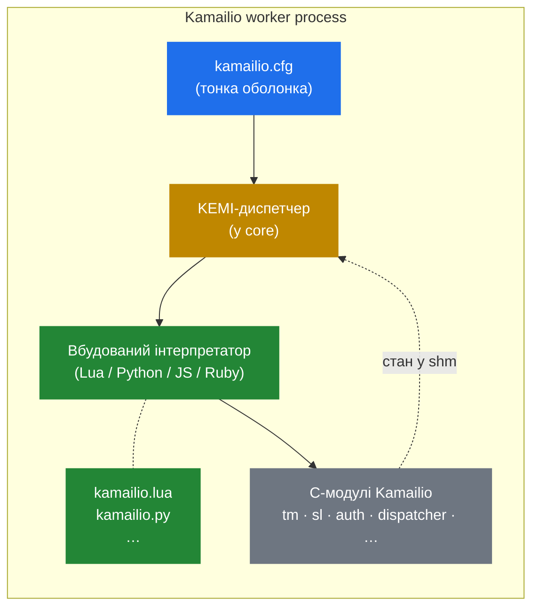

# 5.1 Яку проблему вирішує KEMI

> [!IMPORTANT]
> KEMI — **K**amailio **EM**bedded **I**nterface — існує тому, що cfg DSL — навмисно — не справжня мова програмування. У момент, коли вам потрібні справжні строки, JSON, HTTP-виклики, кеш auth-токенів чи будь-яке зі ста типових для телеком-бекенду завдань, KEMI — це escape hatch. Routing-логіка пишеться на Lua, Python, JavaScript чи Ruby; cfg стає тонкою оболонкою, що диспетчеризує до неї.

## Обмеження, які накладає cfg DSL

Попередня частина посібника пояснила, чому cfg DSL такий, як він є: пре-компільований AST, без рекурсії, без loop'ів по колекціях, без власних динамічних структур даних — навмисно, щоб per-message-виконання було дешевим. Цей trade-off правильний для fast-path routing'у. Він же стає болем у момент, коли треба зробити справжню роботу.

Конкретні речі, які cfg DSL не може — або може лише через біль:

- **Викликати HTTP API.** Є модулі (`http_client`, `http_async_client`), але відповідь — плоский string, який ви парсите регексами.
- **Парсити JSON.** Та ж історія: модулі `jansson` і `json` існують, але вкладений доступ до полів через cfg-вирази — вправа з мазохізму.
- **Тримати per-call дерево рішень.** Жодних власних структур, closure'ів, loop'ів по довільним спискам.
- **Перевикористовувати логіку в межах власних модулів.** Sub-route'и — це textual inclusion: ви не можете написати library-функцію, що повертає значення.
- **Інтегруватися з тим, що говорить справжнім протоколом.** Redis, Kafka, gRPC — будь-чим, де natural API — це «ось клієнт-об'єкт з методами».

Для чистого SIP-проксі, що бере `INVITE`, шукає destination у `dispatcher` і форвардить — cfg чудовий, а KEMI лише додав би overhead. Для будь-чого далі — аутентифікація проти кастомного бекенду, dynamic pricing, fraud detection, per-call business rules — ви тягнетеся до KEMI.

## Пропозиція KEMI

KEMI дозволяє писати **нетривіальні частини** routing'у справжньою, добре відомою мовою, лишаючи решту Kamailio недоторканою — та сама процесна модель, та сама архітектура пам'яті, та сама lump-система, ті самі `tm`-транзакції. Ви не переписуєте Kamailio на Lua; ви **вбудовуєте Lua у Kamailio** і диспетчеризуєте до нього з cfg.

У KEMI-driven-сетапі `kamailio.cfg` скорочується до пари десятків рядків: завантажити language-модуль, завантажити script-файл, диспетчеризувати entry-point-route'и до інтерпретатора. Усе інше — `request_route`, `branch_route`, `failure_route` — це тепер функції у вашому Lua/Python/JS/Ruby-файлі.

## Мови

Кожна підтримувана мова має свій модуль Kamailio, що вбудовує інтерпретатор:

| Мова | Модуль Kamailio | Зауваження |
|---|---|---|
| Lua | `app_lua` | Найменший інтерпретатор, найшвидший per-call-overhead. Дефолтний вибір, коли важлива продуктивність. |
| Python | `app_python3` | Найбільша екосистема; найповільніший з чотирьох. `app_python` (Python 2) — legacy. |
| JavaScript | `app_jsdt` | Вбудований через duktape. Корисно, якщо команда пише JS деінде. |
| Ruby | `app_ruby` | Менша спільнота саме під Kamailio, але повний Ruby. |

Існують ще `app_mono` (.NET) і `app_squirrel`, але в продакшні їх рідко зустрінеш.

**API-поверхня всередині скрипта** загалом однакова між усіма чотирма: глобальний namespace (зазвичай `KSR` або `sr`), що експонує функції модулів, доступ до псевдо-змінних, маніпуляції із заголовками, helper'и керування процесом. `KSR.tm.t_relay()` у Lua робить те ж саме, що `KSR.tm.t_relay()` у Python чи JS. Це навмисно — це дає командам можливість міняти мови, не переписуючи routing.

## Що насправді означає «KEMI»

Назва розкривається як **Kamailio Embedded Interface**, що трохи плутає — «embedded» тут означає, що *Kamailio embeds the interpreter*, а не навпаки. Інтерпретатор працює всередині кожного воркер-процесу Kamailio; він не біжить як окремий сервіс, з яким Kamailio говорить через сокет. Це критично для продуктивності: жодного IPC-кордону per SIP message. Ціна диспетчеризації з cfg у скрипт — це виклик функції через FFI, не network round-trip.

Trade-off, який ви за це купуєте, — і є тим, що розбирають наступні три розділи: як bridge працює на C-рівні, як виглядає per-worker-lifecycle інтерпретатора, і коли per-call ціна KEMI варта оплати, а коли native-cfg-шлях просто швидший.

---

  [← Зміст](../) · [← 3.5 Форвардинг і відповіді](11-forwarding.md) · [Далі: 5.2 Bridge →](13-kemi-bridge.md)

