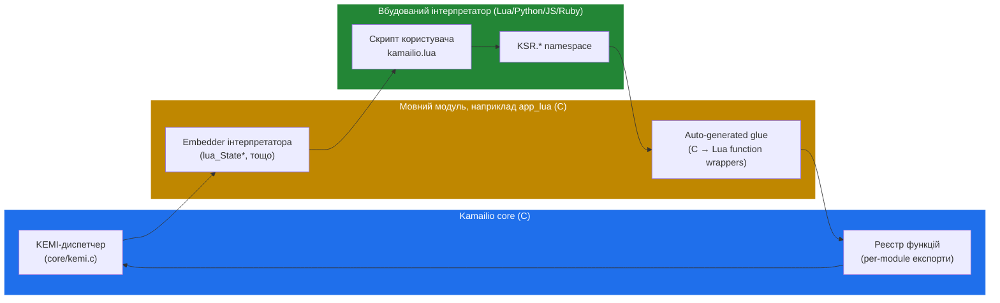

# 5.2 Bridge — вбудовування Lua, Python, JS, Ruby

> [!IMPORTANT]
> Bridge — це те, що робить `KSR.tm.t_relay()` у Lua-скрипті тим самим, що `t_relay()` у cfg. Це не translation layer; це тонкий **FFI-shim**, що дає працюючому інтерпретатору прямий доступ до C-функцій Kamailio. Розуміти його — це те, що дозволяє розрізняти, чому одні функції модулів мають KEMI-біндинги, а інші ні, і чому per-call overhead саме такий, який є.

## Три частини

KEMI-інтеграція в будь-якому воркері складається з трьох окремих частин:



**KEMI-диспетчер** живе в core Kamailio (`core/kemi.c`). Його робота проста: коли треба викликати route, диспетчер дивиться, який мовний модуль зараз активний, і дзвонить per-language-диспетчеру цього модуля з ім'ям функції та вказівником на `sip_msg`.

**Мовний модуль** (наприклад, `app_lua`) відповідальний за вбудовування власне інтерпретатора. Коли стартує `mod_init()`, language-модуль:
1. Читає параметр script-file із cfg (наприклад, `modparam("app_lua", "load", "/etc/kamailio/kamailio.lua")`).
2. Налаштовує language-specific embedding-boilerplate (Lua-вський `luaL_newstate()`, Python-івський `Py_InitializeEx()` і т. д.).
3. Реєструє **glue-функції**, що експонують C API Kamailio у global namespace інтерпретатора.

**Скрипт користувача** — це просто файл якою-небудь мовою на ваш вибір. Він описує функції типу `ksr_request_route()` (Lua) або `ksr_request_route(msg)` (Python), які Kamailio викличе, коли прилетить вхідний запит.

## Реєстр функцій — що експонується

Не кожна C-функція в Kamailio викликається з KEMI. Автори модулів мають **явно експортувати** свої функції у KEMI-реєстр. Механізм — масив структур «KEMI function descriptor»:

```c
static sr_kemi_t sl_kemi_exports[] = {
    { str_init("sl"), str_init("send_reply"),
      SR_KEMIP_INT, ki_sl_send_reply,
      { SR_KEMIP_STR, SR_KEMIP_INT, ... } },
    /* …ще записи… */
    { {0,0}, {0,0}, 0, NULL, { 0 } }   /* термінатор */
};
```

Кожен запис каже: «модуль `sl`, функція `send_reply`, повертає int, імплементована C-функцією `ki_sl_send_reply`, приймає один string і один int». Kamailio на старті проходить ці реєстри й експонує кожен запис як `KSR.<module>.<function>` у кожному завантаженому інтерпретаторі.

Саме тому одні функції модулів KEMI-callable, а інші — ні: автор модуля написав експорт. Якщо ви дивитесь на wiki й кажете «у модуля X є функція Y, яку я хочу викликати з Lua, але вона не показується у `KSR`», — це тому, що KEMI-export-таблиця модуля її не перелічує. Pull request у KEMI-таблицю модуля зазвичай це фіксить.

## Як виглядає bridge-виклик

Коли `request_route` біжить і диспетчеризує до інтерпретатора — себто cfg каже щось на кшталт `cfg_run_route("ksr_request_route");` — насправді відбувається:

1. **Core-диспетчер** отримує виклик з ім'ям route'у і поточним `sip_msg`.
2. **Per-thread state мовного модуля** шукається. (Кожен воркер має свій інтерпретатор — див. [наступний розділ](14-kemi-lifecycle.md).)
3. **`sip_msg` bind'иться** у per-call-контекст інтерпретатора. Це **не** копія — інтерпретатор отримує handle, що по суті є вказівником на C-струкуру.
4. **Іменована функція викликається** у namespace інтерпретатора. Інтерпретатор біжить скрипт.
5. **Кожен `KSR.xyz`-виклик зі скрипта** проходить через auto-generated glue: список аргументів скрипта конвертується з interpreter-значень (Lua-string'ів, Python-об'єктів) у Kamailio-типи (`str` / `int` / `sip_msg*`), реєстрована C-функція викликається, return-значення конвертується назад.
6. **Коли функція повертається**, керування йде назад у диспетчер і назад у cfg. `sip_msg` відображає всі модифікації, які скрипт поставив у чергу (lumps, транзакції тощо).

Ціна кроку 5 — те, що ви платите понад native cfg: argument marshalling між двома type-системами, плюс interpreter overhead від того, скільки script-side-операцій відбулося. Для route'у, що дзвонить чотири функції і робить пару conditions, цей overhead зазвичай — 1-2 мікросекунди per message у Lua, 5-20 мікросекунд у Python. Не безкоштовно, але достатньо мало, щоб 90% розгортань цього не помічали.

## `KSR`-namespace схематично

API на боці скрипта має консистентну форму:

```lua
-- Lua-приклад
KSR.info("Got a request to " .. KSR.pv.get("$ru"))

KSR.hdr.append("X-Trace: from-kamailio\r\n")

if KSR.is_method("INVITE") then
    if KSR.auth_db.www_authenticate("realm", "subscriber") then
        return KSR.tm.t_relay()
    else
        KSR.sl.send_reply(401, "Unauthorized")
    end
end
```

- `KSR.<module>.<function>` — виклик зареєстрованої C-функції з модуля Kamailio.
- `KSR.pv.get("$ru")`, `KSR.pv.sets("$ru", "...")`, `KSR.pv.geti("$rs")` — читання та запис псевдо-змінних, статично типізовані (string / int).
- `KSR.hdr.*` — shortcut'и для маніпуляції із заголовками.
- `KSR.x.exit()`, `KSR.x.drop()` — control flow скрипта, що повертається у lifecycle cfg.
- `KSR.info(...)`, `KSR.warn(...)`, `KSR.err(...)`, `KSR.dbg(...)` — логування на стандартних рівнях Kamailio.

Вище — Lua-синтаксис; Python і JS — ідентично, окрім дрібниць method-call-синтаксису.

## Двосторонній dispatch — cfg ↔ script

Bridge може йти в обидва боки:

- **cfg диспетчеризує до скрипта** — іменуючи функцію скрипта в `cfg_run_route` або через `event_route_callback("event:name", "ksr_event_handler")`.
- **Скрипт диспетчеризує назад до cfg** — викликом `KSR.cfg.route_inv("route_name")` — біжить іменований cfg-route-блок із середини скрипта.

Це робить можливим гібридний патерн: тримати hot path (sanity, simple routing) у cfg для швидкості, передавати скрипту для складних рішень, потім кликати назад у cfg sub-route'и для самого relay'у. Ціна — одне bridge-перехід на handoff, що мало, якщо ви не робите цього на кожен байт.

## Чому біндинги іноді розходяться між мовами

Практичний gotcha: хоча `KSR.*`-API *має бути* ідентичним між мовами, на практиці кожен language-модуль має свій генератор glue-коду. Коли додається новий C-side-KEMI-експорт, він може з'явитися в Lua і Python в одному релізі, але ще не в JS чи Ruby. Wiki — авторитетне джерело для «що насправді експонується».

Якщо обираєте мову для нового проєкту: **Lua** має найширше KEMI-покриття і найшвидший interpreter-overhead. **Python** часто обирається через екосистемні причини (наявний Python-tooling у команді) і — fine для всього, що не tight inner loop. **JS** і **Ruby** функціональні, але трохи відстають у покритті.

Наступний розділ розбирає per-worker-lifecycle інтерпретатора — коли він створюється, як стан переживає повідомлення, що відбувається при reload'і, та режими провалу, які ви побачите лише в продакшні.

---

<p markdown="1" align="center">
  [← Зміст](../) · [← 5.1 Що вирішує KEMI](12-kemi-overview.md) · [Далі: 5.3 Lifecycle →](14-kemi-lifecycle.md)
</p>
