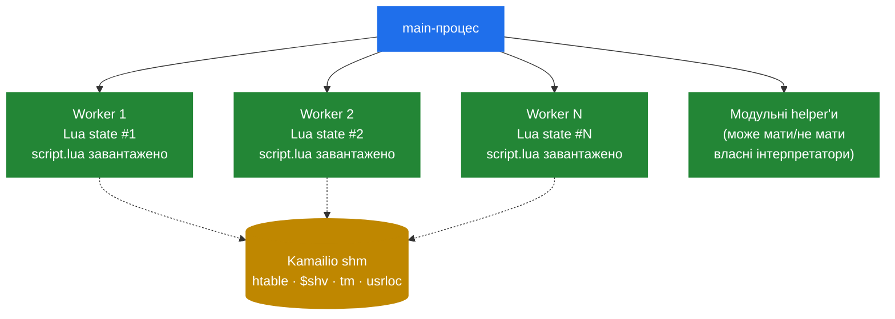

# 5.3 Lifecycle KEMI — коли і що бачить

> [!IMPORTANT]
> Кожен воркер Kamailio має **свій інстанс інтерпретатора**. Вони не діляться станом через інтерпретатор. Вони діляться станом через shm Kamailio — рівно так, як cfg-only-розгортання. Забути про це і тягтися до Lua-global'а, щоб «запам'ятати» щось між викликами — найпоширеніший KEMI-баг у продакшні.

## Де живе інтерпретатор

KEMI-інтеграція слідує тій самій per-process-дисципліні, що й усе інше в Kamailio (див. [розділ 2.1](02-process-model.md)):



Кожен воркер форкається з main з власною копією C-level-простору адрес, потім у `child_init()` language-модуль bootstrap'ить свіжий інтерпретатор всередині цього воркера. Script-файл завантажується в цей інтерпретатор. Інтерпретатор живе весь час життя воркера — він не пере-будується per message.

Наслідки:
- **Lua-global, виставлений у воркері 3, невидимий воркеру 7.** У них буквально різні Lua state'и. Прямого способу шарити Lua-level-стан між воркерами не існує.
- **Усе, чим треба ділитися, має бути у shm.** Це означає `htable`, `$shv` чи БД. Те саме правило, що й для cfg.
- **Інтерпретатор переживає повідомлення в межах воркера.** `local cache = {}`, оголошений на верхньому рівні скрипта, тримає стан між викликами — але лише для повідомлень, які підхопив *цей самий* воркер. Worker affinity — це фікція (див. [розділ 2.1](02-process-model.md)), тож покладатися на те, що сусідні повідомлення попадуть в той самий інтерпретатор, не можна.

## Послідовність старту

Коли Kamailio стартує з налаштованим KEMI, порядок — той самий з [розділу 2.4](05-lifecycle.md), з вставленими хуками language-модуля:

1. **Парсинг cfg** — cfg-файл згадує `loadmodule "app_lua.so"` і `modparam("app_lua", "load", "/etc/kamailio/kamailio.lua")`.
2. **Виділення shm**, **завантаження модулів**.
3. **`mod_init()` в `app_lua`** — ініціалізує власний стан language-модуля. **Не** створює per-worker-інтерпретатори.
4. **Bind слухачів.**
5. **Fork воркерів.**
6. **`child_init()` в `app_lua`** — біжить *всередині кожного воркера*. Тут створюється власне інтерпретатор (`luaL_newstate()`, `Py_InitializeEx()` тощо), зареєстровані glue-функції binду'ються в global namespace, script-файл читається і виконується. Після цього всі script-level-globals (функції, top-level local'и) — в інтерпретаторі.

Якщо скрипт має синтаксичну помилку чи не завантажується, воркер виходить із startup-помилкою. Main-процес логує, який воркер не зміг init'нутися, і **не пере-форкає** його — поломаний скрипт це не recoverable runtime-failure. Рестарт після фіксу.

> [!TIP]
> Більшість language-модулів дзвонять спеціальну top-level-функцію під час `child_init`, якщо вона визначена: `ksr_mod_init()` у Lua, `mod_init()` у Python тощо. Це місце для налаштування per-interpreter-кешів, парсингу конфіг-файлів, які читає скрипт, відкриття file-handle'ів. Бігає **раз на воркера**, після завантаження globals'ів.

## Що відбувається на повідомлення

Коли прилітає запит і `request_route` в cfg диспетчеризує до скрипта:

1. KEMI-диспетчер у воркері шукає per-worker-handle інтерпретатора (маленька C-struct).
2. Поточний `sip_msg*` ставиться у «context for this call» інтерпретатора — доступний зі скрипта через `KSR.*`-namespace.
3. Іменована функція (`ksr_request_route`) викликається всередині інтерпретатора.
4. Працюючи, скрипт може дзвонити будь-яку `KSR.*`-функцію, інші Lua/Python-функції, читати й писати `sip_msg` через псевдо-змінні, ставити lumps у чергу, диспетчеризувати назад у cfg sub-route'и.
5. Коли функція повертається, інтерпретатор лишається живим — лише per-call-context чиститься.

Кілька неочевидних деталей:

- **Інтерпретатор однопоточний у своєму воркері.** Це нормально, бо воркер — теж однопоточний. Жодної GIL-драми, жодного локінгу всередині скрипта.
- **Script-level-стан виживає.** `local count = 0; function ksr_request_route() count = count + 1; ... end` буде інкрементити `count` на кожне повідомлення, яке обробив *цей* воркер. Корисно як per-worker-counter, безглуздо як global-counter.
- **Пам'ять інтерпретатора йде з libc-malloc, не pkg Kamailio.** Language-модуль вбудовує інтерпретатор зі стандартним аллокатором інтерпретатора. Ця пам'ять обмежена GC інтерпретатора; не звільняється з кінцем повідомлення.
- **Lump queue працює рівно так само.** Виклики `KSR.hdr.append(...)` ставлять lump у чергу на C-side-`sip_msg`. Lump applier'у байдуже, звідки lump прилетів — з cfg чи зі скрипта.

## Стан між повідомленнями — правильні та неправильні способи

Три патерни для шарінгу даних між повідомленнями в KEMI-скрипті:

| Патерн | Lifetime | Scope | Коли |
|---|---|---|---|
| Локальна змінна всередині функції | Один виклик | Один стек-фрейм | Per-message |
| Top-level скрипт-змінна | Lifetime воркера | Один інтерпретатор | Per-worker-кеші, статистика; **ніколи** для стану, що має бути узгодженим між воркерами |
| `KSR.htable.sht_get(...)` / `sht_set(...)` | До рестарту чи expiry | Усі воркери в інстансі | Кросворкерний стан — auth-кеші, rate-limiter'и, per-call-рішення |
| `$shv(...)` через `KSR.pv.sets("$shv(x)", ...)` | До рестарту | Усі воркери | Маленькі іменовані globals'и, менш гнучкі за htable |
| Database | Назавжди | Усі воркери, усі інстанси | Persistent-стан |

Wrong-way-патерн, який кусає: думати, що Lua-global спільний. Він — ні. Два послідовні REGISTER'и того самого юзера *швидше за все* потраплять у різні воркери, *точно* матимуть різні interpreter-state'и, і будь-який Lua-side-кеш дасть одну відповідь у воркері 3 і іншу — у воркері 7.

## Reload скрипта — як оновити без рестарту

KEMI-скрипти можна перезавантажити у runtime, не рестартуючи Kamailio. Механізм залежить від language-модуля, але експонується уніформно через RPC:

```bash
kamcmd app_lua.reload
kamcmd app_python3.reload
```

Що відбувається: кожен воркер на наступному повідомленні викидає поточний interpreter-state і пере-bootstrap'ує інтерпретатор із (тепер пере-читаного) script-файлу. Globals'и пере-ініціалізуються, per-worker-кеші втрачаються. In-flight-транзакції у `tm` не зачеплені — вони живуть у shm і не залежать від interpreter-state'у.

> [!WARNING]
> **Reload не транзакційний між воркерами.** Воркери пере-bootstrap'ляться незалежно, у міру того, як кожен підбирає наступне повідомлення. Якщо воркер 3 reload'нувся і одразу обробив `INVITE`, а воркер 7 ще не reload'нувся — обидва бігтимуть різні версії вашого скрипта кілька секунд rollover'у. Для змін, що мають бути атомарними по всіх воркерах — рестартуйте.

## Failure-режими, які бувають тільки в продакшні

Короткий каталог того, що дивує:

- **Lua/Python-exception всередині скрипта** ловиться language-модулем і логується, далі функція скрипта по суті повертає «нічого не робити». Повідомлення може тихо дропнутися, бо неочікуваний exception стрельнув на третьому рядку handler'а.
- **Нескінченний loop у скрипті** паркує один воркер назавжди (його непросто перервати `SIGTERM`'ом). Одне погане повідомлення, що тригерить нескінченний loop, вбиває 1/N throughput'у до рестарту.
- **Memory leak у скрипті** накопичується з часом. Lua-GC автоматичний, але cyclic C-referenced-об'єкти можуть leak'ати; Python-refcount обробляє більшість випадків, але не всі. Стежте за зростанням RSS воркера у вимірі днів, не хвилин.
- **Typo в імені `KSR.*`-функції** — не syntax error, а runtime-`nil`-dispatch. Lua тихо нічого не робить на `nil:call()`; Python кидає, і ви бачите в логу; JS залежить від інтерпретатора.

Наступний розділ дивиться на те, коли вся ця будова — вбудований інтерпретатор, bridge, per-worker-стан — варта своєї ціни, а коли native cfg-шлях просто швидший.

---

<p markdown="1" align="center">
  [← Зміст](../) · [← 5.2 Bridge](13-kemi-bridge.md) · [Далі: 5.4 Tradeoffs →](15-kemi-tradeoffs.md)
</p>
