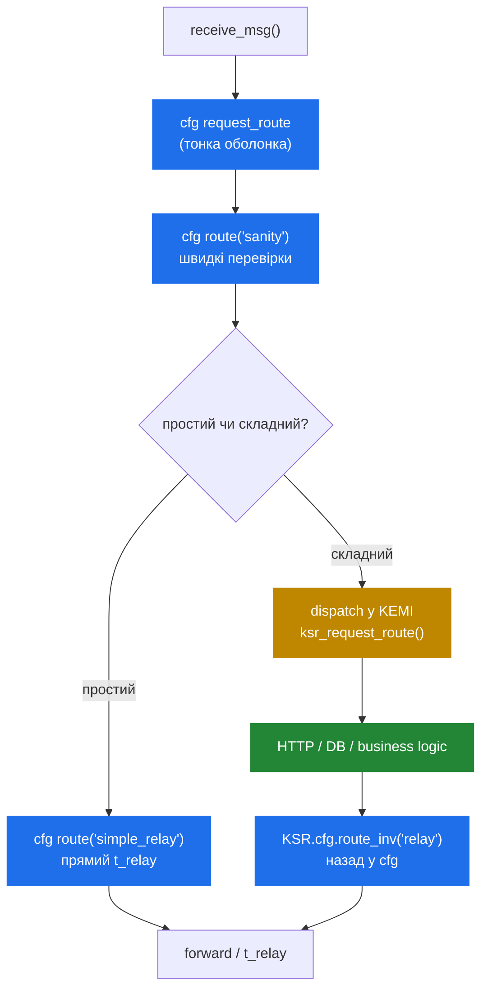

# 5.4 Tradeoffs KEMI — коли виграє, коли — cfg

> [!IMPORTANT]
> KEMI — не завжди правильний вибір, і «беріть KEMI» — не відповідь на «мій cfg ускладнюється». Іноді — так; іноді правильне рішення — винести складність у БД, у модуль чи в зовнішній сервіс. Цей розділ — рамка для рішення.

## Модель ціни — у цифрах і у формі

Native cfg-шлях виконує пре-компільований AST. Per-message-overhead від самого скрипта домінується ціною викликів функцій у C-код модулів — наносекунди на виклик. Тривіальний cfg `request_route` (sanity, lookup, relay) коштує **одиниці мікросекунд** загалом на commodity-залізі.

KEMI-шлях додає:
- Один **interpreter-call entry** на момент диспетчеризації. ~0.5–2 µс у Lua, ~5–10 µс у Python.
- Один **glue marshalling** per `KSR.*`-виклик. ~0.5–2 µс у Lua, ~1–5 µс у Python.
- Те, що інтерпретатор робить сам — алокації строк, table-lookup'и, GC-pressure.

Для route'у, що дзвонить `KSR.*` п'ять разів і робить пару conditions, script-side-overhead — десь між **5 µс (Lua) і 50 µс (Python)** поверх пари µс cfg-шляху. Чи це важить — повністю залежить від throughput-цілі й routing-складності. На 1k CPS 50 µс на виклик — це 50 мс CPU за секунду, нічого. На 50k CPS це 2.5 секунди CPU за секунду — треба більше ядер чи швидший шлях.

> [!TIP]
> Чесне правило: **виміряйте**. Налийте реалістичне навантаження (розділ 2.5) на обидва варіанти і порівняйте. KEMI-overhead workload-залежний у спосіб, який не передбачиш із cfg-складності.

## Коли KEMI явно правильна відповідь

**Потрібні справжні структури даних.** Per-call decision-таблиці, multi-level routing-графи, будь-що, що природно моделюється як hash-of-arrays-of-strings. cfg може у плоскі dispatcher-таблиці і `htable`-lookup'и; не може в «for each entry in this dynamic list, check these three conditions».

**Потрібно дзвонити HTTP API і парсити JSON.** Це *можливо* в cfg через `http_async_client` + `json`-модуль, але script-side-ergonomics жахливі: ви пишете pseudo-regex проти response і керуєте async-callback'ами через іменовані cfg-route'и. У KEMI:

```python
ok, resp, _, _ = KSR.http_client.curl_obj("https://billing.internal/check", json.dumps({"call_id": call_id}))
if ok != 1:
    KSR.sl.send_reply(503, "Billing unavailable")
    return KSR.x.exit()
result = json.loads(resp)
if not result["allowed"]:
    KSR.sl.send_reply(403, "Call not authorised")
    return KSR.x.exit()
```

Це 8 рядків. cfg-еквівалент — це багатоrouтовий бардак з іменованими async-resumption-точками.

**Логіка, що міняється щотижня.** Якщо routing-правила business-driven і часто міняються, швидший dev-цикл KEMI (reload скрипта через `kamcmd`, без рестарту Kamailio) сам по собі вартий per-call-ціни.

**Інтеграція з non-SIP-системами.** Auth проти внутрішнього API, fraud scoring із Redis-backed-моделлю, кастомні CDR-пайплайни — KEMI дає вам бібліотеки і testing-tools (unit-тести для Lua/Python), яких cfg не має.

## Коли виграє cfg

**Hot-path-проксі з простою логікою.** Stateless або low-state-проксі, що просто routit за dispatcher-таблицями: cfg, без питань. KEMI-overhead на такій складності — чисті відходи.

**Registrar-сервери.** REGISTER-handling домінується `usrloc`- і `auth_db`-викликами, які однаково швидкі і з cfg, і з KEMI. cfg-версія коротша і ясніша.

**Будь-що, де routing — справді маленьке дерево рішень.** Якщо ваш `request_route` — це 50 рядків `if-elif-else` проти `is_method`, `$ru =~ pattern` і функцій модулів — це вже правильна форма для cfg.

**Performance-critical sub-route'и.** Навіть у KEMI-driven-розгортанні можна тримати найгарячіший sub-route в cfg і викликати його зі скрипта через `KSR.cfg.route_inv("hot_path")`. Це **гібридний патерн**, і на масштабі часто — правильна відповідь.

## Гібридний патерн

У великому розгортанні практична структура рідко «весь cfg» або «весь KEMI». Це:



- cfg володіє **fast-path sanity і routing'ом**.
- KEMI володіє **business-логікою**: аутентифікація, авторизація проти зовнішніх систем, fraud scoring, усе, що хоче справжніх структур даних.
- cfg володіє **forwarding-рішенням і relay'єм**.
- Обидва можуть викликати один одного; bridge — двосторонній.

Ціна цього — одне bridge-перехід на складний виклик. На ~5 µс per crossing у Lua це по суті безкоштовно навіть на високому CPS — і ви тримаєте швидкість cfg для 90% routing'у, що не потребує скрипта.

## Вибір мови, одним абзацом

Якщо немає інших обмежень: **Lua**. Має найповніше покриття KEMI-біндингів, найнижчий per-call-overhead, і досить маленький, щоб interpreter-footprint per worker був незначним. **Python** — якщо експертиза команди переважно Python-ова, а per-call-ціна (5x Lua's зазвичай) прийнятна для вашого throughput'у — зазвичай так. **JavaScript** — якщо намагаєтесь шарити business-логіку між Kamailio і JS-важким бекендом. **Ruby** — якщо є специфічна причина. Не обирайте за мовним preference, якщо ви на верхньому краї throughput'у; розрив між Lua і Python важить на 10k+ CPS.

## Чого з KEMI робити не варто

Кілька anti-patterns'ів, варті позначення:

- **Не переносьте performance-critical-логіку в KEMI «бо так легше писати».** Легше писати — не означає краще в системі, що бігає на 10k CPS. Спочатку профайл, потім — рішення.
- **Не використовуйте Lua-global'и як крос-воркерний кеш.** Вони не шарені. Беріть `htable` (розділ 8.3 далі) або БД.
- **Не замінюйте короткі cfg-route'и на довші KEMI-еквіваленти** заради ергономіки. Ясний 20-рядковий cfg `if-elif` зазвичай кращий за хитрий 60-рядковий Python-клас.
- **Не намагайтесь обгорнути кожен cfg-примітив у KEMI-helper.** Якщо переписуєте `is_method()` на Python, бо «cfg-версія незручна» — ви воюєте з архітектурою. Просто викличте `KSR.is_method("INVITE")`.

Посібник далі рухається в стан — як `tm` і `dialog` тримають транзакції й виклики живими між повідомленнями, і саме до чого routing-движок і KEMI обидва врешті інтерактують.

---

<p align="center">
  <a href="./">← Зміст</a> · <a href="14-kemi-lifecycle.md">← 5.3 Lifecycle</a> · <em>Далі: 6.1 Transactions (tm) — готується</em>
</p>
