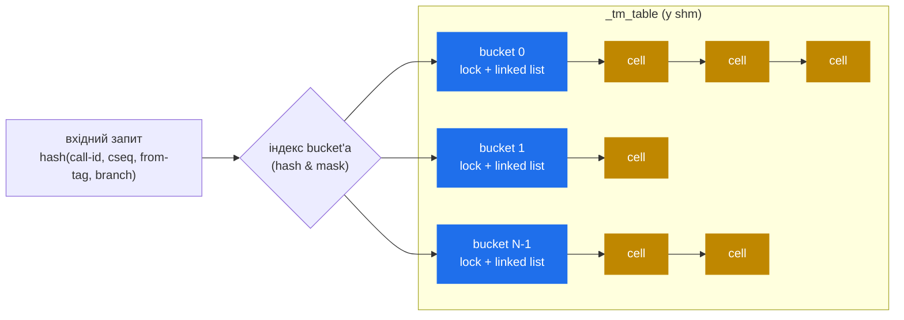

# 6.1 Внутрішнє устрій транзакцій (`tm`)

> [!IMPORTANT]
> `tm` — найважливіший архітектурно модуль у Kamailio. Він тримає per-call-стан у shm, який дозволяє працювати всьому іншому — failure recovery, форкингу, retransmission'у, reply-маршрутизації. Майже все попереднє (lumps, branch'і, failure_route, reply-шлях) врешті залежить від структур даних `tm`'у.

## Що таке транзакція насправді

У SIP-термінах транзакція — це **один запит плюс усе, що є відповіддю на нього**: provisional-відповіді, retransmission'и і рівно одна final-відповідь. Між тими ж UAC/UAS може бути багато транзакцій per call: `INVITE` — одна, `BYE` — друга, in-dialog `re-INVITE` — третя.

Модуль `tm` трекає транзакції з точки зору проксі: коли прилітає запит, `tm` створює **cell**, що тримає достатньо стану, щоб:

- Матчити вхідні відповіді з оригінальним запитом.
- Retransmit'ити запит, якщо next hop не відповів за T1 (тільки UDP).
- Бігти правильні route-блоки (`branch_route`, `failure_route`, `onreply_route`) у правильний момент.
- Трекати, які branch'і в польоті, які — завершені.

Cell живе в **shm** — будь-який воркер може його знайти. pkg-allocated `sip_msg`, що тригернув створення, давно мертвий до моменту, коли прилітає перша відповідь — cell скопіював усе потрібне.

## Hash-таблиця



Структура — рівно та per-bucket-шардована hash з [розділу 2.3](04-concurrency.md): `hash_size` bucket'ів, один лок на bucket, у кожному bucket'і linked list cell'ів. Дефолт — 1024; для високого CPS — 4096+ (див. [розділ 2.5](06-sizing-and-tuning.md)).

Hash-ключ обчислюється з ідентифікаторів запиту, що унікально визначають транзакцію за RFC 3261:
- `Call-ID`
- `CSeq`-номер і метод
- `From`-tag
- параметр branch у верхньому `Via`

Для запитів, у яких branch присутній і починається з magic-cookie `z9hG4bK` (будь-який RFC-3261-compliant SIP-стек), одного branch'а достатньо. Старіший fallback-хешинг існує для non-compliant peer'ів і ACK на 2xx (які за спекою матчаться інакше).

## Усередині cell

Cell-структура щільна. Поля, що архітектурно мають значення:

- **Оригінальний запит, скопійований у shm.** Заголовки, тіло, буфер — все продубльовано з pkg `sip_msg` так, щоб пережити звільнення pkg.
- **Branch-масив** (`MAX_BRANCHES`, типово 16). Кожен branch тримає: destination URI, вихідний буфер (з вже застосованими lumps), per-branch retransmission-стан, per-branch lump-доповнення, транспорт branch'а.
- **Слоти таймерів.** Один — на retransmission (re-send запиту після T1, T2, T3, … з експоненціальним backoff'ом), один — на **final-response-таймер** (макс. час чекати будь-яку final-відповідь — типово `tm_max_inv_lifetime`, дефолт 180 с), один — на **wait-таймер** (linger після final-відповіді, щоб поглинути retransmission'и, типово 30 с).
- **Atomic refcount.** Кожен воркер, що чіпає cell, інкрементить перед роботою, декрементить по завершенню; cell звільняється коли count = 0.
- **Route-хуки.** Який `branch_route[N]`, `failure_route[N]`, `onreply_route[N]` стріляти. Виставляється через `t_on_branch()` / `t_on_failure()` / `t_on_reply()` перед `t_relay()`.
- **Прапори.** local-vs-relayed (чи це транзакція, ініційована Kamailio, чи проксіювана?), canceled, replied тощо.

## Timer wheels

Retransmission'и і тайм-аути мають стріляти в точні інтервали для тисяч одночасних транзакцій. Kamailio не використовує sleep-per-cell-підхід — він користує **timer wheels**.

Timer wheel — це масив bucket'ів, індексованих по deadline modulo розмір wheel'а. Коли таймер ставиться на «стрелити через 500 мс», cell кидається у bucket за offset'ом `(now + 500ms) / tick`. Timer-процес прокидається кожен tick (типово 100 мс для fast timer), проходить поточний bucket, стріляє кожен таймер у ньому.

Ціна — O(1) на постановку, O(N) per tick, де N — «таймерів, що expir'яться у цей tick», не «всі таймери». Мільйон in-flight-транзакцій коштує stride-у того ж per-tick CPU, що й десять, поки deadline'и розподілені.

`tm` ганяє два timer-процеси (введені у [розділі 2.1](02-process-model.md)): один tick'ає швидко (sub-second timers, retransmission'и), інший — повільно (wait-таймер у ~30 с, cleanup). Розділ — щоб повільні housekeeping-задачі не з'їдали швидкі retransmission'и.

## Retransmission, конкретно

Тільки для UDP-транзакцій (TCP надійний за визначенням):

1. Воркер шле запит, ставить retransmission-таймер на T1 (500 мс).
2. Таймер стріляє, воркер re-send'ить той самий вихідний буфер (вже сконструйований у [розділі 3.5](11-forwarding.md)), подвоює інтервал до T2 (1 с).
3. Таймер знову стріляє на T2; re-send; подвоює до T3 (2 с), і так далі — до `tm_max_T2_timer` (дефолт 4 с).
4. Продовжує на cap-і T2, поки або не прилетить відповідь, або стрельне final-response-таймер (дефолт 180 с) — у цей момент транзакція тайм-аут'иться і запускається `failure_route`.

Для non-2xx **відповідей** (4xx-6xx) проксі також retransmit'ить відповідь назад UAC, поки UAC не пришле ACK. 2xx-відповіді особливі: за RFC їх retransmit'ить UAS, не проксі.

## Lookup, дисципліна локів, refcount

Кожна операція над cell слідує тому самому патерну:

```c
hash = hash_request(msg);
bucket = &_tm_table->buckets[hash & mask];

lock_get(&bucket->lock);
cell = find_cell(bucket, msg);     // прохід по linked list
if (cell) {
    atomic_inc(&cell->ref_count);   // pin поки працюємо
    lock_release(&bucket->lock);
    /* … робота над cell, можливо взяти cell->lock на час мутації стану … */
    if (atomic_dec_and_test(&cell->ref_count)) {
        free_cell(cell);
    }
} else {
    lock_release(&bucket->lock);
}
```

Лок bucket'а тримається *тільки* на час проходу по linked list. Лок per-cell (теж вбудований у cell) захищає внутрішні мутації. Refcount тримає cell живим навіть після release'у bucket-локу, тож повільний воркер не може мати cell висмикнутий з-під нього peer-воркером.

## Що ламається і де дивитися

Два класи продакшн-проблем з `tm`:

> [!WARNING]
> **Вичерпання shm через leak'нуті cells.** Кожен cell, що не завершився (через buggy `failure_route` без `t_reply()`, або пропущений `t_continue()` на suspend'нутій транзакції), тримає свою shm-алокацію назавжди. `kamcmd tm.stats` показує `current` vs `historic`; якщо `current` росте монотонно — ви leak'аєте.

- **Hash-contention на високому CPS** — кожен `t_relay()` бере bucket-лок коротко, і якщо `hash_size` замалий, ці локи contend'ять. Симптом: `perf top` показує `lock_get` нагорі, `kamcmd tm.stats` показує нерівний розподіл глибин bucket'ів.
- **Retransmission-storm'и** — якщо next hop не відповідає і у вас тисячі UDP-транзакцій, кожна retransmit'ить незалежно. Bandwidth і CPU взлітають. Мітигуйте через `pike` чи downstream rate-limiting.

Наступний розділ бере cell, додає поверх dialog-tracking і пояснює, як Kamailio тримає call-level-стан через кілька транзакцій.

---

<p markdown="1" align="center">
  [← Зміст](../) · [← 5.4 KEMI tradeoffs](15-kemi-tradeoffs.md) · [Далі: 6.2 Діалоги →](17-dialogs.md)
</p>
