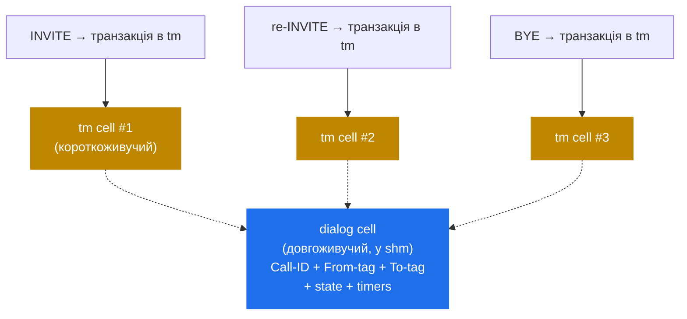

# 6.2 Діалоги — call-level-стан через кілька транзакцій

> [!IMPORTANT]
> SIP-**виклик** — це кілька транзакцій: `INVITE`, що його піднімає, in-dialog `re-INVITE`'и, `BYE`, що його завершує. `tm` трекає кожну транзакцію незалежно. **`dialog`** — модуль, що склеює їх разом — щоб проксі могло відповісти «чи цей `BYE` — частина виклику, який я авторизував раніше?» і «скільки часу триває цей виклик?» — не перевіряючи auth на кожному повідомленні.

## Що дає dialog поверх `tm`

Один `tm` не може відповісти на call-level-питання. Він знає лише про транзакції: `BYE`, що прилетів через годину після `INVITE`, — це *нова* транзакція, і `tm` поняття не має, що вони пов'язані. Зв'язок живе в SIP-dialog-ідентифікаторах — Call-ID, From-tag, To-tag — і хтось має їх пам'ятати.

Цей «хтось» — модуль `dialog`. Коли ви викликаєте `dlg_manage()` на запиті в `request_route`, `dialog` відкриває dialog-record для виклику, ключований на цих ідентифікаторах, який переживає кожну транзакцію виклику:

Dialog-record переживає транзакцію, що його створила. `INVITE`'овий `tm`-cell виходить з WAIT-таймера через ~30 секунд після 200 OK; dialog лишається живим увесь час виклику — типово хвилини чи години.

## State machine діалогу

Dialog проходить три стани:

- **EARLY** — `INVITE` пішов, прилетіли provisional-відповіді, final ще немає.
- **CONFIRMED** — `INVITE` отримав 2xx final-відповідь. ACK обмінялися. Виклик піднятий.
- **TERMINATED** — `BYE` отриманий і відповідь дана, або dialog тайм-аут'нувся.

Кожен `dlg_manage()` хукається у `tm`, щоб отримувати сповіщення про потрібні події:

- На 1xx — лишається EARLY, оновлюються timestamp'и.
- На 2xx final + ACK — у CONFIRMED, стартує inactivity-таймер.
- На final-відповідь BYE — у TERMINATED, dialog-cell звільняється.
- На стрільбу final-response-таймера `tm` без 2xx — fail назад у TERMINATED, free.

Stat-переходи — це й те, що робить `dialog` «stateful»-модулем у спосіб, у який `tm` ним не є. `tm` знає лише «транзакція в роботі» чи «транзакція завершена». `dialog` знає різницю між «дзвонить» і «розмова йде».

## Що тримає dialog-cell

Dialog-cell у shm має:

- **Ідентифікатори.** Call-ID, From-tag, To-tag. Це lookup-ключі.
- **Endpoint URI.** Контакт caller'а, контакт callee, request-URI на момент setup'у.
- **Route set.** Заголовки `Record-Route`/`Route`, як їх встановив проксі-ланцюг. Потрібні для правильного routing'у in-dialog-запитів.
- **Timestamp'и.** Створення, остання активність, час підтвердження.
- **State.** EARLY / CONFIRMED / TERMINATED.
- **Змінні.** Per-dialog scratchpad — `$dlg_var(name)` у cfg. Корисно для наклеювання даних на виклик, що мають пережити окремі транзакції.
- **Profile membership.** У які `dlg_profile`'и dialog зарахований — для «скільки одночасних викликів на gateway».

Cell використовує той самий shm-аллокатор і ту саму per-bucket-локовану hash, що й `tm`. `hash_size` у `dialog` — окремий від `tm`'ого.

## Sticky vs. transient — що трекати

`dialog` дорогий у shm, якщо вмикати на кожен виклик. Рішення — per-call: виклик `dlg_manage()` у `request_route` — це opt-in. Більшість розгортань не трекають кожен виклик — трекають ті, що мають значення.

Причини трекати dialog:
- **Routing in-dialog-запитів.** re-INVITE'и і BYE, що мають піти тим же шляхом, що оригінал.
- **Call accounting.** Per-call duration, billing, CDR generation.
- **Per-call rate-limiting.** `dlg_profile_get("calls_per_user")` для обмеження одночасних викликів per user.
- **Виявлення hijacking'у.** Перевірка, що BYE приходить від сторони, що була в оригінальному INVITE.
- **State topology hiding'а.** Коли в грі `topos`, dialog — природне місце для повішення mapping'у (більше — в розділі 8.1).

Причини *не* трекати:
- Виклик — stateless-форвард, і Kamailio не треба впізнавати BYE.
- shm-бюджет тісний, а call count величезний (LSR — Least-Cost-Router-проксі).

## Keepalive — виявлення тихих провалів

SIP-виклик може мовчати годинами. UAC зареєстрований, UAS прийняв, обидва ендпоінти шлють RTP кудись — а Kamailio й гадки не має, чи dialog ще живий. Якщо BYE загубився (UDP, network partition, NAT timeout), dialog сидітиме у shm назавжди.

`dialog` розв'язує це через **OPTIONS-based keepalive**: опційно періодично шле SIP `OPTIONS`-пінг кожному ендпоінту у CONFIRMED-діалогах. Якщо ендпоінт не відповідає у налаштований тайм-аут — dialog мітиться мертвим і термінується.

Ціна: одна in-flight `tm`-транзакція per dialog per keepalive-інтервал. На тисячах одночасних викликів і 5-хвилинному keepalive це значущий трафік — але це єдиний спосіб виявити partition-induced dead calls без join'у на БД UAS.

## Persistence через restart

За дефолтом dialog-record'и живуть у shm і втрачаються при рестарті Kamailio. Для довгих викликів це погано: ви рестартуєте, і будь-який виклик, що був активним, стає необнулюваним з боку Kamailio — BYE не зматчиться з жодним dialog-record'ом і може зафор'юардитися неправильно.

Фікс — **DB-backing у `dialog`**, аналогічний патерну `usrloc` (наступний розділ). Dialog'и пишуться в таблицю `dialog` або на кожне state-change (синхронно, дорого), або періодично (асинхронно, типовий продакшн-режим). На рестарті таблиця читається назад у shm на стадії `child_init()`, активні dialog'и реконструюються.

> [!WARNING]
> **DB-backed dialog-state — «best-effort», не транзакційний.** Між останнім flush'ем і рестартом нещодавно-підтверджені dialog'и можуть втратитися. Для більшості операторів це прийнятно — виклики, що дзвонять у момент рестарту, відновляться через стан ендпоінтів, а Kamailio просто не матиме що про них сказати.

## Де dialog і `tm` перетинаються

Обидва модулі співпрацюють явно:

- `dialog` реєструє callback'и у `tm` для transaction-подій, що його цікавлять (final-відповіді на INVITE, ACK, BYE-термінація).
- Коли `tm` чистить cell, він повідомляє `dialog`, щоб dialog-record оновив стан.
- `dialog` *не* чіпає `tm`-cell'и напряму; іде через зареєстрований callback-API.

Цей розділ означає, що можна ганяти `tm` без `dialog` (statelessish-проксі без call-tracking), але не можна ганяти `dialog` без `tm` — `dialog`'ові state-переходи драйвляться транзакціями, які спостерігає `tm`.

Наступний розділ бере іншу довгоживучу shm-backed-структуру — кеш контактів реєстратора — і показує, як `usrloc` тримає in-memory state синхронним з БД, не беручи лока на кожен REGISTER.

---

  [← Зміст](../) · [← 6.1 Транзакції (tm)](16-tm-internals.md) · [Далі: 6.3 Патерн usrloc →](18-usrloc.md)

