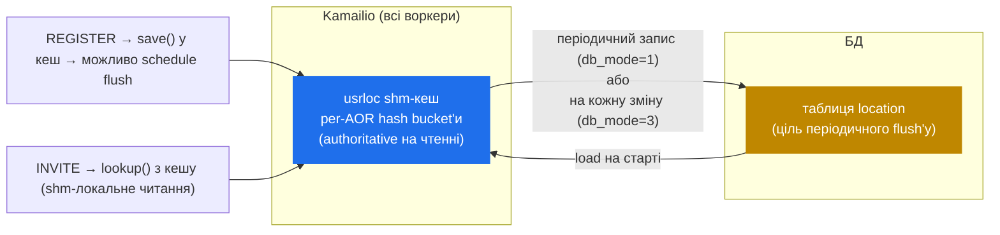

# 6.3 Патерн `usrloc` — in-memory-кеш, DB-sync

> [!IMPORTANT]
> Кожен зареєстрований SIP-юзер має **контакт** — IP, порт, expiry — що каже проксі, куди слати наступний INVITE. На 100 000 активних юзерах робити цей lookup у БД на кожне routing-рішення — вбивство. `usrloc` розв'язує це патерном, який повторюється по всьому Kamailio: in-memory-кеш, періодична DB-синхронізація, lock-cheap read-шлях. Сам патерн вартий розуміння більше, ніж конкретний модуль — варіанти його підпирають persistence у `dialog`, gateway-списки `dispatcher`'а і сам `htable`.

## Яку проблему розв'язує `usrloc`

SIP-UA реєструється, шлючи REGISTER з Contact-заголовком. Проксі записує binding `AOR → [contact, contact, …]` (Address Of Record → один чи більше contact-URI, бо юзери можуть зареєструватися на кількох пристроях). На кожен наступний INVITE на цей AOR проксі робить lookup, знаходить contact-список і фор'юардить.

Performance-обмеження: REGISTER-refresh'і постійні (~30–600 секунд per user), lookup'и сплескові (на кожен INVITE). Обидва шляхи мають бути дешевими. Робити це через БД означає:

- Кожен REGISTER → один UPDATE + COMMIT.
- Кожен INVITE → один SELECT по індексованій таблиці.

На 100 k юзерах з 5-хвилинним refresh'ем — це ~333 UPDATE'и/с лише на keepalive-REGISTER'и, плюс lookup-навантаження. БД стає bottleneck'ом.

`usrloc` короткозамикає це, тримаючи всю contact-таблицю **у shm**, а БД — як backup, не як source-of-truth на hot-path.

## Архітектура



Три речі, які варто помітити:

1. **Кеш — source of truth у рантаймі.** Lookup'и взагалі не торкаються БД. Insert'и йдуть у кеш першими; БД оновлюється асинхронно (або взагалі ні, у `db_mode=0`).
2. **БД — для persistence, не для consistency.** Існує, щоб ре-наповнити кеш після рестарту і шарити стан між кількома Kamailio-інстансами, якщо налаштована крос-інстансна реплікація. Кеш веде, БД слідує.
3. **DB-mode — це кнопка.** `db_mode=0` (без БД), `db_mode=1` (write-back, періодичний flush), `db_mode=2` (write-through на кожну зміну), `db_mode=3` (write-back з realtime-кеш-у-БД), з кількома варіантами. Продакшн майже завжди — 1.

## Структура кешу

Кеш — per-bucket-шардована hash, та сама форма, що `tm` (див. [розділ 6.1](16-tm-internals.md)) і `dialog`. Bucket'и ключовані по хешу AOR-строки. Кожен bucket тримає linked list `urecord`-структур:

```c
struct urecord {
    str aor;                    // "alice@example.com"
    struct ucontact *contacts;  // linked list bindings'ів
    /* … прапори, refcount … */
};

struct ucontact {
    str contact;                // "sip:alice@1.2.3.4:5060;…"
    time_t expires;             // коли binding стає stale
    str received;               // source IP/port (для NAT'нутих юзерів)
    str user_agent;             // User-Agent з REGISTER
    /* … ще багато полів … */
};
```

Один AOR може мати кілька `ucontact`-записів (юзер зареєстрований на телефоні + softphone'і + WebRTC-клієнті; INVITE форкатиметься до всіх трьох). `lookup()` повертає цей список, скрипт робить `t_relay()` з потрібною fork-стратегією.

## Обробка REGISTER

Коли прилітає REGISTER:

1. Парсимо запит, аутентифікуємо (auth/auth_db), знаходимо AOR.
2. Беремо bucket-лок для AOR.
3. Знаходимо чи створюємо `urecord`.
4. Для кожного Contact-заголовка в REGISTER:
   - Якщо `expires=0` — видаляємо відповідний `ucontact`.
   - Інакше — insert або update, з `expires = now + Expires`.
5. Звільняємо bucket-лок.
6. **Можливо** scheduling DB-запис — якщо `db_mode=1`, запис відкладається до наступного flush-tick'а; якщо `db_mode=2` — синхронно тут (slow path); якщо `db_mode=0` — пропускається.
7. Будуємо 200 OK з поточним contact-сетом.

Лок тримається лише на час кроків 2-5, які — чисті shm-операції. DB-запис у кроку 6 (якщо є) відбувається поза локом.

## Обробка lookup'у

Коли прилітає INVITE і скрипт викликає `lookup("location")`:

1. Хешуємо user-part request-URI, щоб знайти bucket.
2. Беремо bucket-лок.
3. Проходимо linked list, знаходимо `urecord`.
4. Ітеруємо `ucontact`'и, пропускаючи expired.
5. На кожен валідний contact дзвонимо `append_branch()`, щоб додати fork-destination у `tm`.
6. Звільняємо bucket-лок.

Все. Жодної БД, жодного network round-trip'у, жодного IPC — лише in-memory hash-lookup з per-bucket-локом. На 1024 bucket'ах і 100 k контактах прохід по bucket-linked-list'у — ~100 entries у середньому, тримається. Підняти `hash_size` зробить lookup'и пропорційно дешевшими, якщо масштаб вищий.

## Sweeper'ний процес

Expired-контакти треба колись чистити. `usrloc` спавнить **dedicated worker-процес** (один з модульних helper'ів з [розділу 2.1](02-process-model.md)), який:

1. Прокидається на таймері (типово раз на хвилину).
2. Проходить кожен bucket, кожен `urecord`, кожен `ucontact`.
3. Видаляє контакти, де `expires < now`.
4. Якщо `db_mode=1` — пише deletions у БД у тому самому проході.

Sweeper бере per-bucket-локи по одному, коротко. Не блокує lookup'и чи REGISTER-обробку довше за фракцію мілісекунди на bucket.

> [!TIP]
> Якщо UAC перестав слати REGISTER'и (вимкнули телефон, втратили мережу), його контакти сидітимуть у кеші до одного sweep-інтервалу після expiry. Lookup'и у це вікно повертатимуть stale-contact, на який Kamailio спробує форвардити. Для більшості сетапів це нешкідливо — retransmission-timeout у `tm` зафейлить виклик швидко. Тюньте sweep-інтервал, якщо ваше середовище очікує дуже швидкого виявлення мертвих UA.

## Механіка DB-синхронізації

У `db_mode=1` (продакшн-дефолт) `usrloc` тримає **per-record dirty-flag**. Коли REGISTER мутує контакт, відповідний `urecord` мітиться dirty. Flush-worker (другий helper-процес або sweeper при налаштуванні) періодично проходить кеш і пише в БД лише dirty-record'и. Clean пропускається.

Це й виграш: на 333 REGISTER/с БД бачить лише реальні зміни, не keepalive-refresh'і, що не змінюють binding. REGISTER з тим самим Contact'ом і оновленим expiry — *не* dirty у сенсі «потрібен DB-запис» — `usrloc` оновлює in-memory expiry, але не flush'ить, доки binding не зміниться.

Trade-off: **між flush'ами БД відстає від реальності**. Якщо Kamailio падає між двома flush'ами, binding'и у shm, що відбулися у цей гепі, втрачаються. На рестарті кеш ре-будується з БД, юзери, чиї реєстрації відбулися у гепі, муситимуть REGISTER'итися знову. Для більшості операторів — прийнятно; для жорсткіших SLA — `db_mode=2` (write-through) і прийняти per-REGISTER DB-ціну.

## Патерн узагальнений

Дизайн `usrloc` — **in-shm-кеш + per-bucket-лок + dirty-flagged DB-sync** — повторюється у Kamailio:

- `dialog` використовує по суті той самий патерн для call-record'ів і DB-backed persistence.
- `dispatcher` тримає gateway-список у shm, перезавантажується з БД на `dispatcher.reload`.
- `htable` — це явний «робіть цей патерн для своїх даних» модуль: generic key-value кеш у shm з опційним DB-backing'ом.
- Address-таблиці `permissions` мають ту саму форму.

Коли ви бачите «цей модуль швидкий на читання, бо стан у shm, але persist'ить у БД» — це і є патерн `usrloc`. Trade-off'и (швидкість lookup'у vs consistency, db_mode-вибір, фрагментація під churn) — однакові всюди.

Наступний розділ виходить зі state-tracking-модулів і входить у control plane — RPC, `kamcmd`, і як рантайм експонує свої кишки оператору.

---

<p markdown="1" align="center">
  [← Зміст](../) · [← 6.2 Діалоги](17-dialogs.md) · [Перехід до 8.1 Topology hiding →](19-topos.md)
</p>
